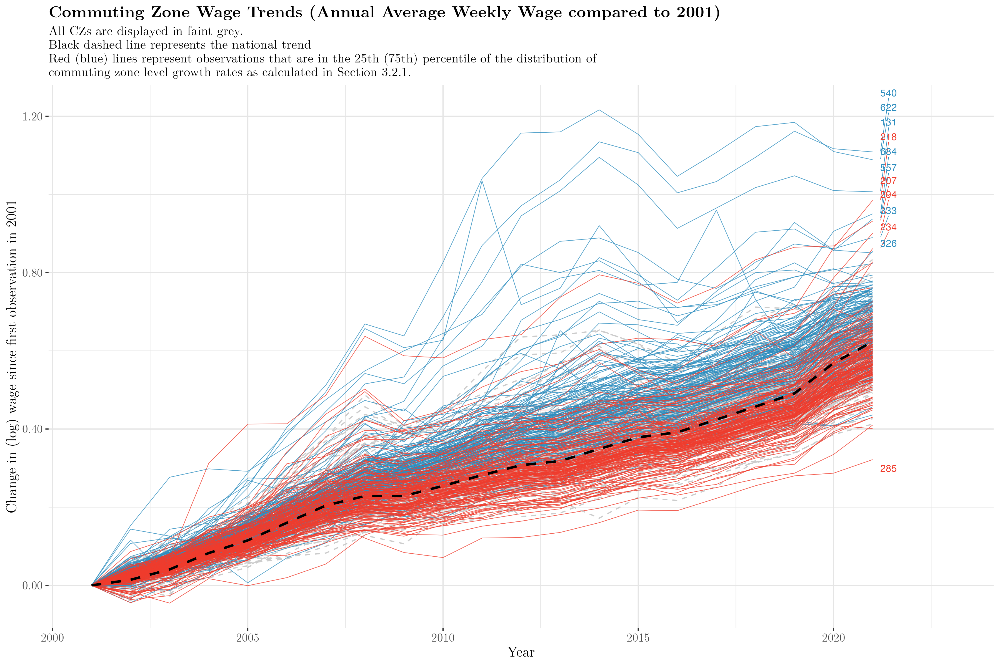

```{r setup-appendix-writer, include=FALSE}

library(here)
appendix_file <- "appendix_generated.tex"  # Changed to .tex for Overleaf
# Includes functions like export_table, export_figure, append_()_to_appendix
source(here('code/source_code/export_appendix_support_funs.R'))

```


```{r si_tex_docs, include = FALSE, echo = FALSE}

append_file_to_appendix(here("code/si_tex_docs/si.tex"))
append_file_to_appendix("../data/raw/QCEW/data_desc_qcew_cz_ind_wage_stats.tex", float_barrier = TRUE)

```

<!-- Note: Any warnings about "missing observations" or "NA being removed" -->

<!-- relates to the lags incorporated. -->

<!-- \listoffigures -->

<!-- \listoftables -->

# Introduction

**Since the 1970s, the United States has experienced a persistent
divergence between productivity growth and wage growth** [@hoffmann2020;
@stansbury; @economicpolicyinstitute; @elsby2013]. While labor
productivity has continued to rise, the earnings of typical workers have
increased far more slowly, leading to a substantial decoupling between
the two trends. Explanations range from heterogeneous demand for human
capital [@autor2014; @katz1992; @acemoglu2012; @autor2011;
@autor_growth_2013] to competition [@stansbury; @deb2022; @yeh2022;
@azar2022; @wilmers2018] to weakened labor market institutions and
policy forces [@egger2019; @lee1999; @mishel2021; @barkai2020;
@autor2016; @card2001; @bivens2013; @stansbury2020].[^1] Though its
causes are hotly debated, the fact itself is well-documented, especially
for lower- and middle-income workers [@komlos2018].[^2]

[^1]: Summers & Stansbury 2018 argue that productivity growth still
    exerts a positive influence on wages overall, but that institutional
    and structural changes have weakened the link for large segments of
    the workforce [@summers2018; @stansbury]. They point to declining
    union density, erosion of the minimum wage, globalization, and
    increased market concentration as key factors that have shifted
    bargaining power away from workers and reduced labor’s share of
    national income [@autor2014]. Furthermore, additional evidence finds
    that this decoupling is far from a universal phenomenon. Rather,
    decoupling applies almost strictly to lower- and medium-wage
    earners, while already higher wages manage to keep up (relatively)
    with productivity growth rates.

[^2]: Though authors find that wage inequality growth has stagnated in
    the last decade, this is not a result of a "catch-up" effect of
    lower- or middle-income earners with top income earners, but rather
    wage growth at the bottom of the wage distribution [@aeppli2022].
    Additionally, further evidence indicates that metric choice can
    influence the ambiguity of earnings and wage inequality conclusions
    [@parolin2025].

\textbf{Regardless of its causes, the decline in the wage–productivity link has important consequences.}
Wages remain the most direct channel through which national productivity
growth translates into household well-being. When wage growth lags
productivity, improvements in aggregate efficiency do not translate into
broad-based improvements in living standards [@mishel2021]. Furthermore,
in a context in which the benefits of economic growth have already
accrued unevenly across communities in the United States, this pattern
may reinforce existing spatial inequalities in economic well-being,
especially in regions where industrial composition and historical shocks
have already left communities economically vulnerable [@bauluz;
@rickard2020; @fee2025; @storper2009; @fallah2011; @benmelech;
@greenstone2010].

<!-- **Regardless of the distribution of wage growth across the country, its -->

<!-- unequal growth has implications for inequality.** Where inequality is -->

<!-- not spatially segregated and high- and low-income households share the -->

<!-- same local markets, the divergence between wages and productivity is -->

<!-- likely to generate upward pressure on prices that disproportionately -->

<!-- burdens lower- and middle-income earners. On the other hand, where -->

<!-- inequality is spatially segregated, patterns of regional divergence -->

<!-- could emerge. -->

**A link that has been far less explored in this context is the
spillover effect of local wages to local wealth-building and its effect
on public goods.** Wage growth is an important contributor to local
wealth-building, allowing households and communities to invest more in
local public goods [@boustan2013]. Communities whose wages rise in line
with productivity growth will likely reap the benefits of economic
growth whereas those who do not, risk falling behind. This link is
particularly important in the US given the structure of local public
financing. Majority of local public services are funded via property
taxes. This funding structure entrenches a mechanism for generating
inequality of opportunity between diversely affluent regions of the
country [@manduca2025; @weir2021; @schechtl2024; @mettler2011].[^3]
Existing work shows that income inequality and uneven local income
growth shape inequalities in local public goods provision, residential
mobility, and long-run opportunity [@chetty2014]. As such, wage
stagnation can translate directly into weakened fiscal capacity. Put
plainly, given the structure of US public services, wherein they are
tied to asset values, inequality in wealth-building can have significant
effects for the quality of local public services.

[^3]: A burgeoning literature points to the role of racial segregation
    and its enduring legacy in perpetuating inequality in local economic
    health, wealth, and public service expenditure [@avenancio-león2022;
    @trounstine2016; @trounstine2021].

**Community well-being and public expenditure in the US is already
characterized by a high degree of spatial heterogeneity** [@manduca2025;
@obrien2025; @feler2017; @chetty2026]. Evidence of how income inequality
perpetuates other forms of inequality (opportunity, health,
infrastructure quality, and broader well-being) is steadily increasing.
[@chetty2016; @logan2012; @semuels2016; @Avancena2021; @flavin2009;
@boustanEffectRisingIncome2013] find that greater income inequality
leads to higher public expenditure across all public goods indicating
that a presence of higher-earners in a local area contributes to higher
levels of expenditure. Though this does not support an unambiguous
denunciation of inequality in itself, it provides additional evidence
for the fact that local incomes affect public expenditure raising the
potential for "superstar" and "left behind" regions to emerge absent
even income growth.

**Local public education is particularly relevant in this context.**
Public schools are responsible for educating over 80% of American
school-age children. In 2019, governments around the US (including the
federal government) spent a total of \$870 billion on public education,
roughly \$17,013 per pupil [@nationalcenterforeducationstatistics2023;
@skinner2019]. However, the quality of services delivered and fiscal
resources spent vary widely across the country [@biolsi2022]. Take
Connecticut for example. In 2016, according to the Connecticut State
Department of Education, the town of Greenwich, one of the
highest-income towns in the country, spent \$22,000 per pupil while
Bridgeport, although only located 40 kilometers away, spent \$14,000
[@semuels2016]. A sometimes lacking, or at best under-performing,
federal equalization system perpetuates this inequality structurally
[@beland2017; @biasi2023; @hoxby1998; @mccabe2019; @baker2016;
@aesa2024].

**The quality of public education, especially at an early age, can have
long-lasting consequences for personal and economic well-being over an
individual's lifetime as well as generations following them**
[@alfonso2020; @zheng2022]. Although only a small piece of the puzzle
that determines quality public education, expenditure levels ensure
adequate funding for facilities, teachers, administrators, and other
services [@baker2017; @baker2025; @jackson2016]. Furthermore, evidence
suggests that progressive spending delivers efficiency gains in school
performance [@rauscher2022]. Therefore, ensuring that local or regional
economic decline does not disrupt or weaken education expenditure levels
is of paramount importance to ensure greater equality in the long-run.
Altogether, this evidence points to the value of identifying the extent
to which expenditure on public education is reliant on local wage growth
across the country.

<!-- [^6]: One investigation assessed the dependence of local public revenues -->

<!--     on fossil fuel production finding that such production generated -->

<!--     about \$138 billion annually for US localities, states, tribes, and -->

<!--     the federal government @raimi2022 . This amount is forecast to -->

<!--     decline by 2050 even in a business-as-usual scenario (assuming no -->

<!--     changes in climate policy stringency). Wyoming, North Dakota, -->

<!--     Alaska, and New Mexico are the states most dependent on fossil fuel -->

<!--     revenues with at least 14% of state and local revenues generated -->

<!--     from the fossil fuel industry (Wyoming's dependence is above 50%). -->

<!--     The work makes a demonstrative statement about the link between this -->

<!--     revenue stream and essential services like schools, public health, -->

<!--     and infrastructure, but stops short of an empirical analysis into -->

<!--     the impact of fossil fuel decline on revenues and associated -->

<!--     expenditure, even at the state level. -->

<!-- **This study therefore determines whether elasticities of public elementary education expenditure to local wage growth are non-zero.** If productivity gains translate unevenly into wages across regions, then the fiscal capacity of local governments may be shaped as much by institutional and structural conditions as by the distribution of aggregate economic growth. We investigate the following questions: -->

**Despite the large literature on the existence of wage-productivity
decoupling and inequality in local public goods provision, one central
link remains under-explored: Are local public education budgets
sensitive to local wages, and if so, for whom and under what
conditions?**

To be more precise, this study investigates the following questions:

*RQ1:* Do local wage gains affect public education expenditure in
levels?

*RQ2:* If so, is this relationship constant across commuting zones? What
sources of heterogeneity mediate this relationship?

*RQ3:* In light of recent reforms to intergovernmental education funding
aimed at reducing disparities in educational expenditure, do
intergovernmental transfers mitigate wealth-driven inequalities in
public education spending?

## Theoretical Motivation and Empirical Approach

Although as mentioned above, existing work provides descriptive evidence
that higher income communities invest more in local services, the causal
effect of wage growth on education spending is unclear due to
substantial endogeneity. Any study of the linkage between two or more
local socioeconomic outcomes presents considerable endogeneity
challenges. Higher-wage households select into districts with better
schools. Education quality affects local human capital and, thus, wages.
Local fiscal decisions respond to political, demographic, and
institutional environments that co-evolve with economic conditions.
Moreover, regional heterogeneity is large. States differ in their
reliance on local versus state funding; commuting zones differ in
industrial composition and exposure to national shocks; and localities
vary in their ability to translate tax bases into expenditures. On a
cultural level, the quality of local education can potentially impact
preferences for education in turn. Thus, a national \`\`average''
elasticity may be misleading. What is missing is a causally identified,
regionally sensitive, and mechanism-informed estimate of the elasticity
of public education expenditure to local wages.

<!-- In the context of this study, wages and public education expenditure are undoubtedly endogenous. Higher-income families may self-select into districts with greater education spending, confounding causal inference. Lower-income families likely struggle financially to make similar mobility decisions. Local education contributes to the quality of local human capital impacting wages and potentially preferences for education. -->

To overcome these challenges, we construct a shift–share instrumental
variable for local wages. More precisely, to interrogate the elasticity
of public education expenditure to wages across US commuting zones, we
construct a shift-share instrument that combines fixed local industry
employment shares with national industry-level changes in real value
added using data from the US Bureau of Labor Statistics and Bureau of
Economic Analysis. This instrument generates plausibly exogenous local
variation by exploiting how regions are differentially exposed to common
national trends, while abstracting from endogenous local dynamics. It is
particularly well suited in this setting, since the local tax base, and
thus education spending, likely depends on industries that are unevenly
distributed across regions but subject to similar industry-specific wage
shocks. We use this instrument to identify the effect of wage shocks on
local public education expenditure as reported by the US Census Bureau's
Annual Survey of State and Local Government Finances.

Given the substantial heterogeneity across U.S. states arising both from
structural sources (such as differences in tax systems, regulatory
environments, and legislative institutions) and from evolved
characteristics (including industrial composition, income levels,
inequality, and broader measures of economic diversity) the scope for
identifying a policy-relevant single national average treatment effect
is inherently limited. Therefore, we proceed in two steps. First, we
provide an initial benchmark using a pooled estimation to establish a
baseline relationship between wages and education expenditure that
generalizes reasonably across the national economy. Second, we
investigate the regional and industrial heterogeneity that these pooled
estimates mask via a state-by-state estimation, within-CZ analysis of
school district expenditure levels, and grouping commuting zones by
their historic wage and GDP growth trajectories to improve comparability
of treatment and control groups in our instrumental variable design. In
the latter heterogeneity analysis, we construct commuting zone growth
rates as idiosyncratic variables absent state and national-level growth
rates, understanding that *relative* growth rates are of particular
importance in a landscape where local economies determine the actual
*value* of wage levels. This allows us to identify where the
wage–expenditure link is strongest or weakest. Finally, we evaluate the
policy landscape of each state using a database of over 900 state-level
legislative and regulatory actions as collated by the Education
Commission of the States (ECS) to identify any active policies that
might obstruct the transmission channel from wages to public education
expenditure. We cross-check the identified redistributive policies
against the states in which we do not identify a significant
wage-spending relationship despite exhibiting relatively high
shift-share instrument variation.

## Main Results and Contribution

1.  First, we find that public education expenditure responds strongly
    and positively to local wage growth. A 10% increase in local wages
    is associated with a 2.2% increase in public elementary education
    expenditure, with a long-run increase of 4.6%.

    2.  Second, examining potential effect channels, we find that a 10%
        increase in local wages is associated with a 5% (0.5%) increase
        in the expenditure of the highest-(lowest-) spending school
        district in each commuting zone that encompasses more than one
        school district. This effect is corroborated in a 0.3% increase
        in the within-CZ variance across school districts as well as a
        4.2% increase in the spread between the maximum and minimum
        spending school district. Essentially, the detected wage effect
        is mainly attributable to affluent districts pulling away from
        lower-spending districts, rather than a uniform increase in
        spending across districts within a single commuting zone.

2.  Third, estimating the instrumental variable model separately for
    each state reveals substantial heterogeneity in the relationship
    between wages and education expenditure. Only a third of the 40
    states analysed in this study show persistent causal non-zero
    elasticities between wages and education expenditure in a
    within-state model, indicating that these carry the weight of
    national-level identification. Across these states the wage
    elasticity varies between 2-10% increases in response to a 10%
    increase in local wages, with Colorado, Florida, and South Dakota
    exhibiting highest wage elasticities. Many of these states rely on
    an above-average share of education funding coming from local
    sources rather than intergovernmental transfers, though this is far
    from a unifying characteristic across selected states. Rather, we
    find that the presence of a clean fiscal transmission channel from
    wages to public education expenditure, unobstructed by
    redistributive policies, defines the statistically significant
    results in majority of the states that exhibit strong within-state
    wage-spending relationships. More precisely, comparing states with
    similarly high relative levels of wage variation across commuting
    zones, the wage-spending relationship breaks down in the states that
    employ either property tax recapture and redistribution mechanisms
    or school district spending caps as tools to achieve greater
    spending equity.

3.  Fourth, elasticities are largest, both in terms of size and
    statistical significance, in commuting zones with historically low
    wage growth compared to other regions, and smallest in regions with
    historically strong wage trajectories. This indicates that regions
    already experiencing economic stagnation may face compounded
    disadvantages through weaker fiscal capacity for education spending.
    Additionally, this evidence points to a delineation between
    communities who teeter at the margins of inadequate funding versus
    those whose wages and other economic conditions give stability to
    local public education systems.

As such, these results make four important contributions to the existing
literature. First, the paper provides causal estimates of the elasticity
of local public education expenditure to local wage growth across US
commuting zones, documenting both the average national relationship and
substantial regional heterogeneity.

Second, the results show that local fiscal capacity is closely tied to
historically uneven wage growth, implying that wage-productivity
decoupling has important implications not only for households but also
for public sector institutions that shape long-run opportunity. Third,
the paper demonstrates how the structure of the US school financing
system amplifies or dampens the effects of local economic change, with
weaker equalizing opportunities exacerbating the consequences of wage
heterogeneity. In a system in which majority of local public budgets
remain reliant on property taxes to fund local public goods, this work
demonstrates the importance of explicit redistributive policies from
wealthier to less wealthy districts. States such as Texas, New Mexico,
Montana, Wyoming, and Arizona, otherwise characterized by substantial
wage variation across local commuting zones, insulate school districts
from wage-related spending fluctuations through property tax recapture,
district- and county-level spending limits, and state equalization
guarantees. On the other hand, South Dakota, Colorado, and Florida
exhibit comparable wage variation which strongly influences local public
education spending. Together, these findings show that the
wage-productivity link has implications that go beyond household
earnings in certain regions, potentially influenced the
inter-generational transmission of economic opportunity in the absence
of insulating policies.

In the sections that follow, we outline the various data sources used in
@sec-data; provide a detailed overview of our shift-share construction
and methodological approach @sec-methods with accompanying results; and
conclude with a discussion of policy implications in @sec-conclusion.

```{r, echo = FALSE, message = FALSE,  include = FALSE, eval = TRUE}

options(width = 500)
# remember that when setting cache to false again, you will need to reset BUILDING_APPENDIX at the top to allow the appendix to take into account changes to code chunks!! if cache = TRUE then BUILDING_APPENDIX = FALSE everywhere (two places - end and beginning). BUILDING_APPENDIX should always be false at the very end of the document 
knitr::opts_chunk$set(echo = FALSE, cache = cached_version, warning = FALSE, message = FALSE, fig.width = 10, fig.height = 10, dev = "ragg_png")

library(tidyverse)
library(conflicted)
library(stargazer)
library(ivreg)
library(purrr)
library(quantreg)
library(zoo)
library(tidycensus)
library(janitor)
library(plm)
library(here)
library(viridis)
library(viridisLite)
library(datasets)
library(broom)
library(xtable)
library(fipio)
library(panelvar)
library(fixest)
library(paletteer)
library(readxl)
library(ggrepel)
library(plm)
library(getspanel)
library(usmap)
library(patchwork)
library(kableExtra)
library(estimatr)
library(lattice)
library(lubridate)
library(stringr)
library(xts)
library(urca)
library(dynlm)
library(tikzDevice)
library(tseries)
library(quantmod)
library(lmtest)
library(sandwich)
library(patchwork)
library(vars)
library(assertthat)
library(ggridges)
library(grid)
library(RColorBrewer)
library(ragg)
library(ggplotify)
extrafont::loadfonts(quiet = TRUE)
source(here('code/source_code/useful_functions.R'))
source(here('code/source_code/dicts.R'))
source(here('code/reg_forms.R'))
source(here('code/source_code/cz_cleaning.R'))
conflict_prefer_all("dplyr", quiet = TRUE)
yes_contemp_ss = TRUE

source(here('code/source_code/fit_stats.R'))

setFixest_etable(fitstat = ~ . + ivf1 + ivf1.p + iv_fstat + iv_fstat_p + wh + wh.p + ivwaldall + ivwaldall.p + kpr, se.below = TRUE)

#iv_fitstats = ~ n + r2_firststage + ar2_firststage + ivfall + ivfall.p + iv_fstat + iv_fstat_p + wh + wh.p + ivwaldall + ivwaldall.p

iv_fitstats = c("n", "r2", "wr2","iv_fstat", "iv_fstat_p", "wh", "wh.p", "ivwaldall", "ivwaldall.p", "ivf1", "ivf1.p") #"partial_f_wald", "partial_f_wald_p")#, "partial_f_effective") #"iv_fstat_marg", "iv_fstat_marg_p", "wh_manual", "wh_manual_p", "sargan_manual", "sargan_manual_p")

default_iv_note = c("", "Note that the R2 and Adjusted R2 values for second-stage regressions are irrelevant information here. I have not yet figured out how to suppress them from the regression tables but will do so for the final version.")

plot_annotation_theme = theme(
      text = ggplot2::element_text(
    family = "Latin Modern Roman"),
  plot.title = element_text(family = "LMRoman10-Bold",  # Use the exact bold font name
                            size = 16, 
                            face = "bold"),
      plot.subtitle = element_text(size = 12))

unit_id = "cz_id"
new_ss_calculation = FALSE
latex_tables = TRUE
beamer_tgl = TRUE

data_cache <- here("output/cache/pull_data_cache_lags_2.RDS")
if (file.exists(data_cache)) {
  mines_cz <- readRDS(data_cache)
} else {
  source(here("code/source_code/pull_data.R"))
  saveRDS(mines_cz, data_cache)
}

```

# Data {#sec-data}

We compile a panel dataset of the following indicators across 636
commuting zones (CZ) in 40 US states annually between 2001-2021.

**Expenditure and Revenue:** This work relies on a harmonized repository
from Willamette University of the data collected annually as part of the
US Census Bureau's Annual Survey of State & Local Government Finances
(SLGF). The SLGF is the 'only comprehensive source of information on the
finances of local governments in the United States' [@pierson]. The data
includes county-level revenue, property taxes, and expenditure on public
education including disaggregated values by revenue source (federal,
state, or other intergovernmental revenue) and expenditure item
(lunches, wages, debt). All values are reported in real US dollars. We
aggregate school district measures up to the commuting zone-level to
ensure the availability of adequate control and treatment variables. We
choose to conduct the analysis on the commuting zone level because it is
a more accurate picture of a local labor market area
[@carpenterWhenUseCommuting2022].[^4] Our main outcome variable is per
pupil spending on elementary education.

[^4]: The database is provided for six different levels of government:
    state, county, municipal, township, special district, and school
    district. Reporting is only mandated in Census years (every five
    years), and even then missing data remains a challenge. This means
    that data provided at any other level of government suffers from
    significant levels of missing data, with a high level of selection
    bias correlated with administrative capacity. However, strengthened
    by a partnership with the National Center for Education Statistics,
    observations for US school districts exhibit near-complete coverage
    between 1997-2021 (@pierson).

**Population controls:** We source commuting-zone level population
statistics by aggregating data from county-level populations statistics
from the US Census Bureau.

**Local GDP:** We gather local GDP control variables by aggregating
county-level GDP data from the Bureau of Economic Analysis (BEA). This
BEA data is only available after 2001, defining the lower limit of our
panel's time dimension. We primarily rely on private industry GDP as a
control variable given a large remaining portion of GDP is government
expenditure which includes public education expenditure.

**Property Prices:** The US Federal Housing Finance Agency maintains an
annual county-level Housing Price Index (HPI) metric, a geographically
linked measure of the movement of single-family house prices. The HPI is
a weighted, repeat-sales index, measuring average price changes in
repeat sales or refinancings on the same properties. This information is
obtained by reviewing repeat mortgage transactions on single-family
properties whose mortgages have been purchased or securitized by Fannie
Mae or Freddie Mac (two US government-sponsored enterprises that
guarantee most US mortgages) [@usfederalhousingfinanceagency]. We
aggregate to the commuting zone level via a population-weighted mean.

**Race Controls:** The National Institute of Health National Cancer
Institute's Surveillance, Epidemiology, and End Results (SEER) Program
provides annual estimates of total White, Black, American Indian/Alaska
Native, Asian/Pacific Islander populations at the county level,
optionally by Hispanic or non-Hispanic origin
[@nationalcancerinstitutedccpssurveillanceresearchprogram]. Though the
US Census Bureau provides county-level estimates of racial make-up of
local areas in the American Community Survey, this data is unavailable
prior to 2009 and is considered less accurate than those provided by the
SEER Database.

**Adequate Education Spending**: The University of Wisconsin's School
Finance Indicators Database provides detailed data on School Funding
Adequacy, measured as the dollar estimate needed per pupil to achieve
U.S. average test scores [@baker].

This data aggregation results in a complete and balanced panel of 636 US
commuting zones across 40 states between 2001-2021. [^5] All data used
is reported annually at the commuting zone level. [^6] Therefore, apart
from an indicator of a commuting zone's state, all variables are
time-variant.

[^5]: 20% of US states are missing from the dataset because (1) we
    impose an exclusion restriction wherein any commuting zone reporting
    more than five \$0 values for property taxes collected is excluded
    due to likely measurement error and (2) Connecticut, Maryland, North
    Carolina, and Virginia have been excluded due to unconventional or
    incomplete public school district reporting.

[^6]: In line with similar work on US economic geography, commuting
    zones were chosen as the unit of analysis as they are a far less
    arbitrary and more accurate representation of local labor market
    areas/economies [@dorn; @fowler2024].

```{r, echo = FALSE, message = FALSE, warning = FALSE, fig.height = 10}

mean_df <- mines_cz %>% 
  group_by(year) %>%
             summarise(real_Total_Educ_Total_Exp = mean(real_Total_Educ_Total_Exp, na.rm = TRUE),
                       real_Total_Educ_Total_Exp_pp = mean(real_Total_Educ_Total_Exp_pp, na.rm = TRUE),
                       real_log_Total_Educ_Total_Exp = mean(log_real_Total_Educ_Total_Exp, na.rm = TRUE),
                       real_log_Total_Educ_Total_Exp_pp = mean(log_real_Total_Educ_Total_Exp_pp, na.rm = TRUE))

```

```{r, eval = FALSE, echo = FALSE}

is.pbalanced(mines_cz, index = c("cz_id", "year"))

```

\autoref{tbl_desc_stats} reports summary statistics across relevant
variables. All (dollar) values are reported in (real 2017-chained)
thousands except for the House Price Index.
\autoref{tab:tbl_order_of_integration} represents the order of
integration of relevant variables calculated using a unit root test
designed for heterogeneous panels [@im2003]. All variables are
integrated I(0) indicating minimal concern for non-stationarity except
in the case of enrollment and population.

```{r, results = 'asis', message = FALSE}
# Create pdata for order of integration data:
pdata_mines_cz <- pdata.frame(arrange(mines_cz, unit, year), index = c("unit", "year"))
pdata_mines_cz_diff <- pdata.frame(arrange(filter(mines_cz, year != 2001), unit, year), index = c("unit", "year"))
log_transform = TRUE

# Function for testing stationarity
test_panel_stationarity <- function(pdata, var_name, exog = "intercept", test_type = "ips") {
  #print(var_name)
  if(var_name == "hpi"){
    pdata <- pdata %>% group_by(unit) %>% filter(!all(is.na(hpi))) %>% ungroup
  }
    result <- purtest(pdata[[var_name]],
                     test = test_type,
                     exo = exog,  # use "trend" if variables have trends
                     lags = "AIC",
                     pmax = 4)
    #print(result)

    return(list(
      statistic = result$statistic$statistic,
      p_value = result$statistic$p.value,
      is_stationary = result$statistic$p.value < 0.05
    ))
}

# Determine integration order
vars_to_test <- c("Enrollment", "pop_total", "real_Elem_Educ_Total_Exp_pp",
                  "real_Property_Tax_pp", "real_Total_IG_Revenue_pp",
                  "real_Total_State_IG_Revenue_pp", "real_gdp_total_pc", 
                  "real_gdp_priv_ind_pc")#, "hpi")
if(log_transform){
  vars_to_test <- paste0("log_", vars_to_test)
}

# Test levels
level_results <- lapply(vars_to_test, function(v) {
  test_panel_stationarity(pdata_mines_cz, v)
})
names(level_results) <- vars_to_test

integration_orders <- sapply(vars_to_test, function(v) {
  if (level_results[[v]]$is_stationary) {
    return(list(order = "I(0)", diff_p_value = ""))
  } else {
    # Test first difference
    diff_test <- test_panel_stationarity(pdata_mines_cz_diff, paste0("diff_", v), exo = "intercept")
    if (diff_test$is_stationary) {
      return(list(order = "I(1)", diff_p_value = round(diff_test$p_value, 4)))
    } else {
      # # Test second difference if needed
      # # Assuming you have second differences with prefix "diff2_"
      # diff2_test <- test_panel_stationarity(pdata_mines_cz_diff2, paste0("diff2_", v), exo = "intercept")
      # return(list(order = "I(2)", diff_p_value = round(diff2_test$p_value, 3)))
      return()
    }
  }
}, simplify = FALSE)

# Display results with cleaner structure
results_df <- tibble(
  Variable = names(integration_orders),
  `Order of Integration` = sapply(integration_orders, function(x) x$order),
  `I(0) test p-value` = sapply(level_results, function(x) ifelse(round(x$p_value, 4) == 0, "<0.0001",  round(x$p_value, 3))),
  `I(1) test p-value` = sapply(integration_orders, function(x) ifelse(x$diff_p_value == 0, "<0.0001", ""))
)

# Variables of interest for descriptive statistics
vars <- c("Property_Tax", "Total_IG_Revenue", "Total_Fed_IG_Revenue", "Total_State_IG_Revenue", "Total_Educ_Total_Exp", "Elem_Educ_Total_Exp") # Total_Revenu

tbl <- mines_cz %>%
  select(Enrollment, pop_total, real_Elem_Educ_Total_Exp_pp, real_Property_Tax_pp, real_Total_IG_Revenue_pp,# real_Total_Fed_IG_Revenue_pp, 
         real_Total_State_IG_Revenue_pp, 
         real_gdp_total_pc, real_gdp_priv_ind_pc, #real_gdp_o_g_mining_quarr_21_pc, 
         hpi, pct_black, pct_white, pct_hispanic) %>% 
         #real_Elem_Educ_Total_Exp, real_Property_Tax, real_Total_IG_Revenue, real_Total_Fed_IG_Revenue, 
         #real_Total_State_IG_Revenue, real_gdp_total, real_gdp_priv_ind, real_gdp_o_g_mining_quarr_21, total_active_n, total_active_prod) %>% 
  mutate(across(c(Enrollment, pop_total), ~./1000)) %>%  # gdp_govt, 
          data.frame() %>%
          stargazer(digits = 2, digits.extra = 3, 
                    type = ifelse(latex_tables, "latex", "text"), covariate.labels = c(
         "Enrollment",
         "Population",
         "Elementary Expenditure per pupil",
         "Property Tax per pupil",
         "Intergovernmental (IG) Revenue per pupil", 
         #"Federal IG Revenue per pupil", 
         "State IG Revenue per pupil",
         "GDP per capita",
         "GDP pc - Private Industry",
         "House Price Index",
         "\\% Black",
         "\\% White", 
         "\\% Hispanic"),
         header = FALSE, label = "tbl_desc_stats", title = "Descriptive Statistics")
         #"GDP pc - Oil, gas, mining",
         #"Elem. Expenditure",
         #"Property Tax",
         #"IG Revenue", 
         #"Federal IG Revenue", 
         #"State IG Revenue",
         #"GDP",
         #"GDP - Private Industry", 
         #"GDP - Oil, gas, mining",
         #"Active Coal Mines",
         #"Coal Produced (k short tons)"))

export_table(tbl, "tbl_desc_stats.tex")
rm(tbl)


integration_table <- results_df %>% 
  mutate(Variable = case_when(Variable == "log_Enrollment" ~ "Enrollment",
         Variable == "log_pop_total" ~ "Population",
         Variable == "log_real_Elem_Educ_Total_Exp_pp" ~ "Elementary Expenditure per pupil",
         Variable == "log_real_Property_Tax_pp" ~ "Property Tax per pupil",
         Variable == "log_real_Total_IG_Revenue_pp" ~ "Intergovernmental (IG) Revenue per pupil", 
         Variable == "log_real_Total_State_IG_Revenue_pp" ~ "State IG Revenue per pupil",
         Variable == "log_real_gdp_total_pc" ~ "GDP per capita",
         Variable == "log_real_gdp_priv_ind_pc" ~ "GDP pc - Private Industry")) %>% 
   kable(.,format = ifelse(latex_tables, "latex", "simple"),
        caption = "Order of Integration",
        booktabs = TRUE,  # This is key for stargazer-like lines
        align = c("l", "c", "c", "c"),  # left, center, center, center
        col.names = c("Variable", "Order of Integration", "I(0) test p-value", "I(1) test p-value"), label = "tbl_order_of_integration") %>%
  footnote(general = "Order of integration determined using the Im-Pesaran-Shin (IPS) panel unit root test with intercept. Lag length selected via AIC with maximum of 4 lags. The null hypothesis is non-stationarity; rejection at the 5% level indicates stationarity. I(0) denotes stationarity in levels and I(1) denotes stationarity in first differences. All variables are log-transformed prior to testing to account for heteroskedasticity.",
           footnote_as_chunk = TRUE,
           threeparttable = TRUE)

integration_table

export_table(integration_table, "tbl_order_of_integration.tex")
rm(integration_table)

```

<!-- ##Descriptive Regression Results - Appendix -->

```{r KRs, include = FALSE, echo = FALSE, results = 'asis'}

append_to_appendix("# Key Relationships between Economic Variables",
               c("Below we display key relationships between several of the economic variables in our study. All economic indicators (house prices, private industry GDP, and wages are positively associated with education expenditure, whereas enrollment is negatively associated with education expenditure per pupil.","\n","We report descriptive regressions in this section to establish relationships between property taxes, education expenditure, private industry GDP, and house prices. All regression models are estimated using two-way fixed effects and standard errors clustered by commuting zone."))

gdp_plot <- mines_cz %>%
  ggplot(aes(x = log_real_gdp_priv_ind_pc, y = log_real_Elem_Educ_Total_Exp_pp)) +
    geom_jitter(colour = "darkorange2", alpha = 0.5) +
    geom_smooth(method=lm, colour = "black")  +
    labs(x = "(log) Private Industry GDP per capita", y = "(log) Education Expenditure per pupil") +
    common_theme

hpi_plot <- mines_cz %>%
  ggplot(aes(x = log_hpi, y = log_real_Elem_Educ_Total_Exp_pp)) +
    geom_jitter(colour = "maroon", alpha = 0.5) +
    geom_smooth(method=lm, colour = "black")  +
    labs(x = "(log) House Prices (Index Value)", y = "(log) Education Expenditure per pupil") +
    common_theme

wage_plot <- mines_cz %>%
  ggplot(aes(x = log_weighted_annual_avg_wkly_wage, y = log_real_Elem_Educ_Total_Exp_pp)) +
    geom_jitter(colour = "darkorchid", alpha = 0.5) +
    geom_smooth(method=lm, colour = "black")  +
    labs( x = "(log) Annual Average Weekly Wage", y = "(log) Education Expenditure per pupil") +
    common_theme

pop_plot <- mines_cz %>%
  ggplot(aes(x = log_Enrollment, y = log_real_Elem_Educ_Total_Exp_pp)) +
    geom_jitter(colour = "steelblue", alpha = 0.5) +
    geom_smooth(method=lm, colour = "black")  +
    labs(x = "(log) Enrollment", y = "(log) Education Expenditure per pupil") +
    common_theme 

wage_prop_values <- mines_cz %>%
  ggplot(aes(x = log_weighted_annual_avg_wkly_wage, y = log_hpi)) +
    geom_jitter(colour = "darkgreen", alpha = 0.5) +
    geom_smooth(method=lm, colour = "black")  +
    labs( x = "(log) Wage", y = "(log) House Prices (Index Value)") +
    common_theme

# Combine first set of plots and save to appendix
combined_plot_1 <- (gdp_plot + hpi_plot) / (wage_plot + pop_plot) + 
  plot_annotation(
    title = "Key Relationships Between Economic Variables and Levels of per pupil Education Expenditure",
    subtitle = "Commuting Zone Level. 2001-2020.",
    theme = plot_annotation_theme
  )

append_figure_to_appendix(
  plot_obj = combined_plot_1,
  filename = "fig_key_relationships.png",
  caption = "Key Relationships Between Economic Variables and Levels of per pupil Education Expenditure. Commuting Zone Level, 2001-2020.",
  label = "fig:key_rel",
  width = "\\textwidth"
)


gdp_ig_plot <- mines_cz %>%
  ggplot(aes(x = log_real_gdp_priv_ind_pc, y = log_real_Total_IG_Revenue_pp)) +
    geom_jitter(, colour = "brown", alpha = 0.5) +
    geom_smooth(method=lm, colour = "black")  +
    labs(title = "Intergovernmental Transfers per pupil vs. GDP per capita", subtitle = "Intergovernmental transfers include all state- and federal level transfers.", x = "(log) Private Industry GDP per capita", y = "(log) Intergovernmental Revenue per pupil") +
    common_theme

append_figure_to_appendix(
  plot_obj = gdp_ig_plot,
  filename = "fig_gdp_ig_revenue.png",
  caption = "Intergovernmental Transfers per pupil vs. GDP per capita. Intergovernmental transfers include all state- and federal level transfers.",
  label = "fig:gdp_ig",
  width = "0.8\\textwidth"
)

# Clean up
rm(gdp_plot, hpi_plot, wage_plot, pop_plot, wage_prop_values, combined_plot_1, gdp_ig_plot)

```

```{r appendix2, include = FALSE, echo = FALSE, results = 'asis'}

append_to_appendix("## Property Tax ~ GDP",
               "GDP has a highly relevant relationship to property taxes. A 1\\% increase in GDP (per capita) is assocaited with a 0.38\\% (0.32\\%) increase in property taxes collected (per capita) (\\autoref{tbl_proptax_gdp}).")

proptax_table <- run_model(prop_taxes, mines_cz) %>%
  etable(tex = latex_tables, adjustbox = "max width=\\textwidth", label = "tbl_proptax_gdp", title = "Relationship between Property Tax and Local GDP")

append_table_to_appendix(proptax_table)

```

```{r appendix3, include = FALSE, echo = FALSE, results = 'asis'}

append_to_appendix("## Education Expenditure ~ Revenue Sources",
               "The below regressions are included to establish the relationship between education expenditure and its component parts (ie. the largest form of IG revenue is state funding and Own Source revenue is largely sourced from Property Taxes).")

educ_source_table <- run_model(educ_source, mines_cz) %>% etable(adjustbox = "max width=\\textwidth", tex = latex_tables)

# Add to appendix
append_table_to_appendix(educ_source_table)

```

```{r, echo = FALSE}
# Create reference data frame with state abbreviations and names
states_helper <- data.frame(
  state.abb = state.abb,
  state.name = state.name,
  state.region = state.region
)

# Read your data
wallethub_ranking <- read.csv(here("data/raw/wallethub_ed_ranking/public-school-rankings-by-state-2025.csv")) %>% 
  rename(wallethub_ranking = PublicSchoolRankingsOverallRank_2024,
         usnews_ranking = US_News_Best_States_Education)
# Keeping in case we wish to add more education rankings
rankings <- wallethub_ranking %>% 
  rename(state_full = state)
# # Convert state column to state_name using merge or match
# # Option 1: Using merge
# rankings <- merge(wallethub_ranking, 
#                            states_helper[, c("state.abb", "state.name")], 
#                            by.x = "state", 
#                            by.y = "state.name", 
#                            all.x = TRUE)
# colnames(rankings)[colnames(wallethub_ranking) == "state.name"] <- "state.abb"

# Option 2: Using match (simpler, preserves row order)
rankings$state_name <- states_helper$state.abb[match(rankings$state_full, states_helper$state.name)]
```

```{r, echo = FALSE}

adequ <- read_xlsx(here('data/raw/school_adequacy_indicators/StateIndicatorsDatabase_2025.xlsx'), sheet = 2) %>% 
  filter(year == 2017) %>% 
  # Missing Hawaii, Alaska, Vermont
  select(state_name, stabbr, necm_predcost_state) %>% 
  rename(state_full = state_name, state_name = stabbr) %>% 
  mutate(necm_predcost_state = necm_predcost_state/1000)


# read_xlsx(here('data/raw/school_adequacy_indicators/StateIndicatorsDatabase_2025.xlsx'), sheet = 2) %>%
#   select(year, state_name, stabbr, necm_predcost_state) %>%
#   rename(state_full = state_name, state_name = stabbr) %>%
#   filter(!is.na(necm_predcost_state)) %>% 
#   mutate(necm_predcost_state = necm_predcost_state/1000) %>%
#     ggplot(aes(x = year, y = necm_predcost_state, color = state_name)) +
#     geom_line()

```

```{r what_is_cz, include = FALSE, echo = FALSE, results = 'asis'}

append_to_appendix(
  "## Commuting Zones",
  "The commuting zones composed of a large number of counties are those surrounding major metropolitan areas in otherwise less populated regions of the country (Atlanta, Georgia (contains 17 counties in Georgia); Chicago, Illinois (contains 12 surrounding counties in Illinois and Wisconsin); Minneapolis, Minnesota (contains 12 surrounding counties in Minnesota and Wisconsin); Indianapolis, Indiana (contains 12 surrounding counties in Indiana); Cincinnati, Ohio (contains 13 surrounding counties in Kentucky and Ohio)."
)

# Georgia (17) commuting zone with 17 counties - around Atlanta
# Illinois (12) - around Chicago (contains Illinois and Wisconsin)
# MN (12) - around Minneapolis (contains Minnesota and Wisconsin counties)
# Indiana (12) - around Indianapolis
# Kentucky (13) - Counties bordering Cincinnati Ohio (contains fips in KY and Ohio)

# Create data
what_is_cz <- mines_cz %>% 
  select(cz_id, state, n_fips, all_states) %>% 
  distinct()

what_is_cz$state_name <- sapply(what_is_cz$state, get_state)

# Create histogram plot
cz_histogram <- what_is_cz %>% 
  ggplot() + 
  geom_histogram(aes(x = n_fips), bins = 30, fill = "turquoise4", alpha = 0.7) + 
  labs(
    x = "Number of Constituent Counties", 
    y = "Commuting Zone Count", 
    title = "Number of Counties per Commuting Zone"
  ) +
  common_theme +
  theme(panel.grid.major = element_blank(), panel.grid.minor = element_blank())

# Save histogram to appendix
append_figure_to_appendix(
  plot_obj = cz_histogram,
  filename = "fig_cz_histogram.png",
  caption = "Distribution of number of counties per commuting zone",
  label = "fig:cz_histogram",
  width = "0.8\\textwidth"
)

# Create table of outlier CZs
outlier_czs <- what_is_cz %>% 
  filter(n_fips > 11) %>% 
  pull(cz_id)

temp_outlier_czs <- czs %>% 
  filter(cz_id %in% outlier_czs) %>% 
  select(fips, cz_id)

outlier_table <- fips_codes %>% 
  mutate(fips = paste0(state_code, county_code)) %>% 
  select(fips, state_name, county) %>%  
  left_join(temp_outlier_czs, ., by = "fips")

# Create LaTeX table from outlier data
outlier_table_tex <- outlier_table %>%
  kable(
    format = "latex",
    caption = "Counties in Commuting Zones with More Than 11 Constituent Counties",
    booktabs = TRUE,
    longtable = TRUE,  # For multi-page table
    col.names = c("FIPS", "CZ ID", "State", "County")
  ) %>%
  kable_styling(
    latex_options = c("repeat_header")  # Repeat header on each page
  )

# Add table to appendix
append_table_to_appendix(outlier_table_tex)

# Clean up
rm(what_is_cz, cz_histogram, outlier_czs, temp_outlier_czs, outlier_table, outlier_table_tex)

#temp_fips <- readRDS(here("data/out/regression_data_complete_fips.RDS"))


```

Figure 1 demonstrates the spread of elementary education expenditure per
pupil by commuting zone, grouped by state. Each state's
population-weighted mean expenditure per pupil is represented in black.
There is considerable within-state variation in per-pupil expenditure
levels. Notably, Texas, Montana, and Idaho have commuting zones that
spend nearly twice as much as other zones in the same state.
Furthermore, the mean level of expenditure is nearly four times as high
in the highest-spending state (New York) than in the lowest-spending
state, Idaho. We additionally display these values in relation to the
estimated "adequate" level of expenditure required for students to
achieve average U.S. test scores, represented by the green and red
arrows. Majority of states fall short of the deemed adequate expenditure
value. Mississippi boasts the greatest shortfall in spending while
Wyoming boasts the greatest overshoot in spending. Figure 1 demonstrates
the considerable within- and between-state variability in spending rates
as well as student needs.

```{r, echo = FALSE, fig.height = 7, fig.width = 8, fig.cap = "Per Pupil Education Expenditure"}

cz_mean_test <- mines_cz %>% 
  group_by(unit, state) %>% 
  summarise(real_Elem_Educ_Total_Exp_pp = mean(real_Elem_Educ_Total_Exp_pp, na.rm = TRUE),
            pop_total = mean(pop_total, na.rm = TRUE)) %>% 
  ungroup

cz_mean_test$state_name <- sapply(cz_mean_test$state, get_state)

# Calculate scaling factors
expenditure_range <- range(cz_mean_test$real_Elem_Educ_Total_Exp_pp, na.rm = TRUE)
ranking_range <- range(rankings$wallethub_ranking, na.rm = TRUE)
scale_factor <- diff(expenditure_range) / diff(ranking_range)
offset <- expenditure_range[1] - ranking_range[1] * scale_factor

p <- cz_mean_test %>%
  group_by(state_name) %>%
  mutate(state_mean = weighted.mean(real_Elem_Educ_Total_Exp_pp, pop_total, na.rm = TRUE)) %>%
  ungroup() %>%
  left_join(., rankings, by = "state_name") %>% 
  left_join(., adequ, by = "state_name") %>% 
  mutate(state_name = fct_reorder(state_name, state_mean),
         adequacy_ind = necm_predcost_state >= state_mean) %>%
  ggplot(aes(x = state_name, y = real_Elem_Educ_Total_Exp_pp, color = state_name)) +
  geom_jitter(width = 0.2, alpha = 0.4, size = 1.2) +
  geom_point(aes(x = state_name, y = state_mean), shape = 18, size = 3, color = "black") +
    geom_point(data = . %>% filter(adequacy_ind), aes(x = state_name, y = necm_predcost_state), shape = 25, fill = "tomato", color = "tomato", size = 2) +
      geom_point(data = . %>% filter(!adequacy_ind), aes(x = state_name, y = necm_predcost_state), shape = 24, fill = "springgreen4", color = "springgreen4", size = 2) +
      geom_segment(data = . %>% filter(!adequacy_ind), aes(x = state_name, xend = state_name, y = necm_predcost_state, yend = state_mean), size = 0.2, color = "springgreen4") +
   geom_segment(data = . %>% filter(adequacy_ind), aes(x = state_name, xend = state_name, y = necm_predcost_state, yend = state_mean), size = 0.2, color = "tomato") +

  
  # Add rankings (scaled to primary axis, inverted)
  # geom_point(aes(y = (max(wallethub_ranking, na.rm = TRUE) + min(wallethub_ranking, na.rm = TRUE) - wallethub_ranking) * scale_factor + offset), 
  #            shape = 17, size = 1, color = "red", alpha = 0.7) +
  # geom_point(aes(y = (max(usnews_ranking, na.rm = TRUE) + min(usnews_ranking, na.rm = TRUE) - usnews_ranking) * scale_factor + offset),
  #            shape = 17, size = 1, color = "red", alpha = 0.7) +
  
  # Secondary axis (reversed) - use proper formula syntax
  scale_y_continuous(
    name = "Expenditure per pupil (real $)",
    sec.axis = sec_axis(
      trans = ~ max(ranking_range) + min(ranking_range) - ((.) - offset) / scale_factor, 
      name = "State Ranking"
    )
  ) +
  
  labs(
    x = "State (ordered by mean expenditure per pupil)",
    y = "Real Elementary Education Expenditure per Pupil",
    title = "Education expenditure per pupil by commuting zone",
    subtitle = "Scattered points: Commuting zone mean expenditure per pupil (2001-2021).\nBlack diamond: Population-weighted state mean expenditure per pupil (2001-2021). \nTriangle: Estimated adequate K-12 expenditure per pupil in 2017. Source: School Finance Indicators Database.\n       2017-value reported to match the deflator used to convert nominal $ values to real values in the dataset.\nRed (green) indicates whether the state mean is below (above) adequate spending levels."
  ) +
  #geom_hline(yintercept = 13.5) +
  theme_minimal(base_size = 12) +
  theme(
    plot.title = element_text(face = "bold", size = 14),
    plot.subtitle = element_text(size = 10),
    axis.text.x = element_text(angle = 45, hjust = 1),
    panel.grid.minor = element_blank(),
    panel.background = element_blank(),
    legend.position = "none"
  ) +
  ylim(7,25) + 
  common_theme

p 
export_figure(p, "fig_per_pupil_spending_plot.png", dpi = 300, beamer = beamer_tgl)
rm(p)

#ggsave(here("output/per_pupil_spending_plot.png"), width = 12, height = 8)
  
```

Figure 2 demonstrates the trajectories of local wages from an initial
level in 2001, demonstrating, the diverging wage growth trajectories of
commuting zones in our sample. Blue commuting zones represents those
exhibiting relatively high wage growth trajectories as deemed by the
calculation outlined in @sec-growthrates. The black dashed line
represents the annual national wage growth rate.

{#fig-wages
fig-cap="Wages and Productivity over Time"}

# Methods {#sec-methods}

## Identification Strategy

We are centrally interested in the effect of changes in local wages on
public education expenditure where there is an evident endogeneity
concern between public education expenditure and wages. First, there is
a likely attracting factor of high levels of education expenditure for
higher-income families. Second, absent migration, education systems
provision local labor markets with individuals with diverse human
capital.

\begin{figure}[H]
\centering
\caption{Instrumental Variable Path Diagram}
\begin{tikzpicture}
% nodes %
\node[rectangle] (z) at (0,0) {Instrument};
\node (t) at (4,0) {Local Wages};
\node (y) at (8,0) {Education Expenditure};
\node (u) at (6,-2) {Omitted variable};

% edges %
\draw[->, line width=1] (z) -- (t);
\draw[->, line width=1] (t) -- (y);
\draw[->, line width=1, violet, dashed] (u) -- (t);
\draw[->, line width=1, violet, dashed] (u) -- (y);
\draw[->, line width=1, red, bend right=40, dashed] (y) to (t);
\end{tikzpicture}
\label{fig:iv-approach}
\end{figure}

### Shift-share Instrument

Therefore, we adopt a causal identification strategy via a shift-share
instrument. Shift-share or *Bartik* instruments have gained popularity
in empirical work as a method of handling endogeneity issues in panel
data [@ferri2022; @goldsmith-pinkham2020; @bartik1991].[^7] Such
instruments combine time-variant, unit-invariant changes in aggregate
economic variables (i.e., national changes in industry value added
levels) with time-invariant, unit-variant shares in exposure to these
macro-level changes (i.e., local shares of employment in particular
industries). This decomposition of local-level changes delocalizes
variation over space and time. In doing so, it provides a defensible
strategy for ‘de-endogenizing’ the treatment, as local exposure is
predetermined with respect to contemporaneous shocks. Moreover, by
construction, the approach enables the examination of how macro-level
phenomena propagate to and affect local units, as it generates local
shocks that are driven by national industry trends weighted by the
community exposure to these industries.[^8]

[^7]: Autor et al. use a shift-share instrument to assess the effect of
    Chinese import competition on manufacturing employment in US
    commuting zones [@autor2013]. As an extension, [@feler2017] use a
    similar shift-share instrument to assess the effect of the same
    shock on the size of local government. [@baccini2021] employ a
    shift-share instrument for manufacturing layoffs to tease out the
    effect of a decline in manufacturing on both economically motivated
    and racial identity voting patterns in the US.

[^8]: An additional popular indicator for modelling industrial shocks
    exogenously is *oil price* as these values are often assumed to be
    exogenous to local and even national conditions [@scheer2022].
    Furthermore, various indicators for measuring *deindustrialization*
    have been proposed including the manufacturing share of employment,
    value added, and GDP [@tregenna2009; @tregenna2020]. Finally, in
    rare instances, exogeneity can be secured due to *geographical,
    climatological, or geological factors*. For example, [@borge2015]
    obtain an exogenous measure of local revenue by "instrumenting the
    variation in hydropower revenue, and thus total revenue, by
    topology, average precipitation and meters of river in steep
    terrain." Certain authors have argued that the fact that the
    location of hydrocarbon deposits is dictated by geomorphological
    processes provides a plausible argument for exogeneity
    [@esposito2021; @chen2022].

In the context of this work, we construct the instrument by interacting
commuting-zone level industrial employment shares held constant at a
base period with national real value added growth by industry. The
foundational literature on shift-share instruments outlines various
channels through which to isolate plausible exogeneity, each subject to
a trade-off between instrument relevance and exogeneity. First, authors
argue that local industry shares are exogenous by imposing that shares
be fixed to a particular base year and are therefore unable to adapt to
changes in national-level growth rates. Such a shift-share instrument is
designed as in @eq-ref-bartik.

$$
Z_{it} = \sum_{j=1}^{k} S_{ij\tau}G_{njt}
$$ {#eq-ref-bartik}

where $S_{ij\tau}$ is the local share of unit $i$'s economy (measured
using metrics like employment, wages, revenue) in industry $j$ at a
fixed base year $\tau$ and $G_{njt}$ is the growth rate of industry $j$
at a national level $n$ at time $t$.

Alternatively, authors may argue that the claim of exogeneity in the
national-level growth rates is unlikely to be violated even when
allowing the local shares to vary over time. This approach is likely to
come at significant expense to instrument exogeneity. It is constructed
as follows:

$$
Z_{it} = \sum_{j=1}^{k} S_{ijt}G_{njt}
$$

Finally, authors might be concerned about the implausible exogeneity of
both shares and national-level growth rates in which case they construct
the instrument as in @eq-ref-bartik-2 where the local shares are fixed
at a common base year and industry-specific growth rates $G$ are derived
from data on other similar regions $o$ rather than national-level
changes that are inherently comprised of local-level shifts. This
approach likely comes at significant expense to instrument relevance.

$$
Z_{it} = \sum_{j=1}^{k} S_{0jt}G_{ojt}
$$ {#eq-ref-bartik-2}

Finally, authors can make an additional design choice about whether the
effect of these instruments should be assumed common to an aggregate
local-level wage growth indicator or allowed to vary by industry. In
other words, whether to construct the first-stage relationship of the
2SLS as...:

$$
X_{it} = \alpha_i + \beta\sum_{j=1}^{k}S_{ijt}G_{njt} + \epsilon_{it}
$$

...or...:

$$
X_{it} = \alpha_i + \sum_{j=1}^{k}\beta_{j}S_{j}G_{jt} + \epsilon_{it}
$$

We employ the formulation in @eq-ref-bartik, assuming that base-period
local industry shares and time-varying national rates are exogenous to
local outcomes and construct the former of the first-stage relationships
assuming a common $\beta$ to the sum of these shares.

Using data from the Bureau of Economic Analysis, we construct a
shift-share instrument at the commuting zone level using local
employment shares by industry and national changes in industry-specific
real value added (VA) represented in @eq-bartik. $G_{njt}$ represents
national-level changes in value added in industry $j$ in time $t$ and
$\frac{N_{ij\tau}}{N_{i\tau}}$ represents the 'sensitivity' of a CZ to
these national shocks proxied by an initial share of local employment in
industry $j$ in a baseline time period $\tau$. The product of these two
values defines the shift-share indicator $\tilde{Z}_{i,t,s}$. In order
to construct the share portion, we compute the total local share of
employment in a particular industry $j$. Due to challenges with missing
data, we compute an average share across 2001-2005 as our 'base year'.

We compute the relevant shift-share instrument across 19 two-digit NAICS
industrial categories listed in \autoref{tbl_naics_codes}. Given
industry-level disaggregation of local employment data requires data
suppression for anonymity reasons, Figure 2 displays the data coverage
of our commuting zone level shift-share instruments. Given the high
degree of missingness in the 3-digit categorization we proceed with the
2-digit NAICS codes.

In the Appendices, we provide an additional estimation using a
wage-based shift-share instrument constructed using data from the US
Bureau of Labor Statistics' Quarterly Census of Employment and Wages
(QCEW). This shift-share instrument is constructed as described above
using industry-level changes in real wages. Concerns about endogeneity
between the instrument and outcome variable are greater using a
wage-based shift-share instrument and is therefore excluded from the
main text.
\footnote{We explore the sensitivity of results to the choice of base period
    $\tau$ by constructing the instrument for various base periods as
    well as a rolling window.}

$$
    \tilde{Z}_{it} = \sum_{j=1}^{k}G_{njt}  \frac{N_{ij\tau}}{N_{i\tau}} 
$$ {#eq-bartik}

### Empirical Estimation

This yields a 2SLS AR(1) model defined by the first- and second-stage
regressions represented in @eq-first-stage and @eq-second-stage. Due to
the likely presence of time-dynamic effects, we include contemporaneous,
1-year, 2-year time lags of the shift-share instrument.

$$
\textbf{(First stage)}\qquad
X_{it} \;=\; \rho\,X_{i,t-1} \;+\; \phi \,Y_{i,t-1} \;+\; \sum_{\ell=0}^{2}\pi_{\ell}\,\tilde Z_{i,t-\ell}
\;+\; \boldsymbol{\theta}\mathbf{W}_{it}' \;+\; \alpha_i^{FS} \;+\; \lambda_t^{FS} \;+\; u_{it},
$$ {#eq-first-stage}

$$
\textbf{(Second stage)}\qquad
Y_{it} \;=\; \phi^\ast \,Y_{i,t-1} \;+\; \beta\,\widehat{X}_{it}
\;+\; \boldsymbol{\delta}\mathbf{W}_{it}'\;+\;  \alpha_i^{SS} \;+\; \lambda_t^{SS} \;+\; \varepsilon_{it}
$$ {#eq-second-stage}

<!-- "Explanation for excluded growth rates: the AR1 beta is nowhere near 1 -->

<!-- and therefore growth rate does not work. the coefficient is a long way -->

<!-- from one which means I do not have to worry about unit roots.", -->

where $W_{it}$ is a vector of control variables. We control for
enrollment levels to account for scaling factors in education
expenditure, intergovernmental transfers to account for the significant
role of such transfers in funding education expenditure, percentage of
the population that is Black, percentage of the population that is
Hispanic, and private industry GDP per capita levels to account for
local price levels.

$Y_{it}$ is the natural logarithm of elementary (serving ages 6-12)
education expenditure per pupil for CZ $i$ in year $t$. We focus on
elementary education for two reasons. First, this restriction partly
shields against a justifiable concern about the endogeneity between
wages and quality of local public education. Whereas funding for high
school-level education could likely affect local wages given such
students are of or near working age, funding for elementary education is
unlikely to impact wage rates via a human capital or skills channel.
Second, in terms of public impact, elementary education is of
foundational importance in the lives of children. Slips in public
education provision at a young age could have scarring effects.

$\alpha_i$ represents a CZ fixed effect and $\lambda_t$ represents
year-fixed effects, with stage-relevant superscripts. $u_{it}$ and
$\varepsilon_{it}$ and represent the error terms of the first and second
stage, respectively.

We additionally adopt a dynamic specification by including lagged
dependent variables in both stages of the IV estimation to avoid
spurious correlation identification arising from persistence in
expenditure and wage levels, as well as better accounting for
heterogeneity across units. Education spending likely exhibits inertia
due to slowly evolving budgetary and relevant policy cycles (i.e.,
property tax rate setting). Similarly, local wage levels are
well-predicted by a previous year's wage levels. Failing to account for
these dynamics, our estimates would conflate the causal effect of wage
innovations with mechanical persistence in levels. This yields a more
conservative and interpretable elasticity, though we demonstrate that
the exclusion of the AR(1) term in the second-stage yields a
contemporaneous effect estimate nearly identical to the long-run wage
effect as derived from the dynamic specification in
\autoref{tbl_va_ss_baseline}.

### Interpretation

\begin{figure}[H]
\centering
\caption{Channel Diagram}
\begin{tikzpicture}
% nodes %
\node[draw, double, rounded corners] (z) at (0,0) {Public Education Expenditure};
\node (t) at (3,2) {IG Revenue};
\node (y) at (0,2) {Local Revenue};
\node (u) at (3,4) {Property Tax Rates};
\node (a) at (0,4) {Property Values};
\node[draw,double,rounded corners] (b) at (0,6) {Wages};
\node (c) at (2.5,6) {Population Growth};
\node (d) at (5,6) {Amenities};
\node (e) at (7,6) {Location};

\node (f) at (9,6) {$f(.) = ... + \varepsilon_i$};
\node (g) at (9,4) {$f(.) \approx ... $};
\node (h) at (9,2) {$f(.) \equiv ...$};

% edges %
\draw[->, line width=0.5, dotted] (t) -- (z);
\draw[->, line width=1, dashed] (y) -- (z);
\draw[->, line width=0.5, dotted] (u) -- (y);
\draw[->, line width=1, dashed] (a) -- (y);
\draw[->, line width=1, dashed] (b) -- (a);
\draw[->, line width=0.5, dotted] (c) -- (a);
\draw[->, line width=0.5, dotted] (d) -- (a);
\draw[->, line width=0.5, dotted] (e) -- (a);
\draw[->, line width=1, violet] (b) to[out=180,in=180] (z);


\end{tikzpicture}
\label{fig:channel-diagram}
\end{figure}

The elasticity of public education expenditure to local wages has an
ambiguous interpretation. A positive elasticity would suggest that
higher wages increase household savings rates and willingness to invest
in local public goods, consistent with standard wealth effects. However,
this relationship raises concerns about possible divergence wherein wage
growth in high-earning regions could amplify educational investment,
potentially widening spatial inequality in public education quality
aligning with patterns of income inequality.

Conversely, a negative elasticity could emerge through several channels.
Any response in needs-based intergovernmental revenue mechanisms may
partially offset local fiscal capacity, creating an inverse relationship
between wages and education spending. Alternatively, in more affluent
communities, rising wages may enable households to substitute towards
private education, crowding out or reducing demand for public
expenditure. Furthermore, such a relationship could provide additional
empirical support for a "resource curse" dynamic[^9] wherein local
communities reprioritize fiscal windfalls toward government expenditure
other than public education.

[^9]: Perhaps the most prominent and often-cited relationship between
    education and extractive industries is through the lens of the
    'resource curse.' The validity and empirical existence of a
    'resource curse' has been tested since its conception with disparate
    results [@ahlerup2020; @badeeb2017; @blanco2012; @borge2015;
    @brunnschweiler2008; @cockx2014; @cockx2016; @deacon2011;
    @dialga2022; @douglas2017; @haber; @menaldo2016; @ross2018;
    @ross2015; @sincovich2018; @wiens2014]. The literature is divided
    into two strands focusing on either political (the relationship
    between resource wealth and governance) [@ross2015; @ross2015;
    @wiens2014; @deacon2011] or economic (the relationship between
    resource wealth and economic growth or human capital) resource
    curses. Empirical investigation of the economic resource curse has
    explored the effect of resource dependence on economic growth,
    public health and education expenditure and outcomes, mainly at a
    national level [@borge2015; @cockx2016; @douglas2017;
    @sincovich2018]. In the case of education, the distinct outcome
    measured is level of educational attainment, in other words, whether
    the presence of a booming resource extraction economy provides
    disincentives to education for young people. It is worth noting that
    this literature has been repeatedly questioned on theoretical and
    conceptual grounds as institutional context often dictates whether a
    resource curse exists and empirical analyses seem to be very
    sensitive to methodological choices [@ross2018; @ross2015;
    @dialga2022]. [@borge2015] find support for the paradox of plenty
    hypothesis in Norway - that higher local public revenue negatively
    affects the efficiency of local public good provision.
    [@brunnschweiler2008] critically evaluate 'the empirical basis for
    the so-called resource curse and find that, despite the topic's
    popularity in economics and political science research, this
    apparent paradox may be a red herring. The most commonly used
    measure of “resource abundance” can be more usefully interpreted as
    a proxy for “resource dependence”-endogenous to underlying
    structural factors. In multiple estimations that combine resource
    abundance and dependence, institutional, and constitutional
    variables, we find that (i) resource abundance, constitutions, and
    institutions determine resource dependence, (ii) resource dependence
    does not affect growth, and (iii) resource abundance positively
    affects growth and institutional quality.' [@cockx2014] use a panel
    on 140 countries from 1995-2009 and find an inverse relationship
    between resource dependence and and public health spending over
    time. [@cockx2016] investigate a panel of 140 countries from
    1995-2009 to find an adverse effect of resource dependence on public
    education expenditures relative to GDP. [@dialga2022] find disparate
    results for health and education controlling for institutional
    quality. [@douglas2017] "measure the effect of resource-sector
    dependence on long-run income growth using the natural experiment of
    coal mining in 409 Appalachian counties selected for homogeneity.
    Using a panel data set (1970–2010), we find a one standard deviation
    increase in resource dependence is associated with 0.5–1 percentage
    point long-run and a 0.2 percentage point short-run decline in the
    annual growth rate of per capita personal income. We also measure
    the extent to which the resource curse operates through
    disincentives to education, and find significant effects, but this
    “education channel” explains less than 15 percent of the apparent
    curse.'

In either case, the consequence of a non-zero elasticity, whether
positive or negative, has potential adverse consequences for spatial
inequality of public education delivery by either boosting public
education in affluent areas or dampening investment in less affluent
areas.

Finally, a near-zero elasticity either has a modelling or
policy-relevant implication. On the modelling side, a near-zero
elasticity could indicate that the wage-public goods relationship
operates on a longer time scale than that examined in this work. This
would indicate the need for an alternative identification strategy.
Alternatively, a near-zero elasticity could indicate that local public
education systems are effectively insulated from local wage changes
partly because intergovernmental transfers successfully equalize funding
across regions.

### Results

```{r baseline, include = FALSE, echo = FALSE, results = 'asis'}

panel_lines <- c("We descriptively establish foundational relationships between
local economic conditions that seem to reasonably generalize across the
country using an AR(1) two-way fixed effects ordinary least-squares
panel model with standard errors clustered by commuting zone. We outline
the model specification immediately below:",
"\n",
"\\begin{align}
Y_{it} = \\beta_{0} + \\beta_{x}X_{it} + \\theta Y_{it-1} + \\delta_1 Enrollment_{it} + \\delta_2 IGR_{it} + \\delta_3 Black_{it} + \\delta_3 Hispanic_{it} + \\alpha_i + \\gamma_t + \\varepsilon_{it}
\\end{align}\\label{eq:desc_function}",
"\n",
"$Y_{it}$ is the natural logarithm of elementary (serving ages 6-12)
education expenditure per pupil for CZ $i$ in year $t$.
$\\alpha_i$ represents a CZ fixed effect and $\\gamma_t$ represents
year-fixed effects, respectively. $\\varepsilon_{it}$ represents the
error term. We control for enrollment to account for scaling factors in
education expenditure and intergovernmental transfers to account for the
significant role of such transfers in funding education expenditure.
$X_{it}$ takes three forms represented by \\autoref{eq:gdp_function},
\\autoref{eq:wage_function}, \\autoref{eq:hpi_function} where $h$ represents $h$-year time
lags. We estimate all equations in levels and growth rates.",
"\n",
"\\begin{align}
X_{it}^{GDP} = \\sum_{h=0}^{2} \\beta_h^{\\text{GDP}} \\log(\\text{GDP}_{i,t-h})
\\end{align}\\label{eq:gdp_function}",
"\n",
"\\begin{align}
X_{it}^{Wage} = \\sum_{h=0}^{2} \\beta_h^{\\text{Wage}} \\log(\\text{Wage}_{i,t-h})
\\end{align}\\label{eq:wage_function}",
"\n",
"\\begin{align}
X_{it}^{HPI} = \\sum_{h=0}^{2} \\beta_h^{\\text{HPI}} \\log(\\text{HPI}_{i,t-h})
\\end{align}\\label{eq:hpi_function}",
"\n",
"\\autoref{tbl_desc_res_lev} reports the results from regressions of log
elementary education expenditure per pupil on contemporaneous and lagged
measures of local economic activity. \\autoref{tbl_desc_res_gr} presents
the analogous specifications using annualized growth rates to capture
short-run dynamics. The estimates in \\autoref{tbl_desc_res_lev} show
that per-pupil education spending is systematically higher in commuting
zones with 'stronger' local economies measured in local wages,
industrial GDP, and house prices.",
"\n",
"Lagged economic indicators, particularly private industry GDP and
average weekly wages, are positively and significantly associated with
education spending. In the baseline specification (Column 1), the
elasticity of education spending with respect to local GDP per capita
(private industry) is positive and statistically significant once lagged
values are included.",
"\n",
"A ten-percent increase in local GDP per capita two years prior is
associated with roughly a 1\\% increase in current education expenditure
per pupil, suggesting that fiscal capacity effects unfold gradually over
time. In the case of industry GDP, the magnitude of the coefficients
increases with the number of lags, suggesting a gradual adjustment
process by which local economic growth translates into higher public
investment in education over time. For example, a 10\\% increase in lagged
(t–2) real private GDP per capita is associated with a 0.6\\% increase in
per-pupil spending. The house price index also enters positively and
significantly but only contemporaneously reflecting the immediate link
between house prices and the property taxes that fund public education.
This points to the fundamental relationship between community asset
wealth and public education expenditure.",
"\n",
"Intergovernmental revenue per pupil emerges as the strongest and most
consistent predictor of education expenditure after the auto-regressive
coefficient. A 10\\% increase in intergovernmental transfers is associated
with approximately a 2\\% increase in per-pupil education spending,
controlling for CZ and year fixed effects. This finding highlights the
importance of state and federal aid in sustaining local education
budgets.",
"\n",
"The growth rate regressions, while explaining less variance overall,
largely confirm the patterns observed in the level specifications.
Intergovernmental revenue growth remains a strong and highly significant
determinant of education expenditure growth. Lagged wage and GDP growth also emerge as important
predictors, particularly at longer lags. Notably, wage growth two years
prior is associated with a 0.31\\% increase in education spending growth,
suggesting that labor market improvements take at least a year to
materialize in local education budgets hinting at the relevance of our
primary identifying relationship.",
"\n",
"Taken together, these results offer three key insights. First, public
education investment is strongly mediated by external fiscal flows,
reaffirming the role of intergovernmental transfers in equalizing local
education finance. Second, local labor market conditions, captured
through wages and GDP, exert lagged effects on education spending
consistent with lagged effects of local economic conditions to
industrial change. Third, local housing markets play a significant role
shaping education budgets, reflecting the link between property values
and tax revenues which respond contemporaneously as a result of the
direct mechanical link between property values and local public revenue
generation.",
"\n",
"Additionally, in both levels and growth rates, the consistently negative
coefficient on enrollment indicates a scaling relationship in which
expenditure per pupil declines as enrollment sizes grow.",
"\n"
)

append_to_appendix("# Baseline Descriptive Estimates",
  panel_lines
)
  
baseline_sw <- "log_real_Elem_Educ_Total_Exp_pp ~ sw(log_real_gdp_priv_ind_pc + l1_log_real_gdp_priv_ind_pc + l2_log_real_gdp_priv_ind_pc, log_weighted_annual_avg_wkly_wage + l1_log_weighted_annual_avg_wkly_wage + l2_log_weighted_annual_avg_wkly_wage, log_hpi + l1_log_hpi + l2_log_hpi) + l1_log_real_Elem_Educ_Total_Exp_pp + log_real_Total_IG_Revenue_pp + log_Enrollment + pct_black + pct_hispanic"
# 
# baseline_sw_short <- "log_real_Elem_Educ_Total_Exp_pp ~ sw(log_real_gdp_priv_ind_pc + l1_log_real_gdp_priv_ind_pc + l2_log_real_gdp_priv_ind_pc, log_weighted_annual_avg_wkly_wage + l1_log_weighted_annual_avg_wkly_wage + l2_log_weighted_annual_avg_wkly_wage, log_hpi + l1_log_hpi + l2_log_hpi + l3_log_hpi + l1_log_real_Elem_Educ_Total_Exp_pp ) + log_real_Total_IG_Revenue_pp + log_Enrollment + pct_black + pct_hispanic"

baseline_full <- "log_real_Elem_Educ_Total_Exp_pp ~ log_real_gdp_priv_ind_pc + l1_log_real_gdp_priv_ind_pc + l2_log_real_gdp_priv_ind_pc + log_weighted_annual_avg_wkly_wage + l1_log_weighted_annual_avg_wkly_wage + l2_log_weighted_annual_avg_wkly_wage + log_hpi + l1_log_hpi + l2_log_hpi + l1_log_real_Elem_Educ_Total_Exp_pp + log_real_Total_IG_Revenue_pp + log_Enrollment + pct_black + pct_hispanic"

baseline_gr_sw <- "diff_log_real_Elem_Educ_Total_Exp_pp ~ sw(diff_log_real_gdp_priv_ind_pc + l1_diff_log_real_gdp_priv_ind_pc + l2_diff_log_real_gdp_priv_ind_pc,  gr_weighted_annual_avg_wkly_wage + l1_gr_weighted_annual_avg_wkly_wage + l2_gr_weighted_annual_avg_wkly_wage, gr_hpi + l1_gr_hpi + l2_gr_hpi) + diff_log_real_Total_IG_Revenue_pp + diff_log_Enrollment + pct_black + pct_hispanic"

baseline_gr_full <- "diff_log_real_Elem_Educ_Total_Exp_pp ~ diff_log_real_gdp_priv_ind_pc + l1_diff_log_real_gdp_priv_ind_pc + l2_diff_log_real_gdp_priv_ind_pc + gr_weighted_annual_avg_wkly_wage + l1_gr_weighted_annual_avg_wkly_wage + l2_gr_weighted_annual_avg_wkly_wage + gr_hpi + l1_gr_hpi + l2_gr_hpi + diff_log_real_Total_IG_Revenue_pp + diff_log_Enrollment + pct_black + pct_hispanic"

desc_levels_table <- c(c(run_model(paste0(baseline_sw, ' | unit + year'), mines_cz)),
     c(run_model(paste0(baseline_full, ' | unit + year'), mines_cz))) %>% etable(adjustbox = "max width=\\textwidth", tex = latex_tables, caption = "Descriptive Results in Levels", label = "tbl_desc_res_lev")

append_table_to_appendix(desc_levels_table)

desc_gr_table <- c(c(run_model(paste0(baseline_gr_sw, ' | unit + year'), mines_cz)),
  c(run_model(paste0(baseline_gr_full, ' | unit + year'), mines_cz))) %>% etable(adjustbox = "max width=\\textwidth", tex = latex_tables, caption = "Descriptive Results in Growth Rates", label = "tbl_desc_res_gr")

# Add to appendix
append_table_to_appendix(desc_gr_table)

# Clean up
rm(desc_levels_table, desc_gr_table)


```

```{r baseline_regs_state_fe, include = FALSE, echo = FALSE, results = 'asis'}

append_to_appendix("## Including State Fixed Effects",
               "Regressions establishing baseline relationships between local economic variables and elementary education expenditure using state-fixed effects rather than commuting-zone level effects.")

m1 <- c(c(run_model(paste0(baseline_sw, ' | state + year'), mines_cz)),
     c(run_model(paste0(baseline_full, ' | state + year'), mines_cz))) %>% etable(adjustbox = "max width=\\textwidth", tex = latex_tables, caption = "Descriptive Results in Levels", label = "tbl_desc_res_lev_sfe")

append_table_to_appendix(m1)

m2 <- c(c(run_model(paste0(baseline_gr_sw, ' | state + year'), mines_cz)),
  c(run_model(paste0(baseline_gr_full, ' | state + year'), mines_cz))) %>% etable(adjustbox = "max width=\\textwidth", tex = latex_tables, caption = "Descriptive Results in Growth Rates", label = "tbl_desc_res_gr_sfe")

append_table_to_appendix(m2)

rm(m1, m2)

```

\FloatBarrier

```{r funding_share_interaction, include = FALSE, echo = FALSE, results = 'asis'}

append_to_appendix("## Including State Funding Share Interaction Term",
                   c("Furthermore, given the heterogeneity in reliance on intergovernmental
transfers (largely coming from the state), we interact all economic
predictors above with a variable that represents the share of total
elementary education expenditure (as a continuous variable) coming from
state-level funding.",
"\n"))
#"\\textcolor{red}{1. heatmap of effect vs. share when varying the share in a linear combinantion of interactive and stand-alone beta. 2. Make sure you can reconcile table 4 and table 2 together by showing that the linear #combination of the coefficients using the mean share is the same as in table 2.}"))

selected_twfe_models_state_share_interaction =
  c(log_real_Elem_Educ_Total_Exp_pp ~ sw(state_share*(log_weighted_annual_avg_wkly_wage + l1_log_weighted_annual_avg_wkly_wage + l2_log_weighted_annual_avg_wkly_wage), state_share*(log_hpi + l1_log_hpi + l2_log_hpi)) + log_real_Total_Fed_IG_Revenue_pp + log_Enrollment + pct_black + pct_hispanic | unit + year,
    log_real_Elem_Educ_Total_Exp_pp ~ sw(state_share*(log_real_gdp_priv_ind_pc + l1_log_real_gdp_priv_ind_pc + l2_log_real_gdp_priv_ind_pc), state_share*(log_weighted_annual_avg_wkly_wage + l1_log_weighted_annual_avg_wkly_wage + l2_log_weighted_annual_avg_wkly_wage), state_share*(log_hpi + l1_log_hpi + l2_log_hpi)) + log_real_Total_Fed_IG_Revenue_pp + log_Enrollment  + pct_black + pct_hispanic | unit + year)

m1 <- run_model(selected_twfe_models_state_share_interaction, mines_cz) %>% etable(adjustbox = "max width=\\textwidth", tex = latex_tables, order = c("GDP", "Wage", "House Price"), caption = "Descriptive Results with Funding Source Interaction Effects")

append_table_to_appendix(m1)

rm(m1)
#run_model(selected_twfe_models_levs_state_share_interaction[1:2], mines_cz) %>% etable(tex = latex_tables)
#run_model(selected_twfe_models_levs_state_share_interaction[3:4], mines_cz) %>% etable(tex = latex_tables)

```

```{r load_industry_shares, include = FALSE, echo = FALSE}
# Draw the functions needed to calculate the SS instruments from the following script.
source(here("data/raw/QCEW/industry_shares_cleaning.R"))
```

```{r appendix_industry_shares_display_header, include = FALSE, echo = FALSE, fig.width=10, fig.height=8, results='asis'}

# This chunk has a clean environment - safe to call append_to_appendix
append_to_appendix("# Shift-Share Instrument",
                   "The following section provides further detail on the shift-share instrument as well as supplementary regressions estimated using a wage-based shift share instrument rather than the value-added based shift-share instrument in the main text. We use the abbreviation `SS` to refer to the shift-share instrument.")

```

```{r appendix_industry_shares_display, include = FALSE, echo = FALSE, fig.width=10, fig.height=8, results='asis'}

# This chunk has a clean environment - safe to call append_to_appendix
append_to_appendix("## Data Inputs to the SS Instrument",
                   "Plots of the data inputs to the shift-share instrument. This inputs include national and county-level employment and average weekly wage levels by 2-digit NAICS industry code.")

# Save first plot to appendix
append_figure_to_appendix(
  plot_obj = p1 + common_theme,
  filename = "fig_ss_display_p1.png",
  label = "fig:ss_display_p1",
  width = "0.8\\textwidth"
)

# Save second plot to appendix
append_figure_to_appendix(
  plot_obj = p2 + common_theme,
  filename = "fig_ss_display_p2.png",
  label = "fig:ss_display_p2",
  width = "0.8\\textwidth"
)

# Save third plot to appendix
append_figure_to_appendix(
  plot_obj = p3 + common_theme,
  filename = "fig_ss_display_p3.png",
  label = "fig:ss_display_p3",
  width = "0.8\\textwidth"
)

```

```{r compute_ss, echo = FALSE}

if(new_ss_calculation){
  ss_shares <- compute_shares(source = "QCEW", base_year = 2004, unit_id = "cz_id", flat = FALSE)

  coverage <- ss_shares %>% select(coverage_2digit_naics, coverage_3digit_naics) %>% distinct

  ss_temp <- compute_ss(ss_shares)

  saveRDS(ss_temp, here("code/ss_cache_manual/ss_temp.RDS"))
  saveRDS(coverage, here("code/ss_cache_manual/coverage_ss.RDS"))
}else{
  ss_temp <- readRDS(here("code/ss_cache_manual/ss_temp.RDS"))
  coverage <- readRDS(here("code/ss_cache_manual/coverage_ss.RDS"))
}

```

```{r, echo = FALSE,  results = 'asis', message = FALSE}

rel_inds <- c("Agriculture, Forestry, Fishing, and Hunting" = "11",
"Mining" = "21",
"Construction" = "23",
"Manufacturing" = "31_33",
"Wholesale Trade" = "42",
"Retail Trade" = "44_45",
"Transportation and Warehousing" = "48_49",
"Utilities" = "22",
"Information" = "51",
"Finance and Insurance" = "52",
"Real Estate and Rental and Leasing" = "53",
"Professional, Scientific, and Technical Services" = "54",
"Management of Companies and Enterprises" = "55",
"Administrative and waste management services" = "56",
"Educational Services" = "61",
"Health Care and Social Assistance" = "62",
"Arts, Entertainment, and Recreation" = "71",
"Accommodation and Food Services" = "72",
"Other Services, except government" = "81",
"Public Administration" = "92")

ind_codes <- tibble(`NAICS Code` = unname(rel_inds), "Industry" = names(rel_inds))  %>% 
  mutate(`NAICS Code` = gsub("_", "-", `NAICS Code`)) %>% 
  xtable(label = "tbl_naics_codes", caption = "Industry Categories") 

ind_codes_latex <- capture.output(
  print(ind_codes, include.rownames = FALSE, comment = FALSE)
)

export_table(paste(ind_codes_latex, collapse = "\n"), "tbl_industry_codes.tex")
rm(ind_codes, ind_codes_latex)

```

```{r fig_wage_elasticity, echo = FALSE, fig.height = 8, fig.width = 8, fig.cap = "Data Coverage of Industry-level Employment as Share of Total Reported Employed"}

probs <- c(0.05, 0.25, 0.75, 0.95)
percentiles_coverage <- quantile(
  coverage$coverage_2digit_naics,
  probs = probs,
  na.rm = TRUE
)

# convert to data frame for plotting
percentile_df <- data.frame(
  x = percentiles_coverage,
  label = paste0(names(percentiles_coverage))
)

p <- coverage %>%
  ggplot() +
  geom_histogram(aes(x = coverage_3digit_naics, fill = "3-digit NAICS Codes"), alpha = 0.8, bins = 30) +
  geom_histogram(aes(x = coverage_2digit_naics, fill = "2-digit NAICS Codes"), alpha = 0.8, bins = 30) +
geom_vline(data = percentile_df,
             aes(xintercept = x),
             linetype = "dashed", color = "black", linewidth= 0.3) +
  geom_text(data = percentile_df,
            aes(x = x, y = 80, label = label),
          vjust = -0.5, hjust = 1,
            size = 2.5) +
  labs(x = "% Coverage of CZ's Employed by NAICS sub-categorization",
       y = "No. CZs",
       title = str_wrap("Data Coverage of Industry-level Employment as Share of Total Reported Employed", width = str_wrap_title),
       subtitle = str_wrap("Data coverage is calculated as the fraction of total local employment accounted for in the industry-specific employment values. Percentage labels represent the proportion of commuting zones (percentiles) falling below a coverage value using the 2-digit NAICS sectoral classification of industries.", width = str_wrap_subtitle),
       fill = "NAICS Specificity") +
  common_theme +
  theme(legend.position = "bottom") +
  scale_fill_brewer(palette = "Pastel1")

p
export_figure(p, "fig_data_coverage.png", beamer = beamer_tgl)
rm(p)


```

```{r, echo = FALSE}

if(new_ss_calculation){
  temp_new <- shares_flat_filled %>%
    select(!contains("share")) %>%
    filter(year <= 2005) %>%
    group_by(unit) %>%
    # Creates a mean employment level across 2001-2005 - 5 year mean to deal with missing data
    summarise(across(!year, ~mean(., na.rm = TRUE))) %>%
    ungroup  %>%
    rename(fips = unit)

    if(unit_id == "cz_id"){
      czs_new <- czs %>%
        #select(-old_fips) %>%
        rename(old_fips = fips) %>%
        mutate(fips = case_when(!is.na(getfips[old_fips]) ~ getfips[old_fips],
                                TRUE ~ old_fips),
               cz_id = as.character(cz_id))

      missing_fips <- czs_new %>%
        pull(fips) %>%
        unique %>%
        setdiff(unique(temp_new$fips), .)

      if (length(missing_fips) > 0) {
        message("Warning: Some FIPS codes are missing from czs.")
      }

      temp <- temp_new %>%
        select(fips, matches("^annual_avg_emplvl_\\d{2}$"), annual_avg_emplvl_10_filled) %>%
        left_join(., czs_new, by = "fips", multiple = "first") %>%
        rename("unit" = cz_id) %>%
        select(-c(fips, old_fips, cz_population, cz_id_1990)) %>%
        relocate(unit)

    }else if(unit_id == "fips"){
      temp <- temp %>%
        rename(unit = fips)
    }


  shift_share_filled <- temp %>%
      group_by(unit) %>%
      summarise(across(everything(), ~sum(., na.rm = TRUE))) %>%  # , total_annual_wages)
                #annual_avg_wkly_wage = mean(annual_avg_wkly_wage, na.rm = TRUE)) %>%
      ungroup %>%
    mutate(across(contains("avg_emplvl"), ~./annual_avg_emplvl_10_filled, .names = "share_{.col}")) %>%
    select(unit, contains('share')) %>%
    mutate(year = 2001) %>%
    complete(unit, year = 1998:2022) %>%
    group_by(unit) %>%
    fill(everything(), .direction = "updown") %>%
    ungroup

  assert_that(nrow(shift_share_filled) == n_distinct(shift_share_filled$unit) * n_distinct(shift_share_filled$year))

  ss_temp_fill <- shift_share_filled %>%
        select(unit, year, contains("share")) %>%
        left_join(., natl_rates, by = "year", relationship = "many-to-one") %>%
        rename(!!unit_id := unit) %>%
        select(-ends_with("10"))

  ss_temp_filled <- compute_ss(ss_temp_fill)
  
  # Sanity check against old version
  temp_old <- readRDS(here("code/ss_cache_manual/ss_temp_filled.RDS"))
  stopifnot(ss_temp_filled %>% filter(year %in% temp_old$year) %>% identical(temp_old))

  
  ss_temp_filled <- ss_temp_filled %>%
  group_by(!!sym(unit_id)) %>%
  arrange(year) %>%
  mutate(l1_lev_ss_2d     = lag(lev_ss_2d, 1),
         l2_lev_ss_2d     = lag(lev_ss_2d, 2),
         l1_ss_2d         = lag(ss_2d, 1),
         l2_ss_2d         = lag(ss_2d, 2),
         l1_gdp_ss_2d     = lag(gdp_ss_2d, 1),
         l2_gdp_ss_2d     = lag(gdp_ss_2d, 2),
         l1_lev_gdp_ss_2d = lag(lev_gdp_ss_2d, 1),
         l2_lev_gdp_ss_2d = lag(lev_gdp_ss_2d, 2)) %>%
  ungroup()
  

  stopifnot(ss_temp_filled %>% filter(year %in% temp_old$year) %>% select(-contains("l1"), -contains("l2")) %>% arrange(cz_id, year) %>% identical(temp_old))

  saveRDS(ss_temp_filled, here("code/ss_cache_manual/ss_temp_filled_lags.RDS"))

}else{
  ss_temp_filled <- readRDS(here("code/ss_cache_manual/ss_temp_filled_lags.RDS"))
}

ss_temp_old <- ss_temp
rm(ss_temp_old)
ss_temp <- ss_temp_filled
rm(ss_temp_filled)


```

```{r, echo = FALSE, results = 'asis'}
iv_lev_form <- "log_real_Elem_Educ_Total_Exp_pp ~ l1_log_real_Elem_Educ_Total_Exp_pp + log_real_Total_IG_Revenue_pp + log_real_gdp_priv_ind_pc + log_Enrollment + pct_black + pct_hispanic | unit + year | "

iv_lev_form_var <- "var_log_Elem_Educ_Total_Exp_pp ~ l(var_log_Elem_Educ_Total_Exp_pp, 1) + log_real_Total_IG_Revenue_pp + log_real_gdp_priv_ind_pc + log_Enrollment + pct_black + pct_hispanic | unit + year | "

iv_lev_form_max <- "max_log_Elem_Educ_Total_Exp_pp ~ l(max_log_Elem_Educ_Total_Exp_pp, 1) + log_real_Total_IG_Revenue_pp + log_real_gdp_priv_ind_pc + log_Enrollment + pct_black + pct_hispanic | unit + year | "

iv_lev_form_min <- "min_log_Elem_Educ_Total_Exp_pp ~ l(min_log_Elem_Educ_Total_Exp_pp, 1) + log_real_Total_IG_Revenue_pp + log_real_gdp_priv_ind_pc + log_Enrollment + pct_black + pct_hispanic | unit + year | "

iv_lev_form_diff_min_max <- "log_diff_min_max_Elem_Educ_Total_Exp_pp ~ l(log_diff_min_max_Elem_Educ_Total_Exp_pp, 1) + log_real_Total_IG_Revenue_pp + log_real_gdp_priv_ind_pc + log_Enrollment + pct_black + pct_hispanic | unit + year | "

iv_lev_form_ig_rev <- "log_real_Total_IG_Revenue_pp ~ l1_log_real_Total_IG_Revenue_pp + log_real_gdp_priv_ind_pc + log_Enrollment + pct_black + pct_hispanic | unit + year | "

iv_lev_form_prop <- "log_hpi ~ l1_log_hpi + log_real_gdp_priv_ind_pc + pct_black + pct_hispanic | unit + year | "
iv_lev_form_prop_tax <- "log_real_Property_Tax_pp ~ l(log_real_Property_Tax_pp,1) + log_real_Total_IG_Revenue_pp + log_real_gdp_priv_ind_pc + log_Enrollment + pct_black + pct_hispanic | unit + year | "

iv_lev_form_priv_school_acs5 <- "pct_private_school_primary_acs5 ~ l(pct_private_school_primary_acs5, 1) + log_real_Total_IG_Revenue_pp + log_real_gdp_priv_ind_pc + log_Enrollment + pct_black + pct_hispanic | unit + year | "

iv_lev_form_priv_school_acs1 <- "pct_private_school_primary_acs1 ~ l(pct_private_school_primary_acs1, 1) + log_real_Total_IG_Revenue_pp + log_real_gdp_priv_ind_pc + log_Enrollment + pct_black + pct_hispanic | unit + year | "

iv_gr_form <- "diff_log_real_Elem_Educ_Total_Exp_pp ~ diff_log_real_Total_IG_Revenue_pp + diff_log_real_gdp_priv_ind_pc + diff_log_Enrollment + fd_pct_black + fd_pct_hispanic | unit + year | "
  
if(yes_contemp_ss){

  ss_lev_gr_va <- "log_weighted_annual_avg_wkly_wage ~ l1_log_weighted_annual_avg_wkly_wage + l1_gdp_ss_2d + l2_gdp_ss_2d"
  
  ss_gr_gr_va <- "gr_weighted_annual_avg_wkly_wage ~ l1_gdp_ss_2d + l2_gdp_ss_2d"
  
  ss_lev_lev_va <- "log_weighted_annual_avg_wkly_wage ~ l1_log_weighted_annual_avg_wkly_wage + l1_lev_gdp_ss_2d + l2_lev_gdp_ss_2d"
  
  ss_gr_lev_va <- "gr_weighted_annual_avg_wkly_wage ~ l1_lev_gdp_ss_2d + l2_lev_gdp_ss_2d"
}else{

  ss_lev_gr_va <- "log_weighted_annual_avg_wkly_wage ~ l1_log_weighted_annual_avg_wkly_wage + l1_gdp_ss_2d + l2_gdp_ss_2d"
  
  ss_gr_gr_va <- "gr_weighted_annual_avg_wkly_wage ~ l1_gdp_ss_2d + l2_gdp_ss_2d"
  
  ss_lev_lev_va <- "log_weighted_annual_avg_wkly_wage ~ l1_log_weighted_annual_avg_wkly_wage + l1_lev_gdp_ss_2d + l2_lev_gdp_ss_2d"
  
  ss_gr_lev_va <- "gr_weighted_annual_avg_wkly_wage ~ l1_lev_gdp_ss_2d + l2_lev_gdp_ss_2d"
}

# mines_cz <- mines_cz %>% 
#   filter(state != 28)

df_ivs <- left_join(mines_cz, rename(ss_temp, unit = cz_id), by = c("year","unit")) %>% 
    group_by(unit) %>% 
    arrange(year) %>% 
    mutate(
      # l1_lev_ss_2d = lag(lev_ss_2d, 1),
           # l2_lev_ss_2d = lag(lev_ss_2d, 2),
           # l1_ss_2d = lag(ss_2d, 1),
           # l2_ss_2d = lag(ss_2d, 2),
           # l1_gdp_ss_2d = lag(gdp_ss_2d,1),
           # l2_gdp_ss_2d = lag(gdp_ss_2d, 2),
           # l1_lev_gdp_ss_2d = lag(lev_gdp_ss_2d, 1),
           # l2_lev_gdp_ss_2d = lag(lev_gdp_ss_2d, 2),
           fd_pct_black = pct_black - lag(pct_black),
           fd_pct_hispanic = pct_hispanic - lag(pct_hispanic)) %>%
  ungroup %>% 
  # There were a few observations where the minimum and maximum were equal
  mutate(min_log_Elem_Educ_Total_Exp_pp = ifelse(min_log_Elem_Educ_Total_Exp_pp == max_log_Elem_Educ_Total_Exp_pp, NA, min_log_Elem_Educ_Total_Exp_pp), 
         max_log_Elem_Educ_Total_Exp_pp = ifelse(min_log_Elem_Educ_Total_Exp_pp == max_log_Elem_Educ_Total_Exp_pp, NA, max_log_Elem_Educ_Total_Exp_pp))

# Just a test to make sure that only the relevant 189 lines were changed!
 stopifnot(left_join(mines_cz, rename(ss_temp, unit = cz_id), by = c("year","unit")) %>%
    group_by(unit) %>%
    arrange(year) %>%
    mutate(
      # l1_lev_ss_2d = lag(lev_ss_2d, 1),
      #      l2_lev_ss_2d = lag(lev_ss_2d, 2),
      #      l1_ss_2d = lag(ss_2d, 1),
      #      l2_ss_2d = lag(ss_2d, 2),
      #      l1_gdp_ss_2d = lag(gdp_ss_2d,1),
      #      l2_gdp_ss_2d = lag(gdp_ss_2d, 2),
      #      l1_lev_gdp_ss_2d = lag(lev_gdp_ss_2d, 1),
      #      l2_lev_gdp_ss_2d = lag(lev_gdp_ss_2d, 2),
           fd_pct_black = pct_black - lag(pct_black),
           fd_pct_hispanic = pct_hispanic - lag(pct_hispanic)) %>%
  ungroup %>%
anti_join(df_ivs, ., by = names(df_ivs)) %>% nrow(.) == 189)
 
stopifnot(left_join(mines_cz, rename(ss_temp, unit = cz_id), by = c("year","unit")) %>%
  group_by(unit) %>%
  arrange(year) %>%
  mutate(
    # l1_lev_ss_2d = lag(lev_ss_2d, 1),
    #      l2_lev_ss_2d = lag(lev_ss_2d, 2),
    #      l1_ss_2d = lag(ss_2d, 1),
    #      l2_ss_2d = lag(ss_2d, 2),
    #      l1_gdp_ss_2d = lag(gdp_ss_2d,1),
    #      l2_gdp_ss_2d = lag(gdp_ss_2d, 2),
    #      l1_lev_gdp_ss_2d = lag(lev_gdp_ss_2d, 1),
    #      l2_lev_gdp_ss_2d = lag(lev_gdp_ss_2d, 2),
         fd_pct_black = pct_black - lag(pct_black),
         fd_pct_hispanic = pct_hispanic - lag(pct_hispanic)) %>%
ungroup %>% select(-c(min_log_Elem_Educ_Total_Exp_pp, max_log_Elem_Educ_Total_Exp_pp)) %>%
  identical(select(df_ivs, -c(min_log_Elem_Educ_Total_Exp_pp, max_log_Elem_Educ_Total_Exp_pp))))
  
if(!file.exists(here("data/temp/df_ivs_lags_2.RDS"))){
  saveRDS(df_ivs, here("data/temp/df_ivs_lags_2.RDS"))
}

```

```{r wage_ss_res, include = FALSE, echo = FALSE, results = 'asis'}

panel_lines <- c("First, we display the results for a 2SLS estimation using our wage-based
shift-share instrument.",
"\n",
"The instrumental variable estimates provide similar evidence of a
robust causal relationship between local wages and public education
expenditure. Utilizing our wage-based shift-share instrument we see
highly significant and relevant first-stage relationships when the
shift-share instrument is imposed in levels (except in column 5). In
each case except columns 5-6 (l1 SS, CZ FE), the first-stage regression
yields a statistically significant and economically large coefficient. Varying the
time-lag and inclusion of state or commuting zone fixed effects, we see
that a 10% increase in the shift-share measure (which can be interpreted
as a natural logarithm) is associated with a 2-6% increase in
average weekly wages (p < 0.01), with an F-statistic well above conventional weak instrument thresholds confirming
instrument relevance. The Wu-Hausman tests reject the null of
exogeneity, confirming that OLS estimates are biased and IV estimation
is appropriate. Wald tests of joint significance further support the
strength of the instruments.",
"\n",

"Using wage shocks in levels yields strong instruments, high first-stage
F-statistics, and stable second-stage estimates: higher local wages
robustly increase education spending. Furthermore, given the dependent
variable measures per pupil expenditure, this result implies direct
effects in experience per student. In contrast, when shocks are measured
in growth rates, though the F-statistic remains strong, the
second-stage coefficients become statistically insignificant. This suggests that the
growth-rate specification is poorly identified and cannot provide
reliable causal inference, whereas the level specification produces
credible and consistent results.",

"\n",

"The specification that uses wage shocks in levels provides the most
credible identification strategy. Since levels capture the
cross-sectional fiscal variation that drives differences in property
values and school spending, the level specification is more consistent
with the economic mechanisms of interest and delivers more reliable
causal estimates. Simultaneously, the weakness of the growth-rate
specification does raise concerns about the robustness of the results.
If the relationship between wages, house prices, and education
expenditure is driven by common non-stationary trends, then regressions
in levels risk spurious correlation. The fact that the IV design loses
power when variables are differenced into growth rates may suggest that
part of the strong level results reflect long-run trends rather than
short-run causal shocks. However, examining
the structure of the growth rate shock, the instability of the variable
is likely causing the poor identification in the growth rate
regressions.")

append_to_appendix("## Results Using the Wage-based Shift-Share Instrument",
               panel_lines,
                label = "app:wage_based_ss_baseline")

if(yes_contemp_ss){
  ss_wage_lev_gr <- "log_weighted_annual_avg_wkly_wage ~ l1_log_weighted_annual_avg_wkly_wage + ss_2d + l1_ss_2d + l2_ss_2d"
  
  ss_wage_gr_gr <- "gr_weighted_annual_avg_wkly_wage ~ ss_2d + l1_ss_2d + l2_ss_2d"
  
  ss_wage_lev_lev <- "log_weighted_annual_avg_wkly_wage ~ l1_log_weighted_annual_avg_wkly_wage + lev_ss_2d + l1_lev_ss_2d + l2_lev_ss_2d"
  
  ss_wage_gr_lev <- "gr_weighted_annual_avg_wkly_wage ~ lev_ss_2d + l1_lev_ss_2d + l2_lev_ss_2d"
}else{
  ss_wage_lev_gr <- "log_weighted_annual_avg_wkly_wage ~ l1_log_weighted_annual_avg_wkly_wage + l1_ss_2d + l2_ss_2d"
  
  ss_wage_gr_gr <- "gr_weighted_annual_avg_wkly_wage ~ l1_ss_2d + l2_ss_2d"
  
  ss_wage_lev_lev <- "log_weighted_annual_avg_wkly_wage ~ l1_log_weighted_annual_avg_wkly_wage + l1_lev_ss_2d + l2_lev_ss_2d"
  
  ss_wage_gr_lev <- "gr_weighted_annual_avg_wkly_wage ~ l1_lev_ss_2d + l2_lev_ss_2d"
}


# #iv_model_2d_lev_gr <- feols(as.formula(paste0(iv_lev_form, ss_wage_gr_gr)), data = df_ivs, panel.id = c("unit", "year"), cluster = "unit")
# 
iv_model_2d_gr_gr <- feols(as.formula(paste0(iv_gr_form, ss_wage_gr_gr)), data = df_ivs, panel.id = c("unit", "year"), cluster = "unit")
# 
# iv_model_2d_lev_gr <- feols(as.formula(paste0(iv_lev_form, ss_wage_lev_lev_va)), data = df_ivs, panel.id = c("unit", "year"), cluster = "unit")
# 
# iv_model_2d_gr_gr <- feols(as.formula(paste0(iv_gr_form, ss_wage_gr_gr_va)), data = df_ivs, panel.id = c("unit", "year"), cluster = "unit")
# 
# iv_model_2d_gr_lev <- feols(as.formula(paste0(iv_gr_form, ss_wage_gr_lev_va)), data = df_ivs, panel.id = c("unit", "year"), cluster = "unit")
# 
# iv_model_2d_gr_lev_lev_ed <- feols(as.formula(paste0(iv_lev_form, ss_wage_gr_lev_va)), data = df_ivs, panel.id = c("unit", "year"), cluster = "unit")
if(yes_contemp_ss){
  temp_test <- "log_real_Elem_Educ_Total_Exp_pp ~  log_real_Total_IG_Revenue_pp + log_real_gdp_priv_ind_pc + log_Enrollment + pct_black + pct_hispanic | unit + year | log_weighted_annual_avg_wkly_wage ~ lev_gdp_ss_2d + l1_lev_gdp_ss_2d + l2_lev_gdp_ss_2d"
  temp_test4 <- "log_real_Elem_Educ_Total_Exp_pp ~ log_real_Total_IG_Revenue_pp + log_real_gdp_priv_ind_pc + log_Enrollment + pct_black + pct_hispanic | unit + year | log_weighted_annual_avg_wkly_wage ~ l1_log_weighted_annual_avg_wkly_wage + lev_ss_2d + l1_lev_ss_2d + l2_lev_ss_2d"}else{
    temp_test4 <- "log_real_Elem_Educ_Total_Exp_pp ~ log_real_Total_IG_Revenue_pp + log_real_gdp_priv_ind_pc + log_Enrollment + pct_black + pct_hispanic | unit + year | log_weighted_annual_avg_wkly_wage ~ l1_log_weighted_annual_avg_wkly_wage + l1_lev_ss_2d + l2_lev_ss_2d"
    temp_test <- "log_real_Elem_Educ_Total_Exp_pp ~  log_real_Total_IG_Revenue_pp + log_real_gdp_priv_ind_pc + log_Enrollment + pct_black + pct_hispanic | unit + year | log_weighted_annual_avg_wkly_wage ~ l1_lev_gdp_ss_2d + l2_lev_gdp_ss_2d"
  }


iv_model_2d_lev_lev <- feols(as.formula(paste0(iv_lev_form, ss_wage_lev_lev)), data = df_ivs, panel.id = c("unit", "year"), cluster = "unit")

iv_model_2d_lev_lev_prop <- feols(as.formula(paste0(iv_lev_form_prop, ss_wage_lev_lev)), data = df_ivs, panel.id = c("unit", "year"), cluster = "unit")
iv_model_2d_lev_lev_priv_acs5 <- feols(as.formula(paste0(iv_lev_form_priv_school_acs5, ss_wage_lev_lev)), data = df_ivs, panel.id = c("unit", "year"), cluster = "unit")
iv_model_2d_lev_lev_priv_acs1 <- feols(as.formula(paste0(iv_lev_form_priv_school_acs1, ss_wage_lev_lev)), data = df_ivs, panel.id = c("unit", "year"), cluster = "unit")

# No AR
iv_model_2d_lev_lev_test <- feols(as.formula(temp_test), data = df_ivs, panel.id = c("unit", "year"), cluster = "unit")
# FS AR

iv_model_2d_lev_lev_test4 <- feols(as.formula(temp_test4), data = df_ivs, panel.id = c("unit", "year"), cluster = "unit")

iv_wage_ss_table <- etable(iv_model_2d_lev_lev, iv_model_2d_lev_lev_test4, iv_model_2d_gr_gr, iv_model_2d_lev_lev_prop, adjustbox = "max width=\\textwidth", stage = 1:2,fitstat = iv_fitstats, tex = latex_tables, caption = "IV Estimation Using Wage-based Shift-share instrument (l0, l1, l2) in Levels varying state and CZ fixed effects and lags.")

# Add to appendix
append_table_to_appendix(iv_wage_ss_table)

# Clean up
rm(iv_wage_ss_table)

```


```{r cross_sec_rob_check,  include = FALSE, echo = FALSE, results = 'asis'}

append_to_appendix("## Cross-Sectional IV Regressions",
                   "To evaluate the role of the time dynamic component of our model, we estimate a year-by-year cross-sectional regression using various econometric specifications. The first specification demonstrates a cross-sectional regression result absent any time dynamics. In this specification, neither the lagged dependent or endogenous variable are include. Each additional model adds an additional time-dynamic dimension (lagged endogenous regressor, lagged shift-share instruments, and lagged outcome variable. Notably, the inclusion of the lagged dependent variable is pivotal in identifying stable coefficient estimates. The stark difference between cross-sectional and panel estimates in this section illustrates a fundamental identification issue. Cross-sectional specifications without dynamic controls yield elasticity estimates of approximately 2 (nearly ten times) our central panel estimate of 0.22. This divergence reflects the conflation of two distinct relationships: the association between wage levels and spending levels versus the causal effect of wage changes on spending changes. Cross-sectional variation captures persistent differences between high-wage and low-wage regions that reflect unobserved structural characteristics (state policies, historical investment, local preferences) rather than fiscal responses to economic shocks. Our dynamic panel specification with unit fixed effects and a lagged dependent variable isolates within-commuting-zone variation over time, identifying how tax revenues shift when wages change while controlling for both time-invariant heterogeneity and the strong persistence in education budgets. This approach more closely identifies the policy-relevant parameter: the fiscal multiplier linking local economic conditions to public investment in education.",
                   label = "app:cross_sectional_iv")


# Define specifications
csec_forms <- list(
  "Full w. Lags" = "log_real_Elem_Educ_Total_Exp_pp ~ l1_log_real_Elem_Educ_Total_Exp_pp + 
    log_real_Total_IG_Revenue_pp + log_real_gdp_priv_ind_pc + log_Enrollment + 
    pct_black + pct_hispanic | log_weighted_annual_avg_wkly_wage | 
    l1_log_weighted_annual_avg_wkly_wage + lev_ss_2d + l1_lev_ss_2d + l2_lev_ss_2d",
  
  "Wage Lag Only" = "log_real_Elem_Educ_Total_Exp_pp ~ 
    log_real_Total_IG_Revenue_pp + log_real_gdp_priv_ind_pc + log_Enrollment + 
    pct_black + pct_hispanic | log_weighted_annual_avg_wkly_wage | 
    l1_log_weighted_annual_avg_wkly_wage + lev_ss_2d",
  
  "SS Lags Only" = "log_real_Elem_Educ_Total_Exp_pp ~ 
    log_real_Total_IG_Revenue_pp + log_real_gdp_priv_ind_pc + log_Enrollment + 
    pct_black + pct_hispanic | log_weighted_annual_avg_wkly_wage | 
    lev_ss_2d + l1_lev_ss_2d + l2_lev_ss_2d",
  
  "No Lags/Dynamics" = "log_real_Elem_Educ_Total_Exp_pp ~ 
    log_real_Total_IG_Revenue_pp + log_real_gdp_priv_ind_pc + log_Enrollment + 
    pct_black + pct_hispanic | log_weighted_annual_avg_wkly_wage | 
    lev_ss_2d",
  
    "No Dynamics" = "log_real_Elem_Educ_Total_Exp_pp ~  l1_log_real_Elem_Educ_Total_Exp_pp + 
    log_real_Total_IG_Revenue_pp + log_real_gdp_priv_ind_pc + log_Enrollment + 
    pct_black + pct_hispanic | log_weighted_annual_avg_wkly_wage | 
    lev_ss_2d"
)

# Function to run IV for one year and one specification
run_csec_iv <- function(year, formula, data) {
  df_year <- data %>% filter(year == !!year)
  
  #tryCatch({
    model <- ivreg(as.formula(formula), data = df_year)
    
    # Extract diagnostics
    diag <- summary(model, diagnostics = TRUE)$diagnostics
    fstat <- diag["Weak instruments", "statistic"]
    
    # Extract wage coefficient
    wage_coef <- tidy(model) %>%
      filter(term == "log_weighted_annual_avg_wkly_wage")
    
    return(tibble(
      year = year,
      estimate = wage_coef$estimate,
      std.error = wage_coef$std.error,
      p.value = wage_coef$p.value,
      fstat = fstat,
      n_obs = nobs(model)
    ))
  #}, error = function(e) {
    # return(tibble(
    #   year = year,
    #   estimate = NA_real_,
    #   std.error = NA_real_,
    #   p.value = NA_real_,
    #   fstat = NA_real_,
    #   n_obs = NA_integer_
    #))
 # })
}

# Run all specifications for all years
years <- (min(df_ivs$year)):max(df_ivs$year)  # Start at 2003 for lags

results_all <- map_dfr(names(csec_forms), function(spec_name) {
  cat("Running specification:", spec_name, "\n")
  
  map_dfr(years, function(yr) {
    run_csec_iv(yr, csec_forms[[spec_name]], df_ivs)
  }) %>%
    mutate(specification = spec_name)
})

# Add panel estimate for comparison
panel_estimate <- tibble(
  year = years,
  estimate = 0.223,  # Your panel estimate
  std.error = 0.048,  # Your panel SE
  p.value = NA_real_,
  fstat = 7963.5,
  n_obs = NA_integer_,
  specification = "Panel (Main Spec)"
)

# Combine
results_combined <- bind_rows(results_all, panel_estimate)
# 
# # Check results
# cat("\n=== Summary Statistics ===\n")
# results_combined %>%
#   group_by(specification) %>%
#   summarise(
#     mean_estimate = mean(estimate, na.rm = TRUE),
#     median_estimate = median(estimate, na.rm = TRUE),
#     mean_fstat = mean(fstat, na.rm = TRUE),
#     n_significant = sum(p.value < 0.05, na.rm = TRUE)
#   ) %>%
#   print()

# Save results
saveRDS(results_combined, here("output/cross_sectional_iv_results.RDS"))

# Define colors for each specification
spec_colors <- c(
  "Full w. Lags" = "#E41A1C",
  "Wage Lag Only" = "#377EB8", 
  "SS Lags Only" = "#4DAF4A",
  "No Lags/Dynamics" = "#984EA3",
  "No Dynamics" = "#A65628",
  "Panel (Main Spec)" = "#FF7F00"
)

# Main plot
csec_comparison_plot <- results_combined %>%
  filter(!is.na(estimate)) %>%
  ggplot(aes(x = year, y = estimate, color = specification, fill = specification)) +
  
  # Zero line
  geom_hline(yintercept = 0, linetype = "dashed", color = "gray50") +
  
  # # Recession shading
  # annotate("rect", xmin = 2007, xmax = 2009, ymin = -Inf, ymax = Inf, 
  #          fill = "gray80", alpha = 0.3) +
  
  # Confidence intervals (only for cross-sectional, not panel)
  geom_ribbon(
    data = results_combined %>% filter(specification != "Panel (Main Spec)", !is.na(estimate)),
    aes(ymin = estimate - 1.96*std.error, 
        ymax = estimate + 1.96*std.error),
    alpha = 0.15, color = NA
  ) +
  
  # Lines
  geom_line(size = 1) +
  
  # Points (size by F-stat for cross-sectional)
  geom_point(
    data = results_combined %>% filter(specification != "Panel (Main Spec)"),
    aes(size = fstat)
  ) +
  # geom_point(
  #   data = results_combined %>% filter(specification == "Panel (Main Spec)"),
  #   size = 2
  # ) +
  
  # Styling
  scale_color_manual(values = spec_colors) +
  scale_fill_manual(values = spec_colors) +
  scale_size_continuous(name = "First-stage F-stat", range = c(1.5, 4)) +
  
  labs(
    title = "Cross-Sectional IV Estimates: Comparing Specifications",
    subtitle = "Point size indicates first-stage F-statistic. Shaded area = 95% CI.",
    x = "Year",
    y = "Wage Elasticity (Effect of 10% wage increase on education spending)",
    color = "Specification",
    fill = "Specification",
    caption = "Panel estimate (orange line) uses full panel with unit and year fixed effects.\nCross-sectional estimates use only between-CZ variation within each year."
  ) +
  
  common_theme +
  theme(
    legend.position = "bottom",
    legend.box = "vertical",
    legend.margin = margin(t = 10)
  ) +
  
  guides(
    color = guide_legend(order = 1, nrow = 2),
    fill = guide_legend(order = 1, nrow = 2),
    size = guide_legend(order = 2)
  ) +
  ylim(-2.5,5)

summary_table <- results_combined %>%
  group_by(specification) %>%
  summarise(
    Mean = mean(estimate, na.rm = TRUE),
    Median = median(estimate, na.rm = TRUE),
    SD = sd(estimate, na.rm = TRUE),
    Min = min(estimate, na.rm = TRUE),
    Max = max(estimate, na.rm = TRUE),
    `Mean F-stat` = round(mean(fstat, na.rm = TRUE), 2),
    `N Significant` = sum(p.value < 0.05, na.rm = TRUE),
    `N Years` = sum(!is.na(estimate))
  ) %>%
  mutate(`N Significant` = ifelse(specification == "Panel (Main Spec)", "", `N Significant`),
         `N Years` = ifelse(specification == "Panel (Main Spec)", "", `N Years`)) %>% 
  arrange(desc(Mean))

# Export table
tab_cross_sectional_summary <- summary_table %>%
  kable(
    format = "latex",
    digits = 3,
    booktabs = TRUE,
    caption = "Summary of Cross-Sectional IV Estimates by Specification"
  ) %>%
  kable_styling() 

append_table_to_appendix(tab_cross_sectional_summary)

# Save figure
append_figure_to_appendix(
  plot_obj = csec_comparison_plot,
  filename = "fig_cross_sectional_comparison.png",
  caption = "Comparison of cross-sectional IV estimates across specifications. Each line represents estimates from separate year-by-year regressions. Point size indicates first-stage F-statistic. The orange line shows the panel IV estimate from the main specification for comparison. Gray shaded area indicates the 2007-2009 recession period.",
  label = "fig:csec_comparison"
)


```

In \autoref{tbl_va_ss_baseline}, we demonstrate a strong and highly
significant first-stage relationship wherein our shift-share instrument
indicates a strong positive contemporaneous relationship with local
wages. Our main specification in Columns 1-2 indicates that a 10%
increase in local wages leads to a 2.23% increase in per-pupil education
expenditure in the short run. The first-stage F-statistic substantially
exceeds conventional weak instrument thresholds. The Wu-Hausman test
definitively rejects the exogeneity of wages, validating our
instrumental variable approach. The implied long-run elasticity is near
0.46, indicating that the cumulative effect of a 10% wage increase is a
4.6% increase in education spending.

In Columns 3-4, we corroborate this long-run effect by removing the
AR(1) term in the second-stage regression. The statistically significant
causal effect of the treatment approaches this long-run effect of 4.6%
(5.6%), capturing the total association between wages and expenditures,
including both the immediate and long-run effects. This near-equivalence
in the estimated effect reflects the fact that the underlying
data-generating process is defined by dynamics, validating our use of a
fully dynamic system.

To contextualize these estimates, we can translate this fiscal response
into resource implications. Given a national average per-pupil
expenditure of \$18,000 [@nationalcenterforeducationstatistics2023] in
2021, a 10% wage increase generating a 2-5% spending increase translates
to \$350-\$850 per student annually. For a district serving 1,000
students, this \$350,000-\$850,000 increase could support hiring 5-13
additional teachers (assuming an average teacher salary of \$65,000
[@nationalcenterforeducationstatistics2021]).

Understanding that wage shocks are likely transmitted to education
expenditure through property taxes, we test this potential mechanism in
columns 5-6 (adjusting the set of control variables to better suit the
first-stage relationship in theory). We find a highly significant house
price elasticity, wherein a 10% increase in wages generate an 8.4%
increase in local house prices. Note that the sample size decreases
because of missing data in the housing price index for several of our
commuting zones.

Our findings indicate that, in a decentralized education system, local
labor market strength affects public education expenditure. Regions
experiencing wage growth see spillovers into public education
expenditure, whereas communities facing wage stagnation or decline might
see their educational spending erode as a result.

```{r, echo = FALSE, results = 'asis'}

iv_model_2d_lev_gr <- feols(as.formula(paste0(iv_lev_form, ss_lev_lev_va)), data = df_ivs, panel.id = c("unit", "year"), cluster = "unit")

iv_model_2d_gr_gr <- feols(as.formula(paste0(iv_gr_form, ss_gr_gr_va)), data = df_ivs, panel.id = c("unit", "year"), cluster = "unit")

iv_model_2d_gr_lev <- feols(as.formula(paste0(iv_gr_form, ss_gr_lev_va)), data = df_ivs, panel.id = c("unit", "year"), cluster = "unit")

iv_model_2d_gr_lev_lev_ed <- feols(as.formula(paste0(iv_lev_form, ss_gr_lev_va)), data = df_ivs, panel.id = c("unit", "year"), cluster = "unit")

iv_model_2d_lev_lev <- feols(as.formula(paste0(iv_lev_form, ss_lev_lev_va)), data = df_ivs, panel.id = c("unit", "year"), cluster = "unit")

# No AR
f2d_lev_lev_test <- "log_real_Elem_Educ_Total_Exp_pp ~  log_real_Total_IG_Revenue_pp + log_real_gdp_priv_ind_pc + log_Enrollment + pct_black + pct_hispanic | unit + year | log_weighted_annual_avg_wkly_wage ~ lev_gdp_ss_2d + l1_lev_gdp_ss_2d + l2_lev_gdp_ss_2d"
f2d_lev_lev_test2 <- "log_real_Elem_Educ_Total_Exp_pp ~ l1_log_real_Elem_Educ_Total_Exp_pp + log_real_Total_IG_Revenue_pp + log_real_gdp_priv_ind_pc + log_Enrollment + pct_black + pct_hispanic | unit + year | log_weighted_annual_avg_wkly_wage ~ lev_gdp_ss_2d + l1_lev_gdp_ss_2d + l2_lev_gdp_ss_2d"
f2d_lev_lev_test3 <- "log_real_Elem_Educ_Total_Exp_pp ~ l1_log_real_Elem_Educ_Total_Exp_pp + log_real_Total_IG_Revenue_pp + log_real_gdp_priv_ind_pc + log_Enrollment + pct_black + pct_hispanic | unit + year | log_weighted_annual_avg_wkly_wage ~ l1_log_weighted_annual_avg_wkly_wage + lev_gdp_ss_2d + l1_lev_gdp_ss_2d + l2_lev_gdp_ss_2d"
f2d_lev_lev_test4 <- "log_real_Elem_Educ_Total_Exp_pp ~ log_real_Total_IG_Revenue_pp + log_real_gdp_priv_ind_pc + log_Enrollment + pct_black + pct_hispanic | unit + year | log_weighted_annual_avg_wkly_wage ~ l1_log_weighted_annual_avg_wkly_wage + lev_gdp_ss_2d + l1_lev_gdp_ss_2d + l2_lev_gdp_ss_2d"
if(!yes_contemp_ss){
   f2d_lev_lev_test <- gsub(" lev_gdp_ss_2d + ", " ", f2d_lev_lev_test, fixed = TRUE)
   f2d_lev_lev_test2 <- gsub(" lev_gdp_ss_2d + ", " ", f2d_lev_lev_test2, fixed = TRUE)
   f2d_lev_lev_test3 <- gsub(" lev_gdp_ss_2d + ", " ", f2d_lev_lev_test3, fixed = TRUE)
   f2d_lev_lev_test4 <- gsub(" lev_gdp_ss_2d + ", " ", f2d_lev_lev_test4, fixed = TRUE)
}

iv_model_2d_lev_lev_test <- feols(as.formula(f2d_lev_lev_test), data = df_ivs, panel.id = c("unit", "year"), cluster = "unit")
# SS AR
iv_model_2d_lev_lev_test2 <- feols(as.formula(f2d_lev_lev_test2), data = df_ivs, panel.id = c("unit", "year"), cluster = "unit")
# Full AR
iv_model_2d_lev_lev_test3 <- feols(as.formula(f2d_lev_lev_test3), data = df_ivs, panel.id = c("unit", "year"), cluster = "unit")
# FS AR
iv_model_2d_lev_lev_test4 <- feols(as.formula(f2d_lev_lev_test4), data = df_ivs, panel.id = c("unit", "year"), cluster = "unit")

tbl <- etable(iv_model_2d_lev_lev, iv_model_2d_lev_lev_test4, adjustbox = "width=0.95\\textheight", stage = 1:2,fitstat = iv_fitstats, tex = latex_tables, caption = "IV Estimation Using VA-based Shift-share instrument (l0, l1, l2) in Levels with CZ and year fixed effects and lags.", label = "tbl_va_ss_baseline")

tbl
export_table(tbl, "tbl_main_reg_table.tex")
rm(tbl)


```


```{r, echo = FALSE, results = 'asis'}


iv_model_2d_lev_lev_prop <- feols(as.formula(paste0(iv_lev_form_prop, ss_lev_lev_va)), data = df_ivs, panel.id = c("unit", "year"), cluster = "unit")
iv_model_2d_lev_lev_prop_tax <-  feols(as.formula(paste0(iv_lev_form_prop_tax, ss_lev_lev_va)), data = df_ivs, panel.id = c("unit", "year"), cluster = "unit")
iv_model_2d_lev_lev_priv_acs5 <- feols(as.formula(paste0(iv_lev_form_priv_school_acs5, ss_lev_lev_va)), data = df_ivs, panel.id = c("unit", "year"), cluster = "unit")
iv_model_2d_lev_lev_priv_acs1 <- feols(as.formula(paste0(iv_lev_form_priv_school_acs1, ss_lev_lev_va)), data = df_ivs, panel.id = c("unit", "year"), cluster = "unit")

tbl <- etable(iv_model_2d_lev_lev_prop, iv_model_2d_lev_lev_prop_tax, iv_model_2d_lev_lev_priv_acs5, iv_model_2d_lev_lev_priv_acs1, adjustbox = "max width=\\linewidth", stage = 1:2,fitstat = iv_fitstats, tex = latex_tables, caption = "IV Estimation Using VA-based shift-share instrument (l0, l1, l2) in Levels with CZ and year fixed effects and lags.", label = "tbl_va_ss_prop_priv_school")

tbl
export_table(tbl, "tbl_main_reg_priv_school.tex")
rm(tbl)

# etable(iv_model_2d_lev_lev, iv_model_2d_lev_lev_test3, iv_model_2d_lev_lev_test, adjustbox = "max width=\\linewidth", stage = 1:2, fitstat = iv_fitstats, tex = TRUE, caption = "IV Estimation Using VA-based Shift-share instrument (l0, l1, l2) in Levels with CZ and year fixed effects and lags.", label = "tbl_va_ss_baseline", headers = c("(FS) Manual IV - Full AR", "(SS) Manual IV - Full AR", "(FS) Full AR", "(SS) Full AR", "(FS) No AR", "(SS) No AR"))
# 
# etable(iv_model_2d_lev_lev_test2, iv_model_2d_lev_lev_test4, iv_model_2d_lev_lev_test3,  adjustbox = TRUE, stage = 1:2, fitstat = iv_fitstats, tex = TRUE, caption = "Mechanism Testing via IV Estimation Using VA-based shift-share instrument.", label = "tbl_va_ss_baseline", headers = c("(FS) SS AR", "(SS) SS AR", "(FS) FS AR", "(SS) FS AR", "(FS) Full AR", "(SS) Full AR"))


```

```{r, echo = FALSE, results = 'asis'}


iv_model_2d_lev_lev_var <- feols(as.formula(paste0(iv_lev_form_var, ss_lev_lev_va)), data = df_ivs, panel.id = c("unit", "year"), cluster = "unit")
iv_model_2d_lev_lev_min <- feols(as.formula(paste0(iv_lev_form_min, ss_lev_lev_va)), data = df_ivs, panel.id = c("unit", "year"), cluster = "unit")
iv_model_2d_lev_lev_max <- feols(as.formula(paste0(iv_lev_form_max, ss_lev_lev_va)), data = df_ivs, panel.id = c("unit", "year"), cluster = "unit")
iv_model_2d_lev_lev_diff_min_max <- feols(as.formula(paste0(iv_lev_form_diff_min_max, ss_lev_lev_va)), data = df_ivs, panel.id = c("unit", "year"), cluster = "unit")
iv_model_2d_lev_lev_ig_rev <- feols(as.formula(paste0(iv_lev_form_ig_rev, ss_lev_lev_va)), data = df_ivs, panel.id = c("unit", "year"), cluster = "unit")


tbl <- etable(iv_model_2d_lev_lev_var, iv_model_2d_lev_lev_min, iv_model_2d_lev_lev_max, iv_model_2d_lev_lev_diff_min_max, adjustbox = "max width=\\linewidth", stage = 1:2,fitstat = iv_fitstats, tex = latex_tables, caption = "Within-CZ Outcomes via IV Estimation Using VA-based shift-share instrument.", label = "tbl_va_ss_baseline_within_cz")

tbl
export_table(tbl, "tbl_main_reg_variance.tex")
rm(tbl)

```


```{r ig_exp_rob_check,  include = FALSE, echo = FALSE, results = 'asis'}

append_to_appendix("## Inter-governmental Expenditure and Wages",
                   "Local and intergovernmental expenditure are the two component parts of total school district budgets, implying concern for endogeneity between the two variables. Similarly, local funding formulas across states frequently adjust state aid depending on the stability and level of local tax bases. Therefore, we employ the baseline economic specification in \\autoref{sec:methods}, replacing total education expenditure per pupil with intergovernmental expenditure per pupil.",
                   label = "app:ig_wages_exploration")

iv_model_2d_lev_lev_ig <- feols(as.formula(paste0("log_real_Total_IG_Revenue_pp  ~ l1_log_real_Total_IG_Revenue_pp + log_real_gdp_priv_ind_pc + log_Enrollment + pct_black + pct_hispanic | unit + year | ",  ss_lev_lev_va)), data = df_ivs, panel.id = c("unit", "year"), cluster = "unit")
iv_model_2d_lev_lev_no_ig <- feols(as.formula(paste0("log_real_Elem_Educ_Total_Exp_pp ~ l1_log_real_Elem_Educ_Total_Exp_pp + log_real_gdp_priv_ind_pc + log_Enrollment + pct_black + pct_hispanic | unit + year | ",  ss_lev_lev_va)), data = df_ivs, panel.id = c("unit", "year"), cluster = "unit")

ig_tbl <- etable(iv_model_2d_lev_lev_ig, iv_model_2d_lev_lev_no_ig, adjustbox = "max width=\\linewidth", stage = 1:2,fitstat = iv_fitstats, tex = latex_tables, label = "tbl_va_ss_baseline_ig_exp", caption = "Wages and Intergovernmental Revenue Per Pupil")

append_table_to_appendix(ig_tbl)
rm(ig_tbl)

```

```{r, echo = FALSE, include = FALSE, results = 'asis'}

iv_model <- iv_model_2d_lev_lev

df_ivs_w_lags <- df_ivs %>% 
  group_by(unit) %>% 
  arrange(year) %>% 
  mutate(l1_lev_gdp_ss_2d = lag(lev_gdp_ss_2d, 1),
         l2_lev_gdp_ss_2d = lag(lev_gdp_ss_2d, 2)) %>% 
  ungroup

iv_model <- feols(
  as.formula(paste0(iv_lev_form, ss_lev_lev_va)),
  data = df_ivs_w_lags, panel.id = c("unit", "year"), cluster = "unit"
)

# 1) get fitted first-stage values
x_hat <- fitted(iv_model, stage = 1)

# 2) convert iv_model$obs_selection to a logical selector (rows used)
obs_sel_raw <- iv_model$obs_selection

n_data <- nrow(df_ivs_w_lags)

make_obs_used <- function(obs_sel_raw, n_data) {
  # If it's already logical and matches data length -> done
  if (is.logical(obs_sel_raw) && length(obs_sel_raw) == n_data) {
    return(obs_sel_raw)
  }

  # If it's numeric: positive or negative indices of removed rows
  if (is.numeric(obs_sel_raw) && length(obs_sel_raw) > 0) {
    # If values are negative, take absolute as removed indices
    removed <- ifelse(obs_sel_raw < 0, abs(obs_sel_raw), obs_sel_raw)
    removed <- unique(as.integer(removed))
    obs_used <- rep(TRUE, n_data)
    # guard removed values within bounds
    removed <- removed[removed >= 1 & removed <= n_data]
    obs_used[removed] <- FALSE
    return(obs_used)
  }

  # If it's a list with element 'obsRemoved' (fixest sometimes stores removed indices there)
  if (is.list(obs_sel_raw) && "obsRemoved" %in% names(obs_sel_raw)) {
    rem_vec <- unlist(obs_sel_raw$obsRemoved)
    removed <- ifelse(rem_vec < 0, abs(rem_vec), rem_vec)
    removed <- unique(as.integer(removed))
    obs_used <- rep(TRUE, n_data)
    removed <- removed[removed >= 1 & removed <= n_data]
    obs_used[removed] <- FALSE
    return(obs_used)
  }

  stop("Unrecognised iv_model$obs_selection format. Please provide the data used to fit the model and ensure it is the same row order.")
}

obs_used <- make_obs_used(obs_sel_raw, n_data)

# 3) subset data to rows used
df_used <- df_ivs_w_lags %>% slice(which(obs_used))

# Ensure lengths match
if (nrow(df_used) != length(x_hat)) {
  stop("Length mismatch after aligning rows. nrow(df_used) = ", nrow(df_used),
       " but length(x_hat) = ", length(x_hat),
       ". Make sure `df_ivs_w_lags` is exactly the same dataset (same row order) passed to feols().")
}

# 4) Extract instrument and original X on those used rows
z_used <- df_used$lev_gdp_ss_2d                      # instrument you want to plot
z1_used <- df_used$l1_lev_gdp_ss_2d 
z2_used <- df_used$l2_lev_gdp_ss_2d 
x_orig_used <- df_used$log_weighted_annual_avg_wkly_wage  # original endogenous regressor

# 5) F-stat
fs_sum <- tryCatch(summary(iv_model, stage = 1), error = function(e) NULL)
ftest <- fitstat(iv_model, 'ivf')
fstat <- ftest[[1]]$stat
fstat_pval <- ftest[[1]]$p

# 6) Plot: fitted X_hat vs Z (used rows)
ggplot(data.frame(z = z_used, z1 = z1_used, z2 = z2_used, x_hat = x_hat, x_orig = x_orig_used)) +
  geom_point(aes(x = z, y = x_hat), alpha = 0.6, color = "steelblue") +
  #geom_smooth(method = "lm", se = FALSE, color = "darkred", lwd = 1) +
  geom_point(aes(x = z1, y = x_hat), alpha = 0.6, color = "darkred") +
  geom_point(aes(x = z2, y = x_hat), alpha = 0.6, color = "purple") +
  labs(
    x = "Instrument (Z)",
    y = expression(hat(X)),
    title = "First-stage: Fitted X vs. instrument Z (rows used by model)",
    subtitle = capture.output(ftest)
  ) +
  theme_minimal(base_size = 13) + 
  common_theme

invisible(gc(verbose = FALSE))
```

\FloatBarrier

## Accounting for Heterogeneity

In order to make meaningful policy-relevant insights, we need to unmask
the substantial heterogeneity obscured by national-level average
treatment effects. These national-level estimates are unlikely to apply
uniformly across states and commuting zones, especially given
heterogeneity in local tax regimes.

Therefore, we (1) use data on local wages and GDP to create indicators
for whether regions have exhibited relative decline or growth compared
to other commuting zones to partition our sample in a data-driven
manner, employ (2) state-by-state and (3) industry-by-industry
estimations in our IV specifications using our VA-based shift-share
instrument.

For completeness, we provide results of average treatment effects for
all implemented estimations in the Appendices.

### Declining vs. Growing Regions {#sec-growthrates}

First, we identify declining and growing regions by estimating
commuting-zone wage and private industry GDP growth rates conditional on
state and national level growth rates and partition our sample across
this distribution.

```{r, include = FALSE}

cz_labels <- read_xls(here('data/out/cz00_eqv_v1.xls')) %>%
  clean_names %>% 
  select(commuting_zone_id_2000, metropolitan_area_2003) %>%
  rename(unit = commuting_zone_id_2000) %>% 
  distinct %>% 
  arrange(unit) %>% 
  filter(!is.na(metropolitan_area_2003)) %>% 
  mutate(unit = as.character(unit)) %>% 
  group_by(unit) %>%
  summarise(
    msa = paste(sort(unique(metropolitan_area_2003)), collapse = ";\n"),
    n_msa = n_distinct(metropolitan_area_2003),   
    .groups = "drop"
  )

```

```{r, include = FALSE}

# Select variabls necessary for IVs without draggin all individual shift-share instrument variables
mines_cz_short <- df_ivs %>% select(names(mines_cz), 
                                    lev_ss_2d,
                                    l1_lev_ss_2d, 
                                    l2_lev_ss_2d,
                                    ss_2d,
                                     l1_ss_2d,
                                     l2_ss_2d,
                                    gdp_ss_2d,
                                     l1_gdp_ss_2d,
                                     l2_gdp_ss_2d,
                                    lev_gdp_ss_2d,
                                     l1_lev_gdp_ss_2d,
                                     l2_lev_gdp_ss_2d) %>% 
  select(-starts_with("var_"), -starts_with("max_"),
         -starts_with("min_"), -starts_with("diff_min_max_"))

state_lev <- mines_cz_short %>%
  group_by(state, year) %>%
  summarise(across(c(real_gdp_priv_ind, real_gdp_total, pop_total), ~sum(., na.rm = TRUE))) %>%
  ungroup %>%
  mutate(real_gdp_priv_ind_pc = real_gdp_priv_ind/pop_total,
         real_gdp_total_pc = real_gdp_total/pop_total,
         across(!c(state, year), ~log(. + 1), .names = "log_{.col}")) %>%
  group_by(state) %>%
  mutate(across(contains("log"), ~.- dplyr::lag(., 1), .names = "diff_{.col}")) %>%
  ungroup

natl_lev <- mines_cz_short %>%
  group_by(year) %>%
  summarise(across(c(real_gdp_priv_ind, real_gdp_total, pop_total), ~sum(., na.rm = TRUE))) %>%
  ungroup %>%
  mutate(real_gdp_priv_ind_pc = real_gdp_priv_ind/pop_total,
         real_gdp_total_pc = real_gdp_total/pop_total,
         across(!c(year), ~log(. + 1), .names = "log_{.col}"),
         across(contains("log"), ~.- dplyr::lag(., 1), .names = "diff_{.col}"))

growth_rates <- mines_cz_short %>%
  select(unit, names(state_lev)) %>%
  left_join(., state_lev, by = c("state", "year"), suffix = c("", "_state")) %>%
  left_join(., natl_lev, by = c("year"), suffix = c("", "_natl"))
```

In order to identify declining and growing commuting zones, we estimate
separate time series models by commuting zone as follows. These models
allow for the identification of commuting-zone level growth rates while
controlling for state and national trends in a two-step framework.
First, we orthogonalize the state-level growth rate with respect to the
national trend, isolating state-specific fluctuations unrelated to the
national business cycle:

$$
\widetilde{\Delta \log GDPpc}^{state}_{t} 
= \Delta \log GDPpc^{state}_{t} 
- \hat{\gamma}\, \Delta \log GDPpc^{nat}_{t}
$$ Second, we regress commuting zone growth on both the national growth
rate and the orthogonalized state residuals, thereby decomposing local
growth into national, state, and idiosyncratic components. This approach
identifies commuting zones whose trajectories systematically diverge
from higher-level aggregate patterns, providing a clean measure of
relative local economic performance.

$$
\Delta \log GDPpc^{CZ}_{t} 
= \alpha_{g} 
+ \beta_{n} \, \Delta \log GDPpc^{nat}_{t} 
+ \beta_{s} \, \widetilde{\Delta \log GDPpc}^{state}_{t} 
+ \varepsilon_{t}
$$

In these equations, each GDP term represents the private industry GDP
per capita at the CZ, state, or national level, denoted by superscript.

Intuitively, this specification measures how much of each CZ’s growth
can be explained by broader aggregate trends versus localized factors.
By controlling for orthogonalized state and national variation, the
estimated intercept ($\alpha_{g}$) and residual terms capture
persistent, region‐specific trends that are not driven by common
macroeconomic forces. This allows us to identify which commuting zones
are systematically growing or declining relative to their state and
national baselines, thereby providing a purer measure of local economic
dynamics that is robust to shared higher-level
shocks.\footnote{We provide similar analysis of gross GDP in the Appendix.}

We perform the same trend deviation calculation for wages where each
wage variable represents the commuting zone, state, and national level
growth rate in the weekly average wage as reported in QCEW.

$$
\widetilde{\Delta \log Wage}^{state}_{t} 
= \Delta \log Wage^{state}_{t} 
- \hat{\gamma}\, \Delta \log Wage^{nat}_{t}
$$

$$
\Delta \log Wage^{CZ}_{t} 
= \alpha_{w} 
+ \beta_{n} \, \Delta \log Wage^{nat}_{t} 
+ \beta_{s} \, \widetilde{\Delta \log Wage}^{state}_{t} 
+ \varepsilon_{t}
$$

Figure 5 plots the distribution of values of $\alpha_g$, $\alpha_w$, and
the distribution of commuting-zone level loadings on national and
state-level growth rates. The figure demonstrates that commuting zones
load more variably onto state-level growth rates and more consistently
onto national-level growth rates. These distributions are expected by
design as the state-level growth rates provide variation that the
national level rates do not.

Next, Figure 6 demonstrates the considerable variability in GDP-level
growth rates across commuting zones in the US between 2001-2021.
Visualizing the per capita growth rate deviations by state and region
demonstrates heterogeneity in this variability across states and
regions. For example, Texas, Montana, North Dakota, and Colorado have
outstanding positive outliers in the distribution whereas Kentucky,
Louisiana, South Dakota have outstanding negative outliers. The grey
lines represent the commuting zones value of $\alpha_w$, indicating that
in a large share of cases, wage growth rates are defined by a different
sign than the GDP per capita growth rates, indicating local divergence
between these rates. Though the calculations above could lead to
insignificant such relationships because the growth rates are calculated
in reference to different data (indeed the distributions represented in
the top left panel of Figure 5 have different median values), the volume
of states exhibiting diverging wage and GDP per capita growth rates
indicate that such a divergence is likely a fact of life in many
commuting zones.

To account for this inherent incomparability of the growth rates
$\alpha_w$ and $\alpha_g$, we calculate a standard Pearson correlation
coefficient between the commuting zone time series of GDP per capita and
wages, indicating that several states house commuting zones whose wages
do not track GDP growth. This analysis is presented in the appendix.

<!-- \textcolor{violet}{I wonder if there is a potential interpretation for the right skew of the betas. I will look into this.} -->

```{r, echo = FALSE, eval = TRUE, include = FALSE, fig.height = 10, fig.width = 10, warning = FALSE, fig.cap = c("Distribution of GDP Trend Coefficients", "Lollipop Plot of GDPpc Growth Rates")}


## ---------------------------------------------------------
## 1. Orthogonalise state growth relative to national growth
## ---------------------------------------------------------
growth_rates_orthog <- growth_rates %>%
  group_by(state) %>%
  group_modify(~{
    # state-total residual
    m1 <- lm(diff_log_real_gdp_priv_ind_state ~ diff_log_real_gdp_priv_ind_natl,
             data = .x, na.action = na.exclude)
    .x$state_resid <- residuals(m1)

    # state-per-capita residual
    m2 <- lm(diff_log_real_gdp_priv_ind_pc_state ~ diff_log_real_gdp_priv_ind_pc_natl,
             data = .x, na.action = na.exclude)
    .x$state_resid_pc <- residuals(m2)

    .x
  }) %>%
  ungroup()

## ---------------------------------------------------------
## 2. Regression forms
## ---------------------------------------------------------
trend_forms <- list(
  trend    = diff_log_real_gdp_priv_ind    ~ state_resid    + diff_log_real_gdp_priv_ind_natl,
  trend_pc = diff_log_real_gdp_priv_ind_pc ~ state_resid_pc + diff_log_real_gdp_priv_ind_pc_natl
)

## ---------------------------------------------------------
## 3. Helper to extract coefficients safely
## ---------------------------------------------------------
extract_coefs <- function(formula_obj, data){
  fit <- lm(formula_obj, data = data)
  cf  <- coef(fit)

  tibble(
    intercept = unname(cf["(Intercept)"]),
    beta_nat  = unname(cf[grepl("natl", names(cf))]),
    beta_state= unname(cf[grepl("state_resid", names(cf))])
  )
}

## ---------------------------------------------------------
## 4. Run regressions by commuting zone
## ---------------------------------------------------------
cz_trends <- growth_rates_orthog %>%
  group_by(unit) %>%
  group_modify(~ extract_coefs(trend_forms$trend, .x)) %>%
  ungroup() %>%
  rename(trend = intercept)

cz_trends_pc <- growth_rates_orthog %>%
  group_by(unit) %>%
  group_modify(~ extract_coefs(trend_forms$trend_pc, .x)) %>%
  ungroup() %>%
  rename(trend_pc = intercept,
         beta_nat_pc = beta_nat,
         beta_state_pc = beta_state)

# join them
cz_trends <- cz_trends %>% left_join(cz_trends_pc, by = "unit")

## ---------------------------------------------------------
## 4. Percentiles for classification
## ---------------------------------------------------------
percentiles <- cz_trends %>%
  summarize(
    p25trend     = quantile(trend, 0.25, na.rm = TRUE),
    p75trend     = quantile(trend, 0.75, na.rm = TRUE),
    p25trend_pc  = quantile(trend_pc, 0.25, na.rm = TRUE),
    p75trend_pc  = quantile(trend_pc, 0.75, na.rm = TRUE)
  )

cz_trends <- cz_trends %>%
  mutate(declining = trend < 0,
         declining_extreme = trend < percentiles$p25trend,
         growing_extreme   = trend > percentiles$p75trend,
         declining_pc = trend_pc < 0,
         declining_pc_extreme = trend_pc < percentiles$p25trend_pc,
         growing_pc_extreme   = trend_pc > percentiles$p75trend_pc)

## ---------------------------------------------------------
## 5. Histograms of intercepts
## ---------------------------------------------------------
my_color <- viridis_pal(option = "rocket")(6)

trend_hist <- cz_trends %>%
  ggplot() +
  geom_histogram(aes(x = trend), bins = 75, fill = my_color[2], alpha = 0.7) +
  geom_vline(aes(xintercept = percentiles$p25trend), linetype = "dashed") +
  geom_vline(aes(xintercept = percentiles$p75trend), linetype = "dashed") +
  labs(x = "CZ Intercept (trend)", title = "Distribution of CZ GDP Trend Coefficients", y = "Frequency") +
  common_theme

trend_pc_hist <- cz_trends %>%
  ggplot() +
  geom_histogram(aes(x = trend_pc), bins = 75, fill = my_color[4], alpha = 0.7) +
  geom_vline(aes(xintercept = percentiles$p25trend_pc), linetype = "dashed") +
  geom_vline(aes(xintercept = percentiles$p75trend_pc), linetype = "dashed") +
  labs(x = "CZ Intercept (trend_pc)", title = "Distribution of CZ GDPpc Trend Coefficients", y = "Frequency") +
  common_theme

#trend_hist / trend_pc_hist

## ---------------------------------------------------------
## 6. Plot coefficients by state/region (like your version)
## ---------------------------------------------------------
cz_trends_plot <- cz_trends %>%
  left_join(distinct(select(mines_cz_short, unit, state)), by = "unit")

cz_trends_plot$state = sapply(cz_trends_plot$state, get_state)
cz_trends_plot$region = sapply(cz_trends_plot$state, get_region)

n_states <- dplyr::n_distinct(cz_trends_plot$state)
tmp <- colorRampPalette(brewer.pal(9, "Oranges"))(n_states + 10)
myOranges <- tmp[-c(1:10)]
myOranges <- myOranges[1:n_states]

cz_states <- cz_trends_plot %>%
  group_by(state) %>%
  arrange(state, trend_pc) %>%
  mutate(midpt = ifelse(row_number() == round((max(row_number()) - min(row_number()))/2),1, NA)) %>%
  ungroup() %>%
  mutate(midpt = row_number() * midpt) %>%
  mutate(unit = factor(unit, levels = unit)) %>%
  ggplot(aes(unit, trend_pc)) +
  geom_segment(aes(x=unit ,xend=unit, y=0, yend=trend_pc, color = state)) +
  geom_point(color="darkblue", size=0.5) +
  coord_flip() +
    geom_label(aes(midpt, 0.09,
                   label = state),
               fill = NA,
               #family = "Special Elite",
               fontface = "bold",
               label.padding = unit(.2, "lines"),
               label.r = unit(.25, "lines"),
               label.size = .05,
             size = 3) +
  labs(x = "Commuting Zones by State", y = "GDPpc Trend") +
  common_theme + 
  theme(axis.text.y=element_blank(),
        axis.ticks.y=element_blank(),
        legend.position = "none") +
  scale_color_manual(values = myOranges)


cz_trend <- cz_trends_plot %>%
  arrange(trend_pc) %>%
  mutate(unit = factor(unit, levels = unit)) %>%
  ggplot(aes(unit, trend_pc)) +
  geom_segment(aes(x=unit ,xend=unit, y=0, yend=trend_pc, color = unit)) +
  geom_point(color="darkblue", size=0.5) +
  coord_flip() +
  labs(x = "Commuting Zones", y = "GDPpc Trend") +
  common_theme +
  theme(axis.text.y=element_blank(),
        axis.ticks.y=element_blank(),
        legend.position = "none") +
  scale_color_viridis(discrete = TRUE, option = "rocket", direction = -1)

#add_labels(cz_trend, cz_trends_plot, "trend_pc", 5) -> cz_trend

cz_regions <- cz_trends_plot %>%
  group_by(region) %>%
  arrange(region, trend_pc) %>%
  mutate(midpt = ifelse(row_number() == round((max(row_number()) - min(row_number()))/2),1, NA)) %>%
  ungroup %>%
  mutate(midpt = row_number() * midpt) %>%
  mutate(unit = factor(unit, levels = unit)) %>%
  ggplot(aes(unit, trend_pc)) +
  geom_segment(aes(x=unit ,xend=unit, y=0, yend=trend_pc, color = region)) +
  geom_point(color="darkblue", size=0.5) +
  coord_flip() +
  labs(x = "Commuting Zones by Region", y = "GDPpc Trend") +
    geom_label(aes(midpt, 0.09,
                   label = region),
               fill = NA,
               #family = "Special Elite",
               fontface = "bold",
               label.padding = unit(.2, "lines"),
               label.r = unit(.25, "lines"),
               label.size = .05,
             size = 3) +
  common_theme +
  theme(axis.text.y=element_blank(),
        axis.ticks.y=element_blank(),
        legend.position = "none") +
  scale_color_brewer(palette = "Reds")

cz_regions + cz_states +  cz_trend + 
  plot_annotation(
    title = "Commuting Zone GDP pc Growth Rates",
    subtitle = "Intercepts from regressions controlling for national growth and state-specific residual growth.", theme = plot_annotation_theme
  ) + 
  common_theme

```

```{r, echo = FALSE,include = FALSE, eval = TRUE, fig.height = 10, fig.width = 10, warning = FALSE, fig.cap = "Beta Loadings on GDP pc Growth Rates by CZ"}


## ---------------------------------------------------------
## Scatter plot of betas
## ---------------------------------------------------------
scatter_betas <- cz_trends_plot %>%
  ggplot(aes(x = beta_nat, y = beta_state, color = region)) +
  geom_hline(yintercept = 0, linetype = "dashed", alpha = 0.5) +
  geom_vline(xintercept = 0, linetype = "dashed", alpha = 0.5) +
  geom_point(alpha = 0.7) +
  labs(
    x = expression(beta["nat"]~"(loading on national growth)"),
    y = expression(beta["state"]~"(loading on state-specific growth)"),
    title = "Commuting Zone GDPpc Growth Loadings",
    subtitle = "Coefficients from regressions on national growth and state-specific residuals",
    color = "Region"
  ) +
  common_theme + 
  scale_color_brewer(palette = "Set2")

## ---------------------------------------------------------
## 9. Histograms of betas
## ---------------------------------------------------------
hist_nat <- cz_trends_plot %>%
  ggplot(aes(x = beta_nat)) +
  geom_histogram(fill = "steelblue", alpha = 0.7, bins = 50) +
  labs(x = expression(beta["nat"]), y = "Count",
       title = "Distribution of beta_nat") + 
  common_theme

hist_state <- cz_trends_plot %>%
  ggplot(aes(x = beta_state)) +
  geom_histogram(fill = "tomato", alpha = 0.7, bins = 50) +
  labs(x = expression(beta["state"]), y = "Count",
       title = "Distribution of beta_state") + 
  common_theme

scatter_betas / (hist_nat + hist_state)


```

<!-- \textcolor{violet}{Georgia is an incredibly interesting case in which nearly all commuting zones have relatively declining GDPpc growth rates but relatively growing wage growth rates}. -->

```{r wage-trends-lollipop, eval = TRUE, include = FALSE, echo = FALSE, fig.height = 10, fig.width = 10, warning = FALSE,  fig.cap = c("Distribution of Wage Trend Coefficients", "Lollipop Plot of Wage Growth Rates"), fig.align = "center"}
# 0. Prepare CZ-level wage growth + national series (you already did this earlier)
wage_growth_rates <- mines_cz_short %>%
  select(year, unit, state, gr_weighted_annual_avg_wkly_wage, natl_gr_annual_avg_wkly_wage, state_gr_annual_avg_wkly_wage) 

growth_rates_wage_orthog <- wage_growth_rates %>%
  group_by(state) %>%
  group_modify(~{
    # fit state-level series on national series (na.action = na.exclude to preserve NAs)
    fm <- try(lm(state_gr_annual_avg_wkly_wage ~ natl_gr_annual_avg_wkly_wage, data = .x, na.action = na.exclude),
              silent = TRUE)
    if(inherits(fm, "try-error")){
      .x$state_resid <- NA_real_
    } else {
      .x$state_resid <- residuals(fm)
    }
    .x
  }) %>%
  ungroup()


#wage_trend_formula <- gr_weighted_annual_avg_wkly_wage ~ natl_gr_annual_avg_wkly_wage

wage_trend_formula <- gr_weighted_annual_avg_wkly_wage ~ state_resid + natl_gr_annual_avg_wkly_wage
# wage_trend_formula <- gr_weighted_annual_avg_wkly_wage ~ natl_gr_annual_avg_wkly_wage

# 5. Helper to extract coefficients safely (same style as your GDP template)
# extract_coefs_wage <- function(formula_obj, data){
#   fit <- lm(formula_obj, data = data)
#   cf  <- coef(fit)
#   tibble(
#     intercept = unname(cf["(Intercept)"]),
#     beta_nat  = unname(cf[grepl("natl_gr", names(cf))]),
#     beta_state = unname(cf[grepl("state_resid", names(cf))])
#   )
# }

library(broom)  # optional, but useful

extract_coefs_wage <- function(formula_obj, data){
  fit <- try(lm(formula_obj, data = data), silent = TRUE)
  if(inherits(fit, "try-error")){
    return(tibble(intercept = NA_real_, beta_nat = NA_real_, beta_state = NA_real_))
  }

  coefs <- coef(fit)                    # named numeric vector
  intercept <- if("(Intercept)" %in% names(coefs)) coefs["(Intercept)"] else NA_real_
  beta_nat   <- if(any(grepl("natl_gr", names(coefs)))) coefs[grep("natl_gr", names(coefs))[1]] else NA_real_
  beta_state <- if(any(grepl("state_resid", names(coefs)))) coefs[grep("state_resid", names(coefs))[1]] else NA_real_

  tibble(
    intercept = unname(intercept),
    beta_nat  = unname(beta_nat),
    beta_state = unname(beta_state)
  )
}

# 6. Run the per-CZ regressions and extract intercept (wage_trend)
cz_wage_trends <- growth_rates_wage_orthog %>%
  group_by(unit) %>%
  group_modify(~ extract_coefs_wage(wage_trend_formula, .x)) %>%
  ungroup() %>%   # .id returns the unit label from group_map
  rename(wage_trend = intercept)

# 7. Percentiles and classification flags (same as your original)
percentiles <- cz_wage_trends %>%
  summarize(
    p25trend = quantile(wage_trend, 0.25, na.rm = TRUE),
    p75trend = quantile(wage_trend, 0.75, na.rm = TRUE)
  )

cz_wage_trends <- cz_wage_trends %>%
  mutate(declining = wage_trend <= 0,
         declining_extreme = wage_trend <= percentiles$p25trend,
         growing_extreme = wage_trend > percentiles$p75trend)

# 8. Join back CZ metadata (state) and region mapping like you do downstream
cz_wage_trends_plot <- cz_wage_trends %>%
  left_join(distinct(select(mines_cz_short, unit, state)), by = "unit")

# convert/clean state and region columns as in your working code
cz_wage_trends_plot$state  <- sapply(cz_wage_trends_plot$state, get_state)
cz_wage_trends_plot$region <- sapply(cz_wage_trends_plot$state, get_region)

my_color <- viridis_pal(option = "mako")(5)
trend_hist <- cz_wage_trends %>%
  ggplot() +
  geom_histogram(aes(x = wage_trend), bins = 75, fill = my_color[3], alpha = 0.7) +
  geom_vline(aes(xintercept = percentiles$p25trend), linetype = "dashed") +
  geom_vline(aes(xintercept = percentiles$p75trend), linetype = "dashed") +
  labs(x = "CZ Wage Trend Coefficient", title = "Distribution of CZ Wage Trend Coefficients", y = "Frequency") +
  annotate("text", x = percentiles$p25trend, y = 40, label = "25th Percentile", color = my_color[3], angle = 90, vjust = -0.5) +
  annotate("text", x = percentiles$p75trend, y = 40, label = "75th Percentile", color = my_color[3], angle = 90, vjust = 1.5) + 
  common_theme

n_states <- dplyr::n_distinct(cz_wage_trends_plot$state)

# generate more colors than you need, then drop the first k lightest
tmp <- colorRampPalette(brewer.pal(9, "Blues"))(n_states + 10)  # oversample
myBlues <- tmp[-c(1:10)]   # drop the 2 lightest shades
myBlues <- myBlues[1:n_states] 
# First, create a consistent ordering based on regions
region_order <- cz_wage_trends_plot %>%
  group_by(region) %>%
  summarise(median_trend = median(wage_trend, na.rm = TRUE)) %>%
  arrange(median_trend) %>%
  pull(region)

# Create state order that follows region order
state_region_order <- cz_wage_trends_plot %>%
  mutate(region = factor(region, levels = region_order)) %>%
  arrange(region, wage_trend) %>%
  pull(state) %>%
  unique()

# Now create the plots with consistent ordering

# LEFT PLOT: Regions (same as before)
cz_wage_regions <- cz_wage_trends_plot %>%
  mutate(region = factor(region, levels = region_order)) %>%
  group_by(region) %>%
  arrange(region, wage_trend) %>%
  mutate(midpt = ifelse(row_number() == round((max(row_number()) - min(row_number()))/2), 1, NA)) %>%
  ungroup() %>%
  mutate(
    midpt = row_number() * midpt,
    unit = factor(unit, levels = unique(unit))
  ) %>%
  ggplot(aes(unit, wage_trend)) +
  geom_segment(aes(x = unit, xend = unit, y = 0, yend = wage_trend, color = region)) +
  geom_point(color = "darkblue", size = 0.5) +
  geom_label(aes(midpt, 0.05, label = region),
             fill = NA,
             fontface = "bold",
             label.padding = unit(.2, "lines"),
             label.size = .09,
             size = 4) +
  coord_flip() +
  labs(x = "Commuting Zones by Region", y = "Wage Trend Coefficient") +
  common_theme + 
  theme(axis.text.y = element_blank(),
        axis.text.x = element_text(size = 10),
        legend.position = "none", 
        plot.background = element_rect(fill = NA),
        panel.background = element_rect(fill = NA, color = NA),
        panel.border = element_rect(fill = NA, color = NA),
             panel.grid.major.x = element_blank(),
             panel.grid.minor = element_blank(),
             axis.ticks = element_blank(),
             axis.title.y = element_text(size = 13,
                                         margin = margin(r = 10)),
          panel.grid.major = element_line(color = NA, linewidth = 0.5),
             legend.title = element_text(size = 9),
             plot.margin = margin(10, 25, 10, 25)) +
  scale_color_brewer(palette = "Greens")

# MIDDLE PLOT: States (ordered by region)
cz_wage_states <- cz_wage_trends_plot %>%
  mutate(
    region = factor(region, levels = region_order),
    state = factor(state, levels = state_region_order)
  ) %>%
  arrange(region, state, wage_trend) %>%
  mutate(unit_order = row_number()) %>%
  group_by(state) %>%
  mutate(midpt = ifelse(row_number() == round((max(row_number()) - min(row_number()))/2), 1, NA)) %>%
  ungroup() %>%
  mutate(
    midpt = unit_order * midpt,
    unit = factor(unit, levels = unique(unit))
  ) %>%
  ggplot(aes(unit, wage_trend)) +
  geom_segment(aes(x = unit, xend = unit, y = 0, yend = wage_trend, color = state)) +
  geom_point(color = "darkblue", size = 0.5) +
  geom_label(aes(midpt, 0.09, label = state),
             fill = NA,
             fontface = "bold",
             label.padding = unit(.2, "lines"),
             label.r = unit(.25, "lines"),
             label.size = .05,
             size = 3) +
  coord_flip() +
  labs(x = "Commuting Zones by State", y = "Wage Trend Coefficient") + 
    common_theme + 
  theme(axis.text.y = element_blank(),
        axis.text.x = element_text(size = 10),
        legend.position = "none", 
        plot.background = element_rect(fill = NA),
        panel.background = element_rect(fill = NA, color = NA),
        panel.border = element_rect(fill = NA, color = NA),
             panel.grid.major.x = element_blank(),
             panel.grid.minor = element_blank(),
             axis.ticks = element_blank(),
             axis.title.y = element_text(size = 13,
                                         margin = margin(r = 10)),
          panel.grid.major = element_line(color = NA, linewidth = 0.5),
             legend.title = element_text(size = 9),
             plot.margin = margin(10, 25, 10, 25)) +
  scale_color_manual(values = myBlues)

# RIGHT PLOT: All CZs (same ordering as states plot)
cz_wage_trend <- cz_wage_trends_plot %>%
  arrange(wage_trend) %>%
  mutate(unit = factor(unit, levels = unique(unit))) %>%
  ggplot(aes(unit, wage_trend)) +
  geom_segment(aes(x = unit, xend = unit, y = 0, yend = wage_trend, color = unit)) +
  geom_point(color = "darkblue", size = 0.05) +
  coord_flip() +
  labs(x = "Commuting Zones", y = "Wage Trend Coefficient") + 
    common_theme + 
  theme(axis.text.y = element_blank(),
        axis.text.x = element_text(size = 10),
        legend.position = "none", 
        plot.background = element_rect(fill = NA),
        panel.background = element_rect(fill = NA, color = NA),
        panel.border = element_rect(fill = NA, color = NA),
             panel.grid.major.x = element_blank(),
             panel.grid.minor = element_blank(),
             axis.ticks = element_blank(),
             axis.title.y = element_text(size = 13,
                                         margin = margin(r = 10)),
          panel.grid.major = element_line(color = NA, linewidth = 0.5),
             legend.title = element_text(size = 9),
             plot.margin = margin(10, 25, 10, 25)) +
  scale_color_viridis(discrete = TRUE, option = "mako", direction = -1)

# Combine plots
cz_wage_regions + cz_wage_states + cz_wage_trend + 
  plot_annotation(
    title = "Commuting Zone Wage Growth Rate Controlling for National and State Level Trends", 
    subtitle = "Calculated as idiosyncratic component of CZ growth rate, controlling for state and national fluctuations.",
   theme = plot_annotation_theme) 

rm(cz_wage_regions)
rm(cz_wage_states)
rm(cz_wage_trend)

#ggsave(here("output/cz_wage_trends_lollipop.jpg"), height = 10, width = 16)
```

```{r corr-wage-gdp-reg, echo = FALSE, fig.height = 10, fig.width = 10, warning = FALSE,  fig.cap = c("Correlation between Wage and GDPpc Trends"), fig.align = "center"}
pct_1 <- cz_trends %>% left_join(cz_wage_trends, by = "unit") %>% ggplot(., aes(x = trend_pc, y = wage_trend)) +
     geom_point(alpha = 0.2) +
     geom_smooth(method = "lm", se = TRUE, color = "maroon", fill = "maroon") +
     labs(
         x = "Real GDP pc Trend",
         y = "Wage Trend",
         title = "Relationship Between GDPpc and Wage Trends (per CZ)"
     ) +
     theme_minimal() +
  theme(axis.text.x = element_text(size = 14),
        axis.text.y = element_text(size = 14),
        title = element_text(size = 18))

pct_2 <- cz_trends %>%
  left_join(cz_wage_trends, by = "unit") %>%
  # Rank each variable into percentiles
  mutate(
    gdp_pc_percentile = percent_rank(trend_pc) * 10,
    wage_percentile   = percent_rank(wage_trend) * 10
  ) %>%
  ggplot(aes(x = gdp_pc_percentile, y = wage_percentile)) +
  geom_point(alpha = 0.3, color = "steelblue") +
  geom_smooth(method = "lm", color = "maroon", fill = "maroon", se = TRUE) +
  geom_abline(slope = 1, intercept = 0, linetype = "dashed", color = "gray50") +
  labs(
    x = "Percentile of Real GDP per Capita Trend",
    y = "Percentile of Wage Trend",
    title = "Percentile–Percentile Relationship Between GDPpc and Wage Trends"
  ) +
  theme_minimal(base_size = 14) +
  theme(
    axis.text = element_text(size = 14),
    title = element_text(size = 18)
  )
```

```{r wage-trends-maps, echo = FALSE, include = FALSE, eval = TRUE, fig.height = 10, fig.width = 10, warning = FALSE,  fig.cap = c("Map of Wage GR - Median", "Map of Wage Level - Median"), fig.align = "center"}
pct_1/pct_2

map_data <- mines_cz_short %>%
  select(year, unit, log_weighted_annual_avg_wkly_wage, gr_weighted_annual_avg_wkly_wage) %>%
  group_by(unit) %>%
  mutate(gr_weighted_annual_avg_wkly_wage = mean(gr_weighted_annual_avg_wkly_wage, na.rm = TRUE)) %>%
  filter(year == 2021) %>%
  select(unit, year, log_weighted_annual_avg_wkly_wage, gr_weighted_annual_avg_wkly_wage) %>%
  rename(cz_id = unit)

# map_gr_wage <- gen_czs_years(map_data) %>%
#   left_join(., map_data, by = "cz_id") %>%
#   plot_usmap(data = ., values = "gr_weighted_annual_avg_wkly_wage", regions = "counties", col = "gray90", linewidth = 0.01, exclude = c("AK", "HI")) +
#   scale_fill_gradient2(midpoint = 0.03, na.value = "palegoldenrod", low = "mediumvioletred", high = "midnightblue") +
#   #scale_fill_distiller(colours=c(bl,"white", re), name = "", direction = 1, na.value = "gray90", limits = c(-1, 1)) +
#   theme(panel.background = element_rect(color = "white", fill = "white"),
#         plot.title = element_text(face = "bold")) +
#   labs(title = "Growth Rate of Weekly Wage in Relation to Median (CZ)",
#        fill = "Growth Rate in Weekly Wage (2001-2021)")
# 
# map_lev_wage <- gen_czs_years(map_data) %>%
#   left_join(., map_data, by = "cz_id") %>%
#   plot_usmap(data = ., values = "log_weighted_annual_avg_wkly_wage", regions = "counties", col = "gray90", linewidth = 0.01, exclude = c("AK", "HI")) +
#   scale_fill_gradient2(midpoint = 6.8, na.value = "palegoldenrod", low = "mediumvioletred", high = "midnightblue" )+
#   #scale_fill_distiller(colours=c(bl,"white", re), name = "", direction = 1, na.value = "gray90", limits = c(-1, 1)) +
#   theme(panel.background = element_rect(color = "white", fill = "white"),
#         plot.title = element_text(face = "bold")) +
#   labs(title = "Weekly Wage Level (2021) in Relation to Median (CZ)",
#        fill = "(log) Annual Average Weekly Wage")
# 
# 
# map_gr_wage
# map_lev_wage

rm(map_data)


```

```{r wage-trends-lollipop-detail, eval = TRUE, include = FALSE, echo = FALSE, fig.height = 10, fig.width = 10, warning = FALSE, fig.cap = "Lollipop Plot of Wage Growth Rates - right panel of Figure 8"}

# # Find high and low outliers
# outliers <- cz_wage_trends_plot %>%
#   left_join(., cz_labels, by = "unit") %>%
#   arrange(wage_trend) %>%
#   slice(c(1:5, (n()-4):n()))
# 
# plot_df <- cz_wage_trends_plot %>%
#   left_join(cz_labels, by = "unit") %>%
#   arrange(wage_trend) %>%
#   mutate(unit = fct_inorder(unit))   # lock order to the arrange() result
# 
# # Outliers from the same ordered df
# outliers <- bind_rows(slice_head(plot_df, n = 5), slice_tail(plot_df, n= 5))
# 

temp <-  cz_wage_trends_plot %>% 
  arrange(wage_trend) %>%
  mutate(unit = factor(unit, levels = unit)) %>%
  ggplot(aes(x = unit, y = wage_trend)) +
  geom_segment(aes(xend = unit, y = 0, yend = wage_trend, color = unit)) +
  geom_point(color = "darkblue", size = 0.6) +
  # geom_text_repel(data = add_labels(cz_wage_trends_plot, "wage_trend", 5), aes(label = msa), direction = "y",
  #                 nudge_y = 0.02, size = 3, segment.color = "grey60",
  #                 max.overlaps = Inf) +
  coord_flip() +
  scale_x_discrete(limits = levels(cz_wage_trends_plot$unit)) +  # <- enforces the order
  scale_color_viridis(discrete = TRUE, option = "mako", direction = -1) +
  labs(x = "Commuting Zones", y = "Wage Trend Coefficient", title = "Commuting Zone Wage Growth Rate Controlling for National and State Level Trends", subtitle = "Zoom in on left-most plot from above to see outlier labels.") +
  theme(axis.text.y = element_blank(), axis.ticks.y = element_blank(),
        axis.text.x = element_text(size = 14), legend.position = "none")


#add_labels(temp, cz_wage_trends_plot, "wage_trend", 5)


```

```{r, echo = FALSE, include = FALSE, eval = TRUE, fig.height = 10, fig.width = 10, warning = FALSE, fig.cap = "Beta Loadings on Wage Growth Rates by CZ"}

# -Creating a safe plotting function until state wage growth rates are incorporated
safe_plot <- function(expr, fail_label = "Plot failed", text_size = 4) {
  tryCatch(
    {
      p <- eval(substitute(expr), envir = parent.frame())
      if (!inherits(p, "ggplot")) stop("Expression did not return a ggplot object")
      # Force build so errors in scales/geoms are triggered here (and caught)
      ggplot_build(p)
      p
    },
    error = function(e) {
      ggplot() +
        geom_rect(aes(xmin = 0, xmax = 1, ymin = 0, ymax = 1),
                  fill = "white", color = "grey80") +
        annotate("text", x = 0.5, y = 0.55,
                 label = fail_label,
                 size = text_size, fontface = "bold", hjust = 0.5) +
      
        theme_void()
    }
  )
}

# Example: safe scatter (will be caught if cz_wage_trends_plot or scale mismatches fail)
scatter_betas <- safe_plot({
  cz_wage_trends_plot %>%
    ggplot(aes(x = beta_nat, y = beta_state, color = region)) +
    geom_hline(yintercept = 0, linetype = "dashed", alpha = 0.5) +
    geom_vline(xintercept = 0, linetype = "dashed", alpha = 0.5) +
    geom_point(alpha = 0.7) +
    labs(
      x = expression(beta["nat"]~"(loading on national growth)"),
      y = expression(beta["state"]~"(loading on state-specific growth)"),
      title = "Commuting Zone GDPpc Growth Loadings",
      subtitle = "Coefficients from regressions on national growth and state-specific residuals",
      color = "Region"
    ) +
    theme_minimal() +
    scale_color_brewer(palette = "Set2")
}, fail_label = "Expected error: \nMissing state wage growth rates so histogram fails.")
## ---------------------------------------------------------
## 9. Histograms of betas
## ---------------------------------------------------------
hist_nat <- safe_plot({cz_wage_trends_plot %>%
  ggplot(aes(x = beta_nat)) +
  geom_histogram(fill = "steelblue", alpha = 0.7, bins = 50) +
  labs(x = expression(beta["nat"]), y = "Count",
       title = expression("Distribution of"~beta["nat"])) +
  theme_minimal()}, fail_label = "hist_nat failed")

hist_state <- safe_plot({cz_wage_trends_plot %>%
  ggplot(aes(x = beta_state)) +
  geom_histogram(fill = "tomato", alpha = 0.7, bins = 50) +
  labs(x = expression(beta["state"]), y = "Count",
       title = expression("Distribution of "~beta["state"])) +
  theme_minimal()}, fail_label = "Expected error: \nMissing state wage growth rates so histogram fails.")


scatter_betas / (hist_nat + hist_state)

```

```{r wage_gdp_trend, echo = FALSE, fig.height = 10, fig.width = 10, warning = FALSE,  fig.cap = c("GDPpc and Wage Growth Rates and Loadings", "Lollipop Plot of Wage and GDPpc Growth Rates"), fig.align = "center"}

cz_trends_comb_plot <- cz_trends_plot %>% 
  left_join(rename(cz_wage_trends_plot, beta_nat_wage = beta_nat, beta_state_wage = beta_state), by = c('unit', 'state', 'region'))

# Example: safe scatter (will be caught if cz_wage_trends_plot or scale mismatches fail)
scatter_betas <- cz_trends_comb_plot %>%
    ggplot() +
    geom_point(aes(x = beta_nat_pc, y = beta_state_pc, color = "GDP pc"), alpha = 0.7) +
    geom_point(aes(x = beta_nat_wage, y = beta_state_wage, color = "Wage"), alpha = 0.7) +
    geom_hline(yintercept = 0, linetype = "dashed", alpha = 0.5) +
    geom_vline(xintercept = 0, linetype = "dashed", alpha = 0.5) +
    labs(
      x = expression(beta["nat"]~"(loading on national growth)"),
      y = expression(beta["state"]~"(loading on state-specific growth)"),
      title = "CZ GDPpc Growth Loadings",
      subtitle = "Coefficients from regressions on national growth and state-specific residuals",
      color = "Metric"
    ) +
  common_theme + 
  scale_colour_manual(values = c("cornflowerblue","mediumvioletred", "seagreen")) +
    theme(legend.position = "top")


## ---------------------------------------------------------
## 9. Histograms of betas
## ---------------------------------------------------------
hist_nat <- cz_trends_comb_plot %>%
  ggplot() +
  geom_histogram(aes(x = beta_nat_pc, fill = "GDP pc"), alpha = 0.7, bins = 150) +
  geom_histogram(aes(x = beta_nat_wage, fill = "Wage"), alpha = 0.7, bins = 150) +
  #geom_histogram(aes(x = beta_nat_wage, fill = "GDP"), alpha = 0.7, bins = 50) +
  labs(x = expression(beta["nat"]), y = "Count",
       title = expression("Distribution of"~beta["nat"]),
              fill = "Metric") +
  common_theme + 
    scale_colour_manual(values = c("cornflowerblue","mediumvioletred", "seagreen")) +
    scale_fill_manual(values = c("cornflowerblue","mediumvioletred", "seagreen")) + 
  theme(legend.position = "top")


hist_state <- cz_trends_comb_plot %>%
  ggplot() +
  geom_histogram(aes(x = beta_state_pc, fill = "GDP pc"), alpha = 0.7, bins = 150) +
  geom_histogram(aes(x = beta_state_wage, fill = "Wage"), alpha = 0.7, bins = 150) +
  #geom_histogram(aes(x = beta_state, fill = "GDP"), alpha = 0.7, bins = 50) +
  labs(x = expression(beta["state"]), y = "Count",
       title = expression("Distribution of "~beta["state"]),
              fill = "Metric") +
   common_theme + 
      scale_colour_manual(values = c("cornflowerblue","mediumvioletred", "seagreen")) +
    scale_fill_manual(values = c("cornflowerblue","mediumvioletred", "seagreen")) +
  theme(legend.position = "top")

trend_coefs_hist <- cz_trends_comb_plot %>% 
  pivot_longer(!c(unit, state, region)) %>% 
  filter(name %in% c("wage_trend", "trend_pc")) %>% # , "trend"
  mutate(name = case_when(name == 'wage_trend' ~ "Wage",
                   name == 'trend_pc' ~ "GDP pc")) %>% 
                   #name == 'trend' ~ "GDP")) %>% 
  ggplot(aes(x = value)) +
  geom_histogram(aes(fill = name), alpha = 0.4, bins = 250) +
  geom_density(aes(color = name)) +
  theme(legend.position = "top")  +
  scale_colour_manual(values = c("GDP pc" = "cornflowerblue", "Wage" = "mediumvioletred")) + #, "GDP" = "mediumvioletred"))+
  scale_fill_manual(values = c("GDP pc" = "cornflowerblue", "Wage" = "mediumvioletred")) + #, "GDP" = "mediumvioletred")) +
  labs(title = "Histogram of Wage and GDPpc Growth Rates",
       x = "Growth Rate Value",
       y = "Count",
       color = "Metric",
       fill = "Metric") +
  common_theme + 
    theme(legend.title = element_text(size = 12, face = "italic")) + 
   guides(color = guide_legend(
    title.position = "top",
    title.hjust = 0.5  # Center the title
  ))

p <- (trend_coefs_hist + hist_state) / (scatter_betas + hist_nat) + plot_annotation(title = "Commuting Zone Growth Rates and Jurisdictional Loadings", subtitle = "Each point or component unit of a distribution represents a single commuting zone.", theme = plot_annotation_theme)

p
export_figure(p, "fig_growth_factor_loadings.png", width = 10, beamer = beamer_tgl)
rm(p)

n_states <- dplyr::n_distinct(cz_trends_comb_plot $state)
tmp <- colorRampPalette(brewer.pal(9, "Oranges"))(n_states + 10)
myOranges <- tmp[-c(1:10)]
myOranges <- myOranges[1:n_states]

cz_states <- cz_trends_comb_plot  %>%
  group_by(state) %>%
  arrange(state, trend_pc) %>%
  mutate(midpt = ifelse(row_number() == round((max(row_number()) - min(row_number()))/2),1, NA)) %>%
  ungroup() %>%
  mutate(midpt = row_number() * midpt) %>%
  mutate(unit = factor(unit, levels = unit)) %>%
  ggplot(aes(unit, trend_pc)) +
  geom_segment(aes(x=unit ,xend=unit, y=0, yend=wage_trend), color = "lightgrey") +
  geom_segment(aes(x=unit ,xend=unit, y=0, yend=trend_pc, color = state)) +
  geom_point(color="darkblue", size=0.5) +
  #geom_point(aes(x = unit ,wage_trend), color="green", size=0.5) +
  coord_flip() +
    geom_label(aes(midpt, 0.09,
                   label = state),
               fill = NA,
               #family = "Special Elite",
               fontface = "bold",
               label.padding = unit(.2, "lines"),
               label.r = unit(.25, "lines"),
               label.size = .05,
             size = 3) +
  labs(x = "Commuting Zones by State", y = "GDPpc Trend") +
  common_theme + 
  theme(axis.text.y = element_blank(),
        axis.text.x = element_text(size = 10),
        legend.position = "none", 
        plot.background = element_rect(fill = NA),
        panel.background = element_rect(fill = NA, color = NA),
        panel.border = element_rect(fill = NA, color = NA),
             panel.grid.major.x = element_blank(),
             panel.grid.minor = element_blank(),
             axis.ticks = element_blank(),
             axis.title.y = element_text(size = 13,
                                         margin = margin(r = 10)),
          panel.grid.major = element_line(color = NA, linewidth = 0.5),
             legend.title = element_text(size = 9),
             plot.margin = margin(10, 25, 10, 25)) +
  scale_color_manual(values = myOranges)

cz_trend <- cz_trends_comb_plot  %>%
  arrange(trend_pc) %>%
  mutate(unit = factor(unit, levels = unit)) %>%
  ggplot(aes(unit, trend_pc)) +
  geom_segment(aes(x=unit ,xend=unit, y=0, yend=wage_trend), color = "lightgrey") +
  geom_segment(aes(x=unit ,xend=unit, y=0, yend=trend_pc, color = unit)) +
  geom_point(color="darkblue", size=0.5) +
  coord_flip() +
  labs(x = "Commuting Zones", y = "GDPpc Trend") +
  common_theme + 
  theme(axis.text.y = element_blank(),
        axis.text.x = element_text(size = 10),
        legend.position = "none", 
        plot.background = element_rect(fill = NA),
        panel.background = element_rect(fill = NA, color = NA),
        panel.border = element_rect(fill = NA, color = NA),
             panel.grid.major.x = element_blank(),
             panel.grid.minor = element_blank(),
             axis.ticks = element_blank(),
             axis.title.y = element_text(size = 13,
                                         margin = margin(r = 10)),
          panel.grid.major = element_line(color = NA, linewidth = 0.5),
             legend.title = element_text(size = 9),
             plot.margin = margin(10, 25, 10, 25)) +
  scale_color_viridis(discrete = TRUE, option = "rocket", direction = -1)

#add_labels(cz_trend, cz_trends_plot, "trend_pc", 5) -> cz_trend

cz_regions <- cz_trends_comb_plot  %>%
  group_by(region) %>%
  arrange(region, trend_pc) %>%
  mutate(midpt = ifelse(row_number() == round((max(row_number()) - min(row_number()))/2),1, NA)) %>%
  ungroup %>%
  mutate(midpt = row_number() * midpt) %>%
  mutate(unit = factor(unit, levels = unit)) %>%
  ggplot(aes(unit, trend_pc)) +
  geom_segment(aes(x=unit ,xend=unit, y=0, yend=wage_trend), color = "lightgrey") +
  geom_segment(aes(x=unit ,xend=unit, y=0, yend=trend_pc, color = region)) +
  geom_point(color="darkblue", size=0.5) +
  coord_flip() +
  labs(x = "Commuting Zones by Region", y = "GDPpc Trend") +
    geom_label(aes(midpt, 0.09,
                   label = region),
               fill = NA,
               #family = "Special Elite",
               fontface = "bold",
               label.padding = unit(.2, "lines"),
               label.r = unit(.25, "lines"),
               label.size = .05,
             size = 3) +
common_theme + 
  theme(axis.text.y = element_blank(),
        axis.text.x = element_text(size = 10),
        legend.position = "none", 
        plot.background = element_rect(fill = NA),
        panel.background = element_rect(fill = NA, color = NA),
        panel.border = element_rect(fill = NA, color = NA),
             panel.grid.major.x = element_blank(),
             panel.grid.minor = element_blank(),
             axis.ticks = element_blank(),
             axis.title.y = element_text(size = 13,
                                         margin = margin(r = 10)),
          panel.grid.major = element_line(color = NA, linewidth = 0.5),
             legend.title = element_text(size = 9),
             plot.margin = margin(10, 25, 10, 25)) +
  scale_color_brewer(palette = "Reds")

p <- cz_regions + 
  cz_states +  
  cz_trend + 
  plot_annotation(
    title = "Commuting Zone GDP pc and Wage Growth Rates",
    subtitle = str_wrap("Commuting zone-level wage and GDP per capita growth rates are calculated using annual data from 2001-2021, controlling for national and state-level residual growth rates. The GDP per capita trends are represented in order by the colored bars/blue dots, grouped either by region (left), state (center), or overall (right). The grey bars represent the same commuting zone's wage growth rate.", str_wrap_subtitle),
    theme = plot_annotation_theme
  )

p
export_figure(p, "fig_cz_wage_trends_lollipop.png", height = 12, beamer = beamer_tgl)
rm(p)

```

```{r, echo = FALSE, fig.height = 12, fig.width = 10, warning = FALSE, include = FALSE, results = 'asis', fig.cap = "Correlation Between GDP Growth Rates and Wage Growth Rates by State"}

append_to_appendix("## Correlation Between GDP Growth Rates and Wage Growth Rates by State",
                   "Below, we calculate a standard Pearson correlation
coefficient between the commuting zone time series of GDP per capita and
wages, indicating that several states house commuting zones whose wages
do not track GDP growth. Many states see nearly exclusively positive
correlation coefficients, whereas others see a mix of commuting zones
where the relationship is positive or negative.", 
label = "app:pearson_corr_gdp_wages")

# 1) compute unit-level correlations (if you already have this, skip this block)
unit_corr <- mines_cz_short %>%
  group_by(unit) %>%
  summarise(
    corr_gdp_wage = cor(diff_log_real_gdp_priv_ind_pc,
                        gr_weighted_annual_avg_wkly_wage,
                        use = "pairwise.complete.obs",
                        method = "pearson"),
    .groups = "drop"
  )

# join state/region and keep one row per unit
unit_corr_plot <- unit_corr %>%
  left_join(
    mines_cz_short %>% select(unit, state) %>% distinct(),
    by = "unit"
  )

# 2) order units by state then by correlation (lowest -> highest within state)
unit_corr_plot <- unit_corr_plot %>%
  arrange(state, corr_gdp_wage) %>%
  mutate(unit_ord = factor(unit, levels = unique(unit)))    # preserve order

# 3) compute midpoint (y position) for each state block so we can label it
state_positions <- unit_corr_plot %>%
  group_by(state) %>%
  summarise(
    start = min(as.integer(unit_ord)),
    end   = max(as.integer(unit_ord)),
    mid   = (start + end) / 2,
    .groups = "drop"
  )

unit_corr_plot$state = sapply(unit_corr_plot$state, get_state)
unit_corr_plot$region = sapply(unit_corr_plot$state, get_region)


gdp_wage_corr_plot <- ggplot(unit_corr_plot %>% arrange(corr_gdp_wage) %>%
         mutate(unit = factor(unit, levels = unit)),
       aes(x = unit, y = corr_gdp_wage, fill = corr_gdp_wage)) +
  geom_col(show.legend = FALSE) +
  geom_hline(aes(yintercept = 0)) + 
  scale_fill_viridis_c(option = "cividis", limits = c(-1, 1)) +
  coord_flip() +
  labs(
    title = "Commuting Zone Correlation between GDPpc Growth and Wage Growth",
    x = "Commuting Zone (Unit)",
    y = "Correlation Coefficient"
  ) +
  facet_wrap(~state, scales = "free") +
  common_theme +
  theme(
    panel.grid = element_blank(),   # remove grid lines
    panel.background = element_blank(), # remove gray panel background
    plot.background = element_blank(),  # remove outer gray background
    strip.background = element_blank()  # remove facet label background
  )

# Save to appendix
append_figure_to_appendix(
  plot_obj = gdp_wage_corr_plot,
  filename = "fig_gdp_wage_correlation.png",
  caption = "Commuting zone-level correlation between GDP per capita growth and wage growth, faceted by state. Each bar represents a single commuting zone, ordered by correlation strength within each state.",
  label = "fig:gdp_wage_corr",
  width = "\\textwidth",
  fig_width = 10,    # Wider for faceted plot
  fig_height = 12    # Taller to accommodate many facets
)

# Clean up
rm(unit_corr, unit_corr_plot, state_positions, gdp_wage_corr_plot)

```

```{r, echo = FALSE}
mines_cz_decl <- cz_trends %>%
  select(unit, contains("trend"), contains("growing"), contains("declining")) %>%
  left_join(mines_cz_short, ., by = "unit")

mines_cz_wage_decl <- cz_wage_trends %>%
  select(unit, contains('trend'), contains('growing'), contains('declining')) %>%
  left_join(mines_cz_short, ., by = "unit")

# print("Declining")
# run_model(selected_iv_models, filter(mines_cz_decl, declining_pc)) %>% etable(headers = c("INSTR: Total Active Prod", "INSTR: (l1) Total Active Prod","INSTR: Total Active Prod", "INSTR: (l1) Total Active Prod"))
# print("Growing")
# run_model(selected_iv_models, filter(mines_cz_decl, !declining_pc)) %>% etable(headers = c("INSTR: Total Active Prod", "INSTR: (l1) Total Active Prod","INSTR: Total Active Prod", "INSTR: (l1) Total Active Prod"))
#
# print("Extreme Decline (25th percentile of growth rates)")
# run_model(selected_iv_models, filter(mines_cz_decl, declining_pc_extreme)) %>% etable(headers = c("INSTR: Total Active Prod", "INSTR: (l1) Total Active Prod","INSTR: Total Active Prod", "INSTR: (l1) Total Active Prod"))
#
# print("Extreme Growth (75th percentile of growth rates)")
# run_model(selected_iv_models, filter(mines_cz_decl, growing_pc_extreme)) %>% etable(headers = c("INSTR: Total Active Prod", "INSTR: (l1) Total Active Prod","INSTR: Total Active Prod", "INSTR: (l1) Total Active Prod"), title = "Hello")

```

#### Sample Partitioning by Growth Rates

Using these growth rates, we partition the sample according to the
percentiles described above. \autoref{tbl_gdp_ss_wage_subsamples} and
\autoref{tbl_gdp_ss_gdp_subsamples} examine how the relationship between
local economic conditions and elementary education expenditure per pupil
varies across structurally growing and declining regions as defined in
the previous section. We partition our sample into four sub-samples by
their values of $\alpha_{w}$ and $\alpha_{g}$ as shown in
@tbl-categories, where the "Declining" and "Growing" sub-groups are
inclusive of the "Hyper-Declining" and "Hyper-Growing" communities,
respectively.

| Category        | Definition ($\alpha_{w}$, $\alpha_{g}$) |
|-----------------|-----------------------------------------|
| Declining       | $\alpha < 0$                            |
| Hyper-Declining | $\alpha < P_{25}$                       |
| Growing         | $\alpha > 0$                            |
| Hyper-Growing   | $\alpha > P_{75}$                       |

: Category Definitions {#tbl-categories}

Zones with negative (positive) values of $\alpha_{w}$ or $\alpha_g$ are
designated as declining (growing), while those in the bottom (P25) and
top (P75) quartiles are labelled hyper-declining and hyper-growing,
respectively. This stratification enables comparison of fiscal
responsiveness across local economies with different long-run growth
trajectories.

\autoref{tbl_gdp_ss_wage_subsamples} partitions CZs by $\alpha_w$.
Interestingly, we observe positive statistically significant
relationships between wages and public education expenditure though the
magnitude and statistical significance of this relationship declines
almost uniformly as $\alpha_w$ discretely increases. We see a similar
declining size and significance in the explanatory variable accounting
for inter-governmental revenue, indicating that these revenues play a
smaller role in regions exhibiting above-average wage growth.

\autoref{tbl_gdp_ss_gdp_subsamples} partitions CZs by long-run GDP per
capita trends. The statistical significance and magnitude variations in
the wage response tell a less monotonic story here, likely mirroring the
lack of systematic correlation between $\alpha_w$ and $\alpha_g$.

Regardless, all models except Column 5 in
\autoref{tbl_gdp_ss_wage_subsamples} remain well-identified, with high
first stage F statistics, convincing performance on the Wu-Hausman
endogeneity tests and Wald tests. Combined, these results indicate that
partitioning by background wage growth rates provides greater insight
into the sample's heterogeneity than diversity in GDP per capita growth
rates. More precisely, given communities feel wage growth more directly
than GDP per capita improvements, it is likely that the relationship
between public education and wage changes is better captured by
sub-sampling by wage growth rates.

```{r, include = FALSE, eval = TRUE, echo = FALSE}
library(ggrepel)

# prepare data
plot_df <- mines_cz_wage_decl %>%
  select(year, unit, state, contains('extreme'), log_weighted_annual_avg_wkly_wage,
         gr_weighted_annual_avg_wkly_wage, natl_log_annual_avg_wkly_wage,
         natl_gr_annual_avg_wkly_wage, state_gr_annual_avg_wkly_wage) %>%
  group_by(unit) %>%
  arrange(unit, year) %>%
  mutate(
    first_obs = first(log_weighted_annual_avg_wkly_wage),
    trend_t0 = log_weighted_annual_avg_wkly_wage - first_obs
  ) %>%
  ungroup()

# choose which groups to highlight
# (example: growing_extreme == TRUE and declining_extreme == TRUE columns exist)
highlight_df <- plot_df %>%
  filter(growing_extreme == TRUE | declining_extreme == TRUE) %>% 
  mutate(extreme_grouping = case_when(growing_extreme ~ "Extreme Growth", 
                                        declining_extreme ~"Extreme Decline", 
                                        TRUE ~ NA))

# compute national trend (if available) — use the natl series (one value per year)
natl_df <- plot_df %>%
  select(year, natl_log_annual_avg_wkly_wage) %>%
  distinct() %>%
  arrange(year) %>%
  mutate(natl_trend = natl_log_annual_avg_wkly_wage - first(natl_log_annual_avg_wkly_wage))

# basic plot
p <- ggplot() +
  # 1) faint spaghetti for all CZs
  geom_line(
    data = filter(plot_df, growing_extreme != TRUE & declining_extreme != TRUE),
    aes(x = year, y = trend_t0, group = unit),
    color = "grey80",
    linetype = "dashed",
    linewidth = 0.5
  ) +
  # 2) overlay highlighted groups (growing / declining)
  geom_line(
    data = filter(plot_df, growing_extreme == TRUE),
    aes(x = year, y = trend_t0, group = unit),
    color = "#2b8cbe",   # blue
    linewidth = 0.25,
    alpha = 0.8
  ) +
  geom_line(
    data = filter(plot_df, declining_extreme == TRUE),
    aes(x = year, y = trend_t0, group = unit),
    color = "#ef3b2c",   # red
    linewidth = 0.25,
    alpha = 0.8
  ) +
  # 3) national reference line (bold)
  geom_line(
    data = natl_df,
    aes(x = year, y = natl_trend),
    color = "black",
    size = 1.0,
    linetype = "dashed"
  ) +
  # 4) add labels at the end for highlighted CZs (take last-year values)
  # geom_text_repel(
  #   data = highlight_df %>% group_by(unit) %>% filter(year == max(year)),
  #   aes(x = year + 0.2, y = trend_t0, label = unit, color = as.factor(extreme_grouping)),
  #   size = 3,
  #   segment.size = 0.2,
  #   direction = "y",
  #   hjust = 0,
  #   show.legend = FALSE
  # ) +
  # cosmetics
  scale_color_manual(values = c("Extreme Growth" = "#2b8cbe", "Extreme Decline" = "#ef3b2c")) + 
  labs(
    x = "Year",
    y = "Change in (log) wage since first observation in 2001",
    title = "Commuting Zone Wage Trends (Annual Average Weekly Wage compared to 2001)",
    subtitle = "All CZs are displayed in faint grey.\nBlack dashed line represents the national trend\nRed (blue) lines represent observations that are in the 25th (75th) percentile of the distribution of\ncommuting zone level growth rates as calculated in Section 3.2.1."
  ) +
  common_theme +

  scale_x_continuous(breaks = scales::pretty_breaks(n = 8)) +
  scale_y_continuous(labels = scales::number_format(accuracy = 0.01))

# widen plotting area to accommodate labels slightly to the right
p + coord_cartesian(xlim = c(min(plot_df$year), max(plot_df$year) + 2))

export_figure(p, "fig_wage_trends_plot.png", width = 12, height = 8, beamer = beamer_tgl)
ggsave(here("output/wage_trends_plot.png"), width = 12, height = 8)

```

```{r growth_rate_partitioning_extra, include = FALSE, echo = FALSE, results = 'asis'}

append_to_appendix("# Growth Rate Sample Partitioning",
                   "In the following section, we provide supplementary information and econometric estimation details and results not included in the main text pertaining to the sample partitioning exercise by commuting zone level growth rates.")

# This chunk only displays - models were created in create_growth_rate_models

form <- paste0(baseline_sw, " | unit + year")

# Initialize variables to store for later use
n_forms <- NULL
n_forms_wage <- NULL

# GDP models

mods_list_gdp_pc <- list()
mods_list_gdp_pc["Declining"] <- run_model(form, filter(mines_cz_decl, declining_pc))
n_forms <- mods_list_gdp_pc[['Declining']] %>% length
mods_list_gdp_pc["Hyper-Declining"] <- run_model(form, filter(mines_cz_decl, declining_pc_extreme))
mods_list_gdp_pc["Growing"] <- run_model(form, filter(mines_cz_decl, !declining_pc))
mods_list_gdp_pc["Hyper-Growing"] <- run_model(form, filter(mines_cz_decl, growing_pc_extreme))


# Wage models
mods_list_wage <- list()
mods_list_wage["Declining"] <- run_model(form, filter(mines_cz_wage_decl, declining))
n_forms_wage <- mods_list_wage[['Declining']] %>% length
mods_list_wage["Hyper-Declining"] <- run_model(form, filter(mines_cz_wage_decl, declining_extreme))
mods_list_wage["Growing"] <- run_model(form, filter(mines_cz_wage_decl, !declining))
mods_list_wage["Hyper-Growing"] <- run_model(form, filter(mines_cz_wage_decl, growing_extreme))

```

```{r baseline_growth_rate_partitioning, include = FALSE, echo = FALSE, results = 'asis'}


append_to_appendix("## Baseline Models for Growth Rate Sample Partitioning", 
                   "...")

m1 <- etable(mods_list_gdp_pc, tex = latex_tables, adjustbox = "max width=\\textwidth", 
       headers = rep(names(mods_list_gdp_pc), each = n_forms), 
       title = "Baseline Regression Applied to Declining GDP vs. Growing GDP Regions",  
       label = "tab:baseline_gdp_subsamples")

append_table_to_appendix(m1)

m2 <- etable(mods_list_wage, tex = latex_tables, adjustbox = "max width=\\textwidth", 
       headers = rep(names(mods_list_wage), each = n_forms_wage), 
       title = "Baseline Regression Applied to Declining Wage vs. Growing Wage Regions",  
       label = "tab:baseline_wage_subsamples")

append_table_to_appendix(m2)
rm(m1, m2)

invisible(gc(verbose = FALSE))

```

\FloatBarrier

```{r, echo = FALSE}

decl <- filter(mines_cz_decl, declining_pc)
grow <- filter(mines_cz_decl, !declining_pc)

decl_extr <- filter(mines_cz_decl, declining_pc_extreme)
grow_extr <- filter(mines_cz_decl, growing_pc_extreme)

dfs <- list("All" = mines_cz_decl, "Hyper-Declining (GDP)" = decl_extr, "Declining (GDP)" = decl, "Growing (GDP)" = grow, "Hyper-Growing (GDP)" = grow_extr)


decl_wage <- filter(mines_cz_wage_decl, declining)
grow_wage <- filter(mines_cz_wage_decl, !declining)

decl_extr_wage <- filter(mines_cz_wage_decl, declining_extreme)
grow_extr_wage <- filter(mines_cz_wage_decl, growing_extreme)

dfs_wage <- list("All" = mines_cz_decl, "Hyper-Declining (Wage)" = decl_extr_wage, "Declining (Wage)" = decl_wage, "Growing (Wage)" = grow_wage, "Hyper-Growing (Wage)" = grow_extr_wage)

rm(decl_extr_wage, grow_extr_wage, decl_wage, grow_wage, decl, grow, decl_extr, grow_extr)

```

```{r, echo = FALSE}

mods <- list()
#mods_fs <- list()
for(df in names(dfs)){
    # IV regression using shift-share instrument
    iv_model <-  feols(as.formula(paste0(iv_lev_form, ss_lev_lev_va)),
   data = dfs[[df]], panel.id = c("unit", "year"), cluster = "unit")
    mods[[df]] <- iv_model#$second_stage
    #mods_fs[[df]] <- iv_model$first_stage
    invisible(gc(verbose = FALSE))
}

mods_wage <- list()
#mods_wage_fs <- list()
for(df_wage in names(dfs_wage)){
    # IV regression using shift-share instrument
    iv_model <- feols(as.formula(paste0(iv_lev_form, ss_lev_lev_va)),
   data = dfs_wage[[df_wage]], panel.id = c("unit", "year"), cluster = "unit")
    mods_wage[[df_wage]] <- iv_model#$second_stage
    #mods_wage_fs[[df_wage]] <- iv_model#$first_stage
    invisible(gc(verbose = FALSE))
}

```

```{r wage_ss_growth_rate_partitioning, include = FALSE, echo = FALSE, results = 'asis'}

append_to_appendix("## Wage-based SS Instrument for Growth Rate Sample Partitioning",
                   c("When applying our instrumental variable design we find that the signal is consistent across various GDP growth trajectories, but the relationship weakens as communities are defined by higher rates of wage growth."))

m1 <- etable(mods, tex = latex_tables, adjustbox = "max width=\\textwidth", headers = names(mods), fitstat = iv_fitstats, title = "Second-Stage: Wage-based Shift-Share Instrument (l1) Applied to Declining GDP vs. Growing GDP Regions")
# etable(mods, tex = latex_tables, adjustbox = "max width=\\textwidth", headers = names(mods), stage = 1, fitstat = iv_fitstats, title = "First-Stage: Wage-based Shift-Share Instrument (l1) Applied to Declining GDP vs. Growing GDP Regions")

append_table_to_appendix(m1)

m2 <- etable(mods_wage, tex = latex_tables, adjustbox = "max width=\\textwidth", headers = names(mods_wage), fitstat = iv_fitstats, title = "Second-Stage: Wage-based Shift-Share Instrument (l1) Applied to Declining Wage vs. Growing Wage Regions")
# etable(mods_wage, tex = latex_tables, adjustbox = "max width=\\textwidth", headers = names(mods_wage), stage = 1, fitstat = iv_fitstats, title = "First-Stage: Wage-based Shift-Share Instrument (l1) Applied to Declining Wage vs. Growing Wage Regions")

append_table_to_appendix(m2)
rm(m1, m2)

```

\FloatBarrier

```{r, echo = FALSE}

mods <- list()
#mods_fs <- list()
for(df in names(dfs)){
    # IV regression using shift-share instrument
    iv_model <- feols(as.formula(paste0(iv_lev_form, ss_lev_lev_va)),
   data = dfs[[df]], panel.id = c("unit", "year"), cluster = "unit")
    mods[[df]] <- iv_model#$second_stage
    #mods_fs[[df]] <- iv_model$first_stage
    invisible(gc(verbose = FALSE))
}

mods_wage <- list()
#mods_wage_fs <- list()
for(df_wage in names(dfs_wage)){
    # IV regression using shift-share instrument
    iv_model <- feols(as.formula(paste0(iv_lev_form, ss_lev_lev_va)),
   data = dfs_wage[[df_wage]], panel.id = c("unit", "year"), cluster = "unit")
    mods_wage[[df_wage]] <- iv_model#$second_stage
    #mods_wage_fs[[df_wage]] <- iv_model$first_stage
    invisible(gc(verbose = FALSE))
}

```

```{r, echo = FALSE, results='asis'}

tbl <- etable(mods_wage, tex = latex_tables, headers = names(mods_wage), adjustbox = "max width=\\textwidth", fitstat = iv_fitstats, title = "Second-Stage: VA-based Shift-Share Instrument (l1) Applied to Declining Wage vs. Growing Wage Regions", label = "tbl_gdp_ss_wage_subsamples")
tbl
export_table(tbl, "tbl_reg_decl_grow_wage.tex")
rm(tbl)

# etable(mods_wage, tex = latex_tables, headers = names(mods_wage), adjustbox = "max width=\\textwidth", fitstat = iv_fitstats, title = "First-Stage: VA-based Shift-Share Instrument (l1) Applied to Declining Wage vs. Growing Wage Regions", label = "tbl_gdp_ss_wage_subsamples")
tbl <- etable(mods,   tex = latex_tables, adjustbox = "max width=\\textwidth", headers = names(mods), fitstat = iv_fitstats, title = "Second-Stage: VA-based Shift-Share Instrument (l1) Applied to Declining GDP vs. Growing GDP Regions", label = "tbl_gdp_ss_gdp_subsamples")
# etable(mods,   tex = latex_tables, adjustbox = "max width=\\textwidth", headers = names(mods), fitstat = iv_fitstats, title = "First-Stage: VA-based Shift-Share Instrument (l1) Applied to Declining GDP vs. Growing GDP Regions", label = "tbl_gdp_ss_gdp_subsamples")

tbl
export_table(tbl, "tbl_reg_decl_grow_gdp.tex")
rm(tbl)

invisible(gc(verbose = FALSE))

```

\FloatBarrier

### State-by-state estimation

Next, given the substantial heterogeneity in state-level economic makeup
and public finance regimes, we investigate state-specific relationships
between our variables of interest.

States vary in the number of commuting zones they contain. Figure 12
demonstrates that states have anywhere between 2 (Delaware) and 58
(Texas) commuting zones. This allows us to estimate panel-style
regressions within each state to net out between-state variation that
might be confounding our current treatment estimates. We exclude any
states that contain less than 5 commuting zones (Delaware, Maine,
Nevada, New Hampshire, New Jersey) due to sample size concerns.

```{r, echo = FALSE, results = 'asis', fig.height = 5, fig.width = 8, fig.cap = "Histogram: Commuting Zones by State"}
  
mines_cz_short %>%
  group_by(state) %>%
  summarise(n_czs = n_distinct(cz_id)) -> hist_states_cz

hist_states_cz$state_name = sapply(hist_states_cz$state, get_state)

outliers <- filter(hist_states_cz, n_czs > 25)
states_to_remove <- hist_states_cz %>% filter(n_czs < 5) %>% pull(state)

df_ivs_state <- df_ivs %>% filter(!(state %in% states_to_remove))
reg_states <- df_ivs_state %>%
  pull(state) %>%
  unique

if(!file.exists(here("data/temp/reg_states.RDS"))){
  saveRDS(reg_states, here("data/temp/reg_states.RDS"))
}

p <- ggplot(hist_states_cz, aes(x = n_czs)) +
  geom_histogram(bins = 25, fill = "dodgerblue4", color = "white", alpha = 0.8) +
  # add invisible points for label positioning
  geom_point(data = outliers, aes(y = 0), alpha = 0) +
  geom_text_repel(
    data = outliers,
    aes(x = n_czs, y = 1, label = state_name),
    nudge_y = 3.5,
    size = 3,
    color = "black"
  ) +
  common_theme +
  labs(
    x = "Number of Commuting Zones in State",
    y = "Number of States",
    title = "Distribution of Commuting Zones per State"
  )

p
export_figure(p, "fig_cz_dist_state.png", height = 6, beamer = beamer_tgl)
rm(p)


```

\FloatBarrier

```{r, echo = FALSE}

extract_coef_info <- function(model, state_name, iv = FALSE, vars_of_interest_list) {
      # Get summary
      coef_summary <- summary(model)$coeftable
  if(iv){
      ftest_summary <- fitstat(model, "ivf1.stat")[[1]]
      ftest_p_summary <- fitstat(model, "ivf1.p")[[1]]
  }

  model_r2 <- r2(model, type = "wr2")
  # Filter for relevant variables
  coef_df <- as.data.frame(coef_summary) %>%
    rownames_to_column("variable") %>%
    filter(variable %in% vars_of_interest_list | grepl(paste0(vars_of_interest_list, collapse = "|"), variable)) %>%
    mutate(
      state = state_name,
      # Calculate 95% confidence intervals
      ci_lower = Estimate - 1.96 * `Std. Error`,
      ci_upper = Estimate + 1.96 * `Std. Error`,
      p_val = `Pr(>|t|)`,
      significance = case_when(
        p_val < 0.001 ~ "***",
        p_val < 0.01  ~ "**",
        p_val < 0.05  ~ "*",
        p_val < 0.1   ~ ".",
        TRUE               ~ ""
      ),
      r2_within = model_r2)
  
  if(iv){
    coef_df %>% 
      mutate(ftest = ftest_summary,
      ftest_p = ftest_p_summary) %>%
    select(state, variable, estimate = Estimate, ci_lower, ci_upper, p_val, significance, r2_within, ftest, ftest_p) %>% return(.)
  }else{
    coef_df %>% 
    select(state, variable, estimate = Estimate, ci_lower, ci_upper, p_val, significance, r2_within) %>% return(.)
  }
}

```

```{r state_by_state_descriptive_sm, include = FALSE, echo = FALSE, results = 'asis'}

append_to_appendix("# State-by-State Estimation",
                   "In the following section, we provide additional detail on the estimated state-by-state models outlined in the main text. We also provide descriptive regression results as benchmarks for comparison with the instrumental variable approach.")

```

```{r state_by_state_descriptive_inputs, include = FALSE, echo = FALSE}

state_mods <- list()
for(k in reg_states){
  mod <- df_ivs_state %>%
    filter(state == k) %>%
    feols(as.formula("log_real_Elem_Educ_Total_Exp_pp ~ diff_log_real_Elem_Educ_Total_Exp_pp + log_weighted_annual_avg_wkly_wage + l1_log_weighted_annual_avg_wkly_wage + l2_log_weighted_annual_avg_wkly_wage + log_real_Total_IG_Revenue_pp + log_real_gdp_priv_ind_pc + log_Enrollment + pct_black + pct_hispanic | unit + year"),
    data = ., panel.id = c("unit", "year"), cluster = "unit")
  state_mods[[as.character(k)]] <- mod
}

# Apply to list of models
# Assuming: model_list is named by state names
results_df <- imap_dfr(state_mods, ~extract_coef_info(.x, .y, vars_of_interest_list = c("log_weighted_annual_avg_wkly_wage", "l1_log_weighted_annual_avg_wkly_wage", "l2_log_weighted_annual_avg_wkly_wage")))
results_df$state_name <- sapply(results_df$state, get_state)

results_df_cleaned_desc <- results_df %>%
  # Add lag labels
  mutate(label = case_when(
    variable == 'log_weighted_annual_avg_wkly_wage' ~ 'l0',
    variable == 'l1_log_weighted_annual_avg_wkly_wage' ~ 'l1',
    variable == 'l2_log_weighted_annual_avg_wkly_wage' ~ 'l2'
  )) %>%
  # filter(significance != "") %>%
  # Compute total estimate and max R²
  group_by(state_name) %>%
  mutate(
    total_estimate = sum(estimate, na.rm = TRUE),
    any_significant = any(significance != ""),
    r2_within_max = max(r2_within, na.rm = TRUE)
  ) %>%
  ungroup() %>%
  # Order `state` by R²
  mutate(state_name = fct_reorder(state_name, total_estimate, .desc = TRUE)) %>%
  # Create numeric lag order (to control x-axis sorting within each state)
  mutate(
    lag_order = case_when(label == "l0" ~ 1,
                          label == "l1" ~ 2,
                          label == "l2" ~ 3),
    state_label = paste(state_name, label, sep = "_")
  ) %>%
  # Reorder state_label using combined (state, lag_order)
  arrange(state_name, lag_order) %>%
  mutate(state_label = factor(state_label, levels = unique(state_label)))


# Create axis labels: state names at 'l1' only, blanks otherwise
axis_labels <- ifelse(grepl("_l0$", levels(results_df_cleaned_desc$state_label)),
                      gsub("_l0$", "", levels(results_df_cleaned_desc$state_label)),
                      "")

```

```{r state_by_state_descriptive, include = FALSE, echo = FALSE, results = 'asis', fig.height = 8, fig.width = 10, fig.cap = "State-by-State Wage Effect - Descriptive"}

append_to_appendix("## Wage Effect Using Descriptive Estimation Strategy",
                   "We report the effect of a 1\\% increase in Wage on education expenditure per pupil as defined in \\autoref{eq:desc_function} where $X_{i,t}$ takes on the values in \\autoref{eq:wage_function}. First, we re-employ our baseline regression in which we regress
our outcome variable on wage levels at time $t-h$ where $h = [0,2]$. The
plot below displays the cumulative effect of a 1\\% increase in wage
levels on education expenditure per pupil in purple. The X marks
represent the individual coefficients on each time lag of the treatment
variable, the linear combination of which form the total dynamic effect
represented by the purple dots. Majority of states see positive
elasticities in relation to wage changes in this descriptive
specification, but some (South Carolina, Missouri, Kentucky, Washington) see
negative elasticities.")

p1 <- results_df_cleaned_desc %>%
  # Plot
  ggplot(aes(x = state_label)) +
  geom_point(aes(y = estimate, alpha = significance), shape = "x", size = 3) +
  # geom_point(
  #   data = . %>% filter(label == "l1"),
  #   aes(y = total_estimate, color = r2_within_max), size = 2
  # ) +
  geom_point(
    data = . %>% filter(label == "l1"),
    aes(y = total_estimate, color = as.numeric(any_significant)), size = 2
  ) +
  geom_hline(yintercept = 0, linetype = "dashed") +
  common_theme +
  theme(
    legend.position = "bottom",
    axis.text.x = element_text(angle = 90, hjust = 1)
  ) +
  labs(
    title = "Effect of 1% Increase in Wage on Education Expenditure per Pupil",
    x = "States (Each with lags: l0, l1, l2)",
    y = "Coefficient Estimate",
    caption = "Effect of contemporaneous, l1, l2 lag of (log) average weekly wage on per pupil Education\n Expenditure controlling for enrollment, GDPpc, and intergovernmental transfers. \n Each state has 3 lagged wage coefficients (l0, l1, l2).\n X's represent coefficients on each time lag. \nPurple dots show total effect across lags, plotted at the l1 position.\n Within R^2 of state-level estimation reflected in color of point).",
    color = "Within R2 of State-level Estimation",
    alpha = "Statistical Significance"
  ) +
    scale_x_discrete(labels = axis_labels) +
  scale_color_distiller(direction = 1, palette = "Purples")

append_figure_to_appendix(
  plot_obj = p1,
  filename = "state_by_state_descriptive.png",
  label = "fig:state_by_state_descriptive"
)

# Clean up
rm(p1)

```

```{r, echo = FALSE, include = FALSE, eval = TRUE}
# Some cleaning to protect memory

invisible(gc(verbose = FALSE))
rm(iv_coaln_gdp)
rm(unit_corr)
rm(unit_corr_plot)
rm(iv_coaln_tax)
rm(iv_model_2d_gr_gr)
rm(iv_model_2d_gr_lev)
rm(iv_model_2d_gr_lev_lev_ed)
rm(iv_model_2d_lev_gr)
rm(iv_model_2d_lev_lev)
rm(iv_model_2d_lev_lev_prop)
rm(iv_model_2d_lev_lev_test)
rm(iv_model_2d_lev_lev_test2)
rm(iv_model_2d_lev_lev_test3)
rm(iv_model_2d_lev_lev_test4)
rm(mines_cz_race)
rm(mines_cz_state_wages)
rm(shares_flat)
rm(shares_flat_filled)
rm(mods_list_wage)
rm(mods_list_gdp_pc)
rm(pdata_mines_cz_diff)
rm(pdata_mines_cz)
rm(hist_nat)
rm(wage_growth_rates)
rm(wallethub_ranking)

```

\FloatBarrier

Using our instrumental variable approach with a value-added based
shift-share instrument, we corroborate the directionality and magnitude
of the effect for 10 states: Colorado, Florida, South Dakota, Kentucky,
North Dakota, Louisiana, Pennsylvania, Oregon, Oklahoma, and Indiana. In
estimating the state-by-state regressions, we only present the results
for states that exceed conventional weak instrument thresholds (F
statistic \>= 12 and p-value \< 0.05) and whose p-values for the second
stage coefficient of interest is \< 0.1.

Examining various characteristics of these states, we find that they
vary widely in demographic composition, enrollment levels, and wage
levels indicating that the detected effects are not attributable to any
extremes in these values. Notably, these states even vary in reliance on
local versus intergovernmental sources for public education expenditure.

```{r, echo = FALSE, fig.height = 10, fig.width = 10, fig.cap = "State-by-State Wage Effect Using VA SS Shock"}

f_stat_threshold = 12

sbs_iv_cache <- here("output/cache/state_by_state_iv.RDS")
if (file.exists(sbs_iv_cache)) {
  state_mods_ss <- readRDS(sbs_iv_cache)
} else {
  state_mods_ss <- list()
  for(k in reg_states){
    mod <- df_ivs_state %>%
      filter(state == k) %>%
      feols(as.formula(paste0(iv_lev_form, ss_lev_lev_va)),
      data = ., panel.id = c("unit", "year"), cluster = "unit")
    state_mods_ss[[as.character(k)]] <- mod#$second_stage
    invisible(gc(verbose = FALSE))
  }
  saveRDS(state_mods_ss, sbs_iv_cache)
}

# Apply to list of models
# Assuming: model_list is named by state names
results_df <- imap_dfr(state_mods_ss, ~extract_coef_info(.x,.y, iv = TRUE, vars_of_interest_list = c("fit_log_weighted_annual_avg_wkly_wage", "fitted_endog")))
results_df$state_name <- sapply(results_df$state, get_state)

results_df_cleaned <- results_df %>%
  # Add lag labels
  mutate(label = case_when(
    variable == 'fit_log_weighted_annual_avg_wkly_wage' ~ 'HPI Effect'
  )) %>%
  #filter(significance != "") %>%
  # Compute total estimate and max R²
filter(r2_within > 0 & ftest >= f_stat_threshold & ftest_p < 0.05 & p_val < 0.1) %>%
  # Order `state` by R²
  mutate(state_name = fct_reorder(state_name, estimate, .desc = TRUE)) %>%
  # Reorder state_label using combined (state, lag_order)
  arrange(state_name) %>%
  mutate(state_label = factor(state_name, levels = unique(state_name)))

# Create axis labels: state names at 'l1' only, blanks otherwise
axis_labels <- levels(results_df_cleaned$state_label)
sig_states <- axis_labels

state_by_state_sig <- results_df_cleaned %>%
  # Plot
  ggplot(aes(x = state_label)) +
# Fill layer (with alpha by significance)
# geom_point(
#   aes(y = estimate, fill = ftest),
#    size = 4) +
    geom_errorbar(aes(ymin = ci_lower, ymax = ci_upper), width = 0.2, alpha = 0.5) +

geom_point(aes(y = estimate, size = ftest, color = r2_within), stroke = 0.25, alpha = 1) +
  geom_hline(yintercept = 0, linetype = "dashed") +
  common_theme +
  theme(
    legend.position = "bottom",
    axis.text.x = element_text(angle = 90, hjust = 1)
  ) +
  labs(
    title = "Effect of 1% Increase in Wage (using VA SS Instrument) on Education Expenditure per Pupil",
    x = "States",
    y = "Coefficient Estimate",
    caption = paste0("Effect of 1% increase in Wage using l1 of VA SS Instrument on PP Education\n Expenditure controlling for enrollment, GDP, % black, % hispanic, and intergovernmental transfers.\n Within R^2 of state-level estimation reflected in color of point. \nDisplays only states whose second-stage coefficient is statistically significant at the 10% level and first-stage F statistic >= ", f_stat_threshold, " and p-value < 0.05"),
   color = "Within R2 of State-level Estimation",
    size = "F-test statistic value",
    alpha = "Statistical Significance"
  ) +
    scale_x_discrete(labels = axis_labels)  +
  scale_fill_distiller(direction = 1) #+
  # scale_shape_manual(
  # values = c(
  #   "***" = 21,
  #   "**"  = 22,
  #   "*"   = 23,
  #   "."   = 24#,
  #   #""    = 25  # non-significant
  # )
#)

ggsave(here("output/state_by_state_est_plot.png"), width = 8, height = 7)
results_df_cleaned_iv <- results_df_cleaned
if(!file.exists(here("data/temp/results_df_cleaned_iv.RDS"))){
  saveRDS(results_df_cleaned_iv, here("data/temp/results_df_cleaned_iv.RDS"))
  saveRDS(sig_states, here("data/temp/sig_states.RDS"))
}

if(!file.exists(here("data/temp/results_df.RDS"))){
  saveRDS(results_df, here("data/temp/results_df.RDS"))
}

testerr <- mines_cz_short %>% select(state, 
                                     share_own,  
                                     log_real_gdp_priv_ind_pc,
          log_real_gdp_priv_ind,
          log_real_Elem_Educ_Total_Exp_pp,
          log_Enrollment, 
          log_weighted_annual_avg_wkly_wage,
          log_pop_school_age,
          pct_black,
          pct_hispanic,
          pct_white,
         log_real_Property_Tax_pp) %>% group_by(state) %>% 
  summarise(across(everything(), ~mean(., na.rm = TRUE))) %>% ungroup
testerr$state_name <- sapply(testerr$state, get_state)

state_rankings <- testerr %>%
  pivot_longer(
    cols = -c(state, state_name),  # All columns except 'state'
    names_to = "variable",
    values_to = "value"
  ) %>%
  group_by(variable) %>%
  mutate(
    rank = rank(-value, ties.method = "first"),  # Higher values = better rank (rank 1)
    # Or use rank(value) if lower values should be rank 1
    in_analysis = state %in% results_df_cleaned_iv$state,  # TRUE/FALSE for coloring
    color_in_analysis = ifelse(in_analysis, state_name, NA)
  ) %>%
  ungroup() %>% 
  mutate(var_label = case_when(variable == 'log_real_gdp_priv_ind_pc' ~ "(log) Private Industry GDP per capita",
#variable == 'diff_log_real_gdp_priv_ind_pc' ~ '(GR) Private Industry GDP per capita',
#variable ==  'diff_log_real_gdp_priv_ind' ~ '(GR) Private Industry GDP',
#variable == 'log_real_gdp_priv_ind' ~ "(log) Private Industry GDP",
variable == 'log_weighted_annual_avg_wkly_wage' ~ '(log) Annual Avg Weekly Wage',
#variable == 'gr_weighted_annual_avg_wkly_wage' ~ '(GR) Annual Avg Weekly Wage',
#variable == 'log_Enrollment' ~ '(log) Enrollment',
variable == 'log_pop_school_age' ~ '(log) School-age Population',
variable == 'share_own' ~ 'Share of Exp from Local Sources',
variable == "log_real_Elem_Educ_Total_Exp_pp" ~ "Education Expenditure per pupil",
variable == 'log_real_Property_Tax_pp' ~ "(log) Property Taxes Collected per pupil",
variable ==  "pct_black" ~ "% Black",
variable ==  "pct_hispanic" ~ "% Hispanic",
variable ==  "pct_white" ~ "% White"))

state_rankings_plot <- ggplot(filter(state_rankings, !is.na(var_label)), aes(x = var_label, y = rank)) +
  geom_point(aes(color = color_in_analysis), size = 2, alpha = 0.7) +
  geom_text(aes(label = color_in_analysis, color = color_in_analysis),
    size = 4,
    hjust = -0.2,  # Offset text to the right of points
    check_overlap = TRUE  # Prevents label overlap
  ) +
  scale_y_reverse() +  # Rank 1 at top
  # scale_color_manual(
  #   #values = c("TRUE" = "steelblue", "FALSE" = "gray60"),
  #   #labels = c("TRUE" = "In Analysis", "FALSE" = "Not in Analysis"),
  #   #name = "Included in IV Analysis"
  # ) +
  labs(
    x = "Indicator",
    y = "Rank",
    subtitle = str_wrap("All 35 states included in the state-by-state estimation are ranked by the population-weighted mean across commuting zones within the state. Each variable is ranked from highest (top) to lowest (bottom) value.", str_wrap_subtitle),
    title = "State Rankings Across Socioeconomic Indicators"
  ) +
  common_theme +
  theme(
    axis.text.x = element_text(angle = 45, hjust = 1),
    legend.position = "none"
  )

p <- state_by_state_sig / state_rankings_plot + 
  plot_layout(heights = unit(c(1, 2), c('null', 'null')))

p
export_figure(p, "fig_state_estimates_rankings.png", height = 10, beamer = beamer_tgl)
rm(p)


# testerr <- mines_cz_short %>% select(state,  share_own) %>% group_by(state) %>%  summarise(mean_share_own = mean(share_own, na.rm = TRUE)) %>% ungroup
# testerr$state_name <- sapply(testerr$state, get_state)
# 
# testerr %>% 
#   mutate(rel_iv = state_name %in% results_df_cleaned_iv$state_label) %>%
#   arrange(-mean_share_own) %>% 
#   mutate(state_name = fct_reorder(state_name, mean_share_own, .desc = TRUE)) %>%
#   ggplot(aes(x = state_name, y = mean_share_own, color = rel_iv)) + 
#   geom_point() +
#   geom_segment(data = . %>% filter(rel_iv), aes(x = state_name, xend = state_name, y = 0, yend = mean_share_own)) +
#   labs(
#     title = "Share of Expenditure from Own Sources",
#     subtitle = "Detected causal effect refers to those states whose first-stage F statistic >= 10 and p-value < 0.05",
#     x = "States",
#     y = "Ed. Exp. coming from Own (Local) Revenue",
#    color = "Detected Causal Effect") +
#     theme(axis.text.x = element_text(angle = 45,hjust = 1),
#                                      subtitle.text = element_text(fontsize = 6),
#                                      legend.position = "bottom",
#                                      ) +
#   scale_color_brewer(palette = "Set2")
# 
# ggsave(here('output/exp_share_compared_to_iv.png'), width =  8, height = 7)
# # 
# covs <- mines_cz %>%
#   select(cz_id, state, log_real_gdp_priv_ind_pc,
#          log_real_gdp_priv_ind,
#          log_real_Elem_Educ_Total_Exp_pp,
#          log_Enrollment, share_state,
#          log_weighted_annual_avg_wkly_wage,
#         #gr_weighted_annual_avg_wkly_wage,
#          #diff_log_real_gdp_priv_ind, diff_log_real_gdp_priv_ind_pc,
#         log_real_Property_Tax_pp) %>%
#   group_by(cz_id, state) %>%
#   summarise(across(everything(), ~mean(., na.rm = TRUE))) %>%
#   ungroup %>%
#   pivot_longer(!c(cz_id, state), names_to = 'covariate')
# 
# covs$state_name <- sapply(covs$state, get_state)
# 
# facet_labels <- c(
#   'log_real_gdp_priv_ind_pc' = "(log) Private Industry GDP per capita",
#   # 'diff_log_real_gdp_priv_ind_pc' = '(GR) Private Industry GDP per capita',
#   # 'diff_log_real_gdp_priv_ind' = '(GR) Private Industry GDP',
#   'log_real_gdp_priv_ind' = "(log) Private Industry GDP",
#   'log_weighted_annual_avg_wkly_wage' = '(log) Annual Avg Weekly Wage',
#   #'gr_weighted_annual_avg_wkly_wage' = '(GR) Annual Avg Weekly Wage',
#   'log_Enrollment' = '(log) Enrollment',
#   'share_state' = 'Share of Exp from State IG Transfers',
#   'log_real_Property_Tax_pp' = "(log) Property Taxes Collected per pupil"
# )
# 
# 
# covs %>%
#   # use ordering from coefficient estimate above
#   mutate(state_name = factor(state_name, levels = levels(results_df_cleaned$state_name))) %>%
#   ggplot(aes(x = state_name, y = value)) +
#   geom_violin(trim = FALSE, fill = "magenta", alpha = 0.2, color = NA) +
#   stat_summary(fun = median, geom = "point", position = position_dodge(width = 0.8),
#                shape = 21, size = 1.5, color = "black", fill = "magenta") +
#   facet_wrap(~covariate, ncol = 1, scales = "free", labeller = labeller(covariate = facet_labels)) +
#     theme(axis.text.x = element_text(angle = 90, hjust = 1)) +
#   labs(title = "Value of Covariates in Order of State-level Coefficient Estimate",
#        subtitle = "Displays the distribution of various covariates by state.",
#        y = "Value",
#        x = "State (in order of coefficient estimate on wage level as in previous plot)")


```

```{r si_funding_dist, include = FALSE, echo = FALSE, cache = FALSE}

append_to_appendix("## State Funding Distribution Rankings",
                   "Below demonstrates each state's national ranking in terms of funding distribution effectiveness as defined by the Education Law Center, where each tile represents a year between 2006-2021. ELC determines state funding distribution rankings by the ratio of state-level funds directed to low vs. high-poverty districts \textcolor{red}{Citation needed.}.")

source(here("data/raw/funding_distribution/funding_dist_scraping.R"))

append_figure_to_appendix(
  plot_obj = dist_fig,
  filename = "fig_funding_distribution_states.png",
  label = "fig:fig_funding_distribution_states.png"
)
rm(dist_fig)

append_file_to_appendix(here("data/raw/funding_distribution/data_desc_funding_dist.tex"))

```

```{r desc_v_iv, include = FALSE, echo = FALSE, results = 'asis', fig.height = 12, fig.width = 12, fig.cap = "Descriptive vs IV Regression Esimate"}

append_to_appendix("## Instrumental Variable versus Descriptive Relationship",
                   "The below plots display the descriptive regression estimate compared to the IV fitted regression coefficient, describing the effect of a 1\\% increase in local wages on education expenditure per pupil. Majority of states find at least a coefficient of equal sign. Interestingly though, the valid and statistically significant instrumental variable coefficients only ever identify positive elasticities.")
 
p1 <- results_df_cleaned_desc %>% 
  select(r2_within, state_name, total_estimate, any_significant) %>% 
  distinct %>% 
  left_join(., results_df, by = "state_name") %>% 
  mutate(state_name = fct_reorder(state_name, estimate, .desc = TRUE)) %>%
  select(state, state_name, estimate, total_estimate, any_significant, significance) %>% 
  ggplot(aes(x = state_name)) + 
  geom_point(aes(y = total_estimate, color = "Descriptive"), size = 2, shape = 21) +
  geom_point(aes(y = estimate, color = "IV"), shape = 21,  size = 2) +
  geom_segment(aes(yend = estimate, y = total_estimate, color = "Descriptive"), color = "lightgrey") +
  geom_point(data = . %>% filter(state %in% results_df_cleaned_iv$state), aes(y = estimate,  color = "IV"), size = 3) +
    geom_point(data = . %>% filter(any_significant), aes(y = total_estimate,  color = "Descriptive"), size = 3) +
  geom_hline(aes(yintercept = 0), alpha = 0.2) +
  labs(title = "Difference between Descriptive and IV Estimates by State",
       subtitle = "Filled blue circles represent the statistically significant estimate in IV regressions for DE, MO, OH, AZ, WA, NH.\n We exclude MS as the statistically significant regression result is unreliable.",
       y = "Effect of Wage Levels on Education Expenditure",
       x = "State (ordered by Descriptive Effect size)",
       color = "Estimate") +
    scale_color_manual(
    values = c("Descriptive" = "royalblue4", "IV" = "purple3")
  ) +
  common_theme + 
  theme(legend.position = "bottom")

append_figure_to_appendix(
  plot_obj = p1,
  filename = "state_state_iv_v_descriptive.png",
  label = "fig:state_state_iv_v_descriptive"
)

# Clean up
rm(p1)

```

```{r wage_ss_state_by_state, include = FALSE, echo = FALSE, results = 'asis', fig.height = 14, fig.width = 10, fig.cap = "State-by-State Wage Effect Using SS Wage Shock"}
# 
# append_to_appendix("### Wage-based SS State by State Estimation", "Similar to the regression estimates reported in the state-by-state estimation in the main text, we provide the analogous estimation using the wage-based SS instrument. ")

state_mods_ss <- list()
for(k in reg_states){
  mod <- df_ivs_state %>%
    filter(state == k) %>%
    feols(as.formula(paste0(iv_lev_form, ss_lev_lev_va)),
    data = ., panel.id = c("unit", "year"), cluster = "unit")
  state_mods_ss[[as.character(k)]] <- mod
}

# Apply to list of models
# Assuming: model_list is named by state names
results_df <- imap_dfr(state_mods_ss, ~extract_coef_info(.x,.y, iv = TRUE, vars_of_interest_list = c("fit_log_weighted_annual_avg_wkly_wage")))
results_df$state_name <- sapply(results_df$state, get_state)

results_df_cleaned <- results_df %>%
  # Add lag labels
  mutate(label = case_when(
    variable == 'fit_log_weighted_annual_avg_wkly_wage' ~ 'HPI Effect'
  )) %>%
  #filter(significance != "") %>%
  # Compute total estimate and max R²
filter(r2_within > 0 & ftest >= f_stat_threshold & ftest_p < 0.05 & p_val < 0.1) %>%

  # Order `state` by R²
  mutate(state_name = fct_reorder(state_name, estimate, .desc = TRUE)) %>%
  # Reorder state_label using combined (state, lag_order)
  arrange(state_name) %>%
  mutate(state_label = factor(state_name, levels = unique(state_name)))

# Create axis labels: state names at 'l1' only, blanks otherwise
axis_labels <- levels(results_df_cleaned$state_label)

results_df_cleaned %>%
  # Plot
  ggplot(aes(x = state_label)) +
# Fill layer (with alpha by significance)
geom_point(
  aes(y = estimate, fill = r2_within, shape = significance),
   size = 4) +
geom_point(aes(y = estimate), shape = 21, size = 4, fill = NA, color = "black", stroke = 0.25, alpha = 1) +
  geom_hline(yintercept = 0, linetype = "dashed") +
  common_theme +
  theme(
    legend.position = "bottom",
    axis.text.x = element_text(angle = 90, hjust = 1)
  ) +
  labs(
    title = "Effect of 1% Increase in Wage (using SS Wage Instrument)\non Education Expenditure per Pupil",
    x = "States",
    y = "Coefficient Estimate",
    caption = paste0("Effect of 1% increase in Wage using l1 of Wage SS Instrument on PP Education\n Expenditure controlling for enrollment, GDP, and intergovernmental transfers.\n Within R^2 of state-level estimation reflected in color of point.\n\nDisplays only states whose second-stage coefficient is statistically significant at the 5% level and first-stage F statistic >= ", f_stat_threshold, " and p-value < 0.05."),
    fill = expression(paste("Within ", R^2)),
    alpha = "Statistical Significance"
  ) +
    scale_x_discrete(labels = axis_labels)  +
  scale_fill_distiller(direction = 1, palette = "Oranges") +
  scale_shape_manual(
  values = c(
    "***" = 21,
    "**"  = 22,
    "*"   = 23,
    "."   = 24#,
    #""    = 25  # non-significant
  )
)
# 
# 
# covs <- mines_cz %>%
#   select(cz_id, state, log_real_gdp_priv_ind_pc,
#          log_real_gdp_priv_ind,
#          log_real_Elem_Educ_Total_Exp_pp,
#          log_Enrollment, share_state,
#          log_weighted_annual_avg_wkly_wage,
#         #gr_weighted_annual_avg_wkly_wage,
#          #diff_log_real_gdp_priv_ind, diff_log_real_gdp_priv_ind_pc,
#         log_real_Property_Tax_pp) %>%
#   group_by(cz_id, state) %>%
#   summarise(across(everything(), ~mean(., na.rm = TRUE))) %>%
#   ungroup %>%
#   pivot_longer(!c(cz_id, state), names_to = 'covariate')
# 
# covs$state_name <- sapply(covs$state, get_state)
# 
# facet_labels <- c(
#   'log_real_gdp_priv_ind_pc' = "(log) Private Industry GDP per capita",
#   # 'diff_log_real_gdp_priv_ind_pc' = '(GR) Private Industry GDP per capita',
#   # 'diff_log_real_gdp_priv_ind' = '(GR) Private Industry GDP',
#   'log_real_gdp_priv_ind' = "(log) Private Industry GDP",
#   'log_weighted_annual_avg_wkly_wage' = '(log) Annual Avg Weekly Wage',
#   #'gr_weighted_annual_avg_wkly_wage' = '(GR) Annual Avg Weekly Wage',
#   'log_Enrollment' = '(log) Enrollment',
#   'share_state' = 'Share of Exp from State IG Transfers',
#   'log_real_Property_Tax_pp' = "(log) Property Taxes Collected per pupil"
# )
# 
# 
# covs %>%
#   # use ordering from coefficient estimate above
#   mutate(state_name = factor(state_name, levels = levels(results_df_cleaned$state_name))) %>%
#   ggplot(aes(x = state_name, y = value)) +
#   geom_violin(trim = FALSE, fill = "magenta", alpha = 0.2, color = NA) +
#   stat_summary(fun = median, geom = "point", position = position_dodge(width = 0.8),
#                shape = 21, size = 1.5, color = "black", fill = "magenta") +
#   facet_wrap(~covariate, ncol = 1, scales = "free", labeller = labeller(covariate = facet_labels)) +
#     theme(axis.text.x = element_text(angle = 90, hjust = 1)) +
#   labs(title = "Value of Covariates in Order of State-level Coefficient Estimate",
#        subtitle = "Displays the distribution of various covariates by state.",
#        y = "Value",
#        x = "State (in order of coefficient estimate on wage level as in previous plot)")


```

```{r, echo = FALSE, include = FALSE, eval = TRUE}
# Some cleaning to protect memory

invisible(gc(verbose = FALSE))
rm(iv_coaln_gdp)
rm(unit_corr)
rm(unit_corr_plot)
rm(iv_coaln_tax)
rm(iv_model_2d_gr_gr)
rm(iv_model_2d_gr_lev)
rm(iv_model_2d_gr_lev_lev_ed)
rm(iv_model_2d_lev_gr)
rm(iv_model_2d_lev_lev)
rm(iv_model_2d_lev_lev_prop)
rm(iv_model_2d_lev_lev_test)
rm(iv_model_2d_lev_lev_test2)
rm(iv_model_2d_lev_lev_test3)
rm(iv_model_2d_lev_lev_test4)
rm(mines_cz_race)
rm(mines_cz_state_wages)
rm(shares_flat)
rm(shares_flat_filled)
rm(mods_list)
rm(pdata_mines_cz_diff)
rm(pdata_mines_cz)
rm(hist_nat)
rm(wage_growth_rates)
rm(wallethub_ranking)

```

```{r, echo = FALSE, results = 'asis', fig.height = 14, fig.width = 10, fig.cap = "Wage Variation, Property Tax Reliance, and Redistributive Policies"}

df_dist_all_sum <- readRDS(here("data/temp/df_dist_all_sum.RDS"))
ss_variance <- readRDS(here("data/temp/ss_variance.RDS"))

grade_fill_colours <- c("A" = "#1D9E75",
                        "B" = "#7FB539",
                        "C" = "#9A9A9A",  # grey
                        "D" = "#D85A30",
                        "F" = "#E24B4A")

state_order <- readRDS(here("data/temp/state_order.RDS"))
state_order_share_own <- state_rankings %>% filter(variable == "share_own") %>% arrange(-rank) %>% pull(state_name)


df_grades_over_time <- readRDS(here("data/temp/df_grades_over_time.RDS"))

# Figure out a sensible x-range for the grade strip.
# Place the strip in the rightmost portion of the plot so it doesn't
# overlap the bars. Adjust `strip_start` and `strip_width` to taste.
y_max        <- max(ss_variance$mean_sd_cross_cz, na.rm = TRUE)
strip_start  <- y_max * 1.02                        # just past longest bar
strip_width  <- y_max * 0.25                        # how wide the strip is
year_range   <- range(df_grades_over_time$source_year)

# Width of each tile on the y-axis (in data units).
# The spacing between consecutive years is strip_width / (n_years - 1),
# so set tile_width to match that for a continuous bar with no gaps.
n_years    <- length(unique(df_grades_over_time$source_year))
tile_width <- strip_width / (n_years - 1)

fig_ss_var_1 <- ggplot(
  ss_variance %>%
    left_join(df_dist_all_sum, by = "state_name") %>% 
        mutate(state_name = factor(state_name, levels = state_order)),
  aes(x = state_name, y = mean_sd_cross_cz, fill = sig_state)
) +
  geom_col(alpha = 0.85) +
  coord_flip(clip = "off") +
  scale_fill_manual(
    values = c("TRUE" = "#1a7a3c", "FALSE" = "grey70"),
    labels = c("TRUE" = "Included in main IV results",
               "FALSE" = "Not significant"),
    name   = NULL
  ) +
  # Per-year grade strip as shaded tiles
  # ggnewscale::new_scale_fill() +
  # geom_tile(
  #   data = df_grades_over_time,
  #   aes(x = state_name, y = axis_placement, fill = grade),
  #   width = 0.8, height = tile_width,
  #   inherit.aes = FALSE
  # ) +
  # scale_fill_manual(values = grade_fill_colours, name = "Grade") +
  # scale_y_continuous(
  #   expand = expansion(mult = c(0.01, 0.05)),
  #   limits = c(0, strip_start + strip_width * 1.05)
  # ) +
      geom_text(aes(y = 0.01, hjust = 0, label = fiscal_mech, color = fiscal_mech_color), size = 2.5, fontface = "bold", family = "LMRoman10-Bold") +
    scale_color_manual(values = c(                                       # ← second color scale
    "Yes" = "black",
    "No"  = "white"
  ), name = "Broken Fiscal Channel") +
  labs(
   title    = "Cross-CZ Variation in Shift-Share Instrument by State",
    subtitle = str_wrap("Mean within-year SD of the shift-share instrument across CZs.
       Higher values indicate more heterogeneous industry exposure across
       CZs within the same state. The color of the bar displays whether the state exhibits a statistically significant (green) non-zero relationship between wages and public education expenditure per pupil. The text label represents the presence of a legislative or constitutional redistribution mechanism, and the policy's name, if applicable. If a policy was implemented between 2001-2021 (during panel window), the year is displayed along with the policy name.", str_wrap_subtitle), 
    x = NULL, y = "Mean cross-CZ SD of shift-share instrument",
    caption = "SD computed across CZs within each state-year, then averaged."
  ) +
  theme_minimal(base_size = 11) +
  theme(
    plot.title       = element_text(face = "bold", size = 13),
    plot.subtitle    = element_text(size = 11, colour = "grey30"),
    legend.position  = "none",
    panel.grid.minor = element_blank(),
    plot.margin      = margin(5, 30, 5, 5)
  ) + common_theme


export_figure(fig_ss_var_1, "fig_policy_wage_variation.png", height = 9, beamer = beamer_tgl)
rm(fig_ss_var_1)

fig_ss_var_2 <- ss_variance %>%
  left_join(df_dist_all_sum, by = "state_name") %>% 
  left_join(
    select(filter(state_rankings, variable == "share_own"), state_name, value, rank, var_label),
    by = "state_name"
  ) %>%
  mutate(
    state_type = case_when(
      sig_state == TRUE  & fiscal_mech_color == "Yes" ~ "Sig + Fiscal mech",
      sig_state == TRUE  & fiscal_mech_color == "No"  ~ "Sig + No mech",
      sig_state == FALSE & fiscal_mech_color == "Yes" ~ "Not sig + Fiscal mech",
      sig_state == FALSE & fiscal_mech_color == "No"  ~ "Not sig + No mech"
    )
  ) %>%
  ggplot(aes(x = value, y = mean_sd_cross_cz)) + 
  
  # Quadrant shading
  annotate("rect", xmin = -Inf, xmax = 0.37, ymin = 0.566, ymax = Inf,
           fill = "steelblue", alpha = 0.05) +
  annotate("rect", xmin = 0.37, xmax = Inf, ymin = 0.566, ymax = Inf,
           fill = "red", alpha = 0.05) +
  annotate("rect", xmin = -Inf, xmax = 0.37, ymin = -Inf, ymax = 0.566,
           fill = "grey", alpha = 0.05) +
  annotate("rect", xmin = 0.37, xmax = Inf, ymin = -Inf, ymax = 0.566,
           fill = "orange", alpha = 0.05) +
  geom_hline(yintercept = 0.566, linetype = "dashed", color = "grey40", linewidth = 0.4) +
  geom_vline(xintercept = 0.37,  linetype = "dashed", color = "grey40", linewidth = 0.4) +
  
  geom_point(
    aes(color = state_type, shape = state_type),   # ← both mapped to state_type
    size = 3, stroke = 0.8
  ) +
  scale_color_manual(
    values = c(
      "Sig + Fiscal mech"     = "darkorange",
      "Sig + No mech"         = "red",
      "Not sig + Fiscal mech" = "#5b8db8",
      "Not sig + No mech"     = "grey60"
    ),
    labels = c(
      "Sig + Fiscal mech"     = "Significant + Redist. Policy",
      "Sig + No mech"         = "Significant + No Redist. Policy",
      "Not sig + Fiscal mech" = "Not significant + Redist. Policy",
      "Not sig + No mech"     = "Not significant + No Redist. Policy"
    ),
    name = "Point Label"       # ← must match shape scale name
  ) +
  scale_shape_manual(
    values = c(
      "Sig + Fiscal mech"     = 4,    # ×
      "Sig + No mech"         = 16,   # circle
      "Not sig + Fiscal mech" = 4,    # ×
      "Not sig + No mech"     = 16    # circle
    ),
    labels = c(
      "Sig + Fiscal mech"     = "Significant + Redist. Policy",
      "Sig + No mech"         = "Significant + No Redist. Policy",
      "Not sig + Fiscal mech" = "Not significant + Redist. Policy",
      "Not sig + No mech"     = "Not significant + No Redist. Policy"
    ),
    name = "Point Label"       # ← must match color scale name
  ) +
  
  ggrepel::geom_text_repel(
    aes(label = state_name, color = state_type),
    size = 2.8, max.overlaps = 20,
    family = "LMRoman10-Bold",
    show.legend = FALSE
  ) +
  
  annotate("text", x = -Inf, y = Inf,  hjust = 0, vjust = 1.5,
           label = "High Exposure\nWeak Fiscal Channel",   size = 3, family = "LMRoman10-Bold") +
  annotate("text", x = Inf,  y = Inf,  hjust = 1, vjust = 1.5,
           label = "High Exposure\nStrong Fiscal Channel", size = 3, family = "LMRoman10-Bold") +
  annotate("text", x = -Inf, y = -Inf, hjust = 0, vjust = -0.5,
           label = "Low Exposure\nWeak Fiscal Channel",    size = 3, family = "LMRoman10-Bold") +
  annotate("text", x = Inf,  y = -Inf, hjust = 1, vjust = -0.5,
           label = "Low Exposure\nStrong Fiscal Channel",  size = 3, family = "LMRoman10-Bold") +
  
  labs(
    x       = "Share of Education Expenditure from Local Sources",
    y       = "Mean cross-CZ SD of shift-share instrument",
    title   = "Reliance on Local Tax Base vs. Instrument Variation by State",
    caption = "Dashed lines show median values. Color and shape = IV significance + Presence of Redistributive Policy."
  ) +
  theme_minimal(base_size = 11) +
  scale_x_continuous(expand = expansion(mult = c(0.05, 0.15))) +
  scale_y_continuous(expand = expansion(mult = c(0.05, 0.15))) +
  common_theme +
theme(legend.position = "bottom",
      panel.grid.major = element_blank()) +
guides(color = guide_legend(ncol = 2),  
       shape = guide_legend(ncol = 2))  

fig_ss_var_2
export_figure(fig_ss_var_2, "fig_policy_instrument_strength.png", beamer = beamer_tgl)
rm(ig_ss_var_2)

rm(ss_variance)
rm(df_dist_all_sum)
rm(state_order)
rm(df_grades_over_time)

```

```{r wage_ss_ind_by_ind_sm, include = FALSE, echo = FALSE, results = 'asis'}

append_to_appendix("# Industry-by-Industry Estimation",

                   "Finally, we investigate whether specific industries are responsible for
the wage-spending relationship by estimating separate panel regressions
using the full commuting zone sample and then grouping commuting zones
by state, instrumenting local level industry-specific wages by these
decomposed shift-share shocks by industry.

Using our value added-based shift share instrument, the figure below
demonstrates the overall treatment effect of local wage changes
instrumented via the general shift-share instrument. We plot the
relevant state-level effects for those states whose estimations pass the
same restriction criteria as above (F statistics <= 12 and p-value
< 0.05 and the p-value of the second stage coefficient of interest is
< 0.05).")

# --- 0) Inputs / variable list ------------------------------------------------
temp_vars <- ss_temp %>%
  select(starts_with("lev_gdp_ss"), -contains("2d") , -contains("_61")) %>%
  names()

#vars_of_interest <- c("fit_log_weighted_annual_avg_wkly_wage", "fitted_endog")

df_ivs_ind <- df_ivs %>% 
  select(unit, year, state, log_real_Elem_Educ_Total_Exp_pp, l1_log_real_Elem_Educ_Total_Exp_pp, log_real_Total_IG_Revenue_pp, log_real_gdp_priv_ind_pc, log_Enrollment, pct_black, pct_hispanic, log_weighted_annual_avg_wkly_wage, l1_log_weighted_annual_avg_wkly_wage, all_of(temp_vars)) %>% 
  group_by(unit) %>% 
    arrange(year) %>% 
    mutate(across(temp_vars, list(l1 = ~lag(., 1), 
                                     l2 = ~lag(., 2)), .names = "{.fn}_{.col}")) %>% 
  ungroup

# Create a plotting wrapper function
run_industry_analysis <- function(
  vars_to_iterate,
  vars_of_interest_list,
  ss_formula_builder,
  extract_func,
  skip_industries = NULL,
  fill_palette = "Greens",
  color_palette = "ggthemes::Classic_20",
  plot_title,
  plot_caption,
  df,
  geom_point_filter_all = ~ dplyr::filter(.x, state == "All")
) {
  
  ind_mods <- tibble()
  
  for (k in vars_to_iterate) {
    # Skip certain industries if specified
    if (!is.null(skip_industries)) {
      ind_val <- gsub("annual_avg_wkly_wage_measure_", "", k)
      if (ind_val %in% skip_industries) next
    }
    
    # Build formula using provided function
    ss_form_temp <- ss_formula_builder(k)
    
    # "All" model IV
    iv_model <- feols(as.formula(paste0(iv_lev_form, ss_form_temp)), 
      data = df, panel.id = c("unit", "year"), cluster = "unit") %>% 
      extract_func(state_name = "All", iv = TRUE, vars_of_interest_list = vars_of_interest_list)
    
    # State-by-state models
    state_mods_ind <- list()
    for (s in reg_states) {
      tmp <- df %>% filter(state == s)
      
      if (tmp %>% select(state, unit, year, !!k) %>%
          group_by(unit) %>% filter(!all(is.na(get(k)))) %>% 
          n_groups(.) == 1) {
        next
      } else {
        mod <- tmp %>% feols(as.formula(paste0(iv_lev_form, ss_form_temp)),
            data = ., panel.id = c("unit", "year"), cluster = "unit")
        state_mods_ind[[s]] <- mod
      }
    }
    
    ind_mods <- imap_dfr(state_mods_ind, ~extract_func(.x, .y, iv = TRUE, vars_of_interest_list = vars_of_interest_list)) %>%
      rbind(iv_model) %>%
      mutate(industry = gsub("lev_ss_|lev_gdp_ss_|annual_avg_wkly_wage_measure_", "", k)) %>%
      rbind(., ind_mods)
    
    invisible(gc(verbose = FALSE))
  }
  
  # Process results (same for all three)
  results_df <- ind_mods %>%
    mutate(industry_name = names(rel_inds)[match(industry, rel_inds)])
  
  base_df <- results_df %>%
    mutate(label = dplyr::case_when(
      variable == "fit_log_weighted_annual_avg_wkly_wage" ~ "Wage Effect",
      variable == "fitted_endog" ~ "Wage Effect",
      grepl("annual_avg_wkly_wage_measure_", variable) ~ "Wage Effect"
    ))
  
  order_levels <- base_df %>%
    filter(state == "All") %>%
    arrange(desc(estimate)) %>%
    pull(industry_name) %>%
    unique()
  
  base_df$state_name <- sapply(base_df$state, get_state)
  
  results_df_cleaned <- base_df %>%
    mutate(
      state_name = as.character(state_name),
      industry_label = factor(industry_name, levels = order_levels),
      overall_estimate = dplyr::if_else(state == "All", estimate, NA_real_)
    )
  
  # Create plot
  plot <- results_df_cleaned %>%
    ggplot(aes(x = industry_label)) +
    geom_point(
      data = geom_point_filter_all,
      aes(y = estimate, fill = r2_within),
      size = 3, shape = 21
    ) +
    geom_text(
      data = ~ dplyr::filter(.x, state != "All" & grepl("*", significance, fixed = TRUE) & ftest >= 12),
      aes(y = estimate, label = state_name, color = state_name),
      size = 3, show.legend = FALSE
    ) +
    geom_hline(yintercept = 0, linetype = "dashed") +
    common_theme +
    theme(legend.position = "bottom", axis.text.x = element_text(angle = 90, hjust = 1)) +
    labs(title = plot_title, x = "Industry", y = "Coefficient Estimate",
         caption = plot_caption, fill = "Within R² (All model)", color = "State") +
    scale_x_discrete(limits = order_levels, labels = function(x) stringr::str_wrap(x, width = 14)) +
    guides(x = guide_axis(n.dodge = 2)) +
    scale_fill_distiller(direction = 1, palette = fill_palette) +
    scale_color_paletteer_d(color_palette) +
    guides(
      fill = guide_colorbar(title = "Within R² (All model)", title.position = "top",
        title.hjust = 0.5, barwidth = unit(6, "cm"), barheight = unit(0.5, "cm"),
        label.position = "bottom"),
      color = guide_legend(title = "State", title.position = "top", title.hjust = 0.5)
    ) +
    theme(
      axis.text.x = element_text(size = 8, vjust = 1, hjust = 1, angle = 35),
      plot.margin = margin(t = 10, r = 10, b = 70, l = 10),
      legend.position = "bottom", legend.direction = "horizontal",
      legend.key.width = unit(0.5, "cm"), legend.key.height = unit(2.5, "cm"),
      legend.title = element_text(size = 10, face = "bold"),
      legend.text = element_text(size = 9), legend.spacing.x = unit(0.2, "cm"),
      legend.box.margin = margin(t = 0, r = 0, b = 0, l = 0),
      legend.box.spacing = unit(3, "mm")
    )
  
  print(plot)
  
  # Return both plot and data
  return(list(plot = plot, data = results_df_cleaned))
  #return(results_df_cleaned)
}


```


```{r ind_ind_new_sm, include = FALSE, echo = FALSE, results = 'asis', warning = FALSE, message = FALSE, fig.height = 8, fig.width = 8, fig.cap = "Industry-Specific Wage Effect via General VA SS Shock"}

append_to_appendix("## Industry-by-Industry Estimation",

"The previous estimation only provides additional confidence in our
instrument choice, indicating that our effect is consistent across
various instruments. However, we are interested in industry-specific
wage elasticities. Therefore, we attempt an alternative estimation in
which we instrument local *industry-specific* wages using our general
shift-share instrument. More precisely, we instrument industry-specific
local wages using our original shift-share instrument as designed in
\\autoref{eq:bartik}. Figure 11 demonstrates the results of a full-sample
estimation (dots) and state sub-samples (text labels of state names). We
only display coefficient estimates whose p-value < 0.05 and first-stage
F-statistic >= 12. This specification demonstrates that industry-level
wages have different effects on education expenditure per pupil. Though
the estimated effect remains positive for all full-sample estimations,
states demonstrate diverse relationships that vary in both magnitude and
sign.")

invisible(gc(verbose = FALSE))

wage_cz <- readRDS(here("data/raw/QCEW/cz_wage_stats_ts_wtd_mean.RDS"))
# --- 0) Inputs / variable list ------------------------------------------------
temp_vars <- ss_temp %>%
  select(starts_with("lev_gdp_ss"), -contains("2d") , -contains("_61")) %>%
  names()

cz_temp_vars <- wage_cz %>% select(contains("annual_avg_wkly_wage_measure")) %>% names

df_ivs_ind <- df_ivs %>% 
  select(unit, year, state, log_real_Elem_Educ_Total_Exp_pp, l1_log_real_Elem_Educ_Total_Exp_pp, log_real_Total_IG_Revenue_pp, log_real_gdp_priv_ind_pc, log_Enrollment, pct_black, pct_hispanic, log_weighted_annual_avg_wkly_wage, l1_log_weighted_annual_avg_wkly_wage, lev_gdp_ss_2d, l1_lev_gdp_ss_2d, l2_lev_gdp_ss_2d, all_of(temp_vars)) %>% 
  group_by(unit) %>% 
    arrange(year) %>% 
    mutate(across(temp_vars, list(l1 = ~lag(., 1), 
                                     l2 = ~lag(., 2)), .names = "{.fn}_{.col}")) %>% 
  ungroup %>% 
  left_join(wage_cz, by = c('unit', 'year'))

rm(wage_cz)
  
res_ivs_new <- run_industry_analysis(
  df = df_ivs_ind,
  vars_to_iterate = cz_temp_vars,
  vars_of_interest_list = c("annual_avg_wkly_wage_measure"),
  ss_formula_builder = function(k) {
    if(yes_contemp_ss) {
      paste0(" log(",k, ") ~ lev_gdp_ss_2d + l1_lev_gdp_ss_2d + l2_lev_gdp_ss_2d + l(log(",k,"), 1)")
    } else {
      paste0(" log(",k, ") ~ l1_lev_gdp_ss_2d + l2_lev_gdp_ss_2d + l(log(",k,"), 1)")
    }
  },
  
  extract_func = extract_coef_info,
  fill_palette = "Purples",
  color_palette = "Polychrome::palette36",
  plot_title = str_wrap("Effect of 1% Increase in Industry-Specific Wages on Education Expenditure per Pupil\nUsing VA SS Shock", width = str_wrap_title),
  plot_caption = str_wrap("Controls: enrollment, GDP, intergovernmental transfers, year & CZ FE. Within R² of full-sample estimation in point color. Each state abbreviation reflects statistically significant state-specific treatment effects with year and CZ FE. All points and state names displayed demonstrate treatment effects whose p-values < 0.05 and first-stage F-statistic >= 12.", width = str_wrap_caption),
  geom_point_filter_all = ~ dplyr::filter(.x, state == "All" & grepl("*", significance, fixed = TRUE) & ftest >= 12)
)

append_figure_to_appendix(
  plot_obj = res_ivs_new$plot,
  filename = "fig_industry_wage_gdp_ss.png",
  label = "fig:ind_wage_gdp"
)

```

```{r indind_SM, include = FALSE, echo = FALSE, results = 'asis', fig.height = 8, fig.width = 8, fig.cap = "Wage Effect via Industry VA SS Shock"}

panel_lines <- c(
"Finally, given our shift-share instruments are the composite effect of
shifts in industry-level real value added, we can decompose this
instrument into industry-specific real value added shocks to test the robustness of our instrument choice. This
decomposition allows us to examine the effect of industry-specific
changes across states in a more explicit manner. In other words, we
re-design our instrument as...",
"\n",

"\\begin{align}",
    "\\tilde{Z}_{ijt} = G_{njt} *  \\frac{N_{ij\\tau}}{N_{i\\tau}}",
"\\end{align}\\label{eq:bartik_decomposed}",
"\n",
"...rather than the sum of all industry-level shocks.",
"\n",
"We estimate separate panel regressions using the full commuting zone
sample and then grouping commuting zones by state, instrumenting local
level wages by these decomposed shift-share shocks by industry.",
"\n",
"Using our value added-based shift share instrument, the figure below
demonstrates the overall treatment effect of local wage changes
instrumented via an industry-specific GDP shock. We find that regardless
of the instrument design, the coefficient estimate is consistent with
the baseline results, where the estimated effect of a 10% change to
local wages on public education expenditure is approximately a 2%
increase, with the effect's magnitude varying meaningfully for several
states. We plot the relevant state-level effects for those states whose
estimations pass the same restriction criteria as above (F statistics
<= 12 and p-value < 0.05 and the p-value of the second stage
coefficient of interest is < 0.05). This estimation provides a view on
the strength of our chosen instrument. Regardless of instrument choice,
the detected effect should be consistent.")

append_to_appendix("## Industry-level Shift-share Decomposition",
                   panel_lines)

res_ind_state_by_state <- run_industry_analysis(
  vars_to_iterate = temp_vars,
  df = df_ivs_ind,
  vars_of_interest_list = c("fit_log_weighted_annual_avg_wkly_wage", "fitted_endog"),
  ss_formula_builder = function(k) {
    if(yes_contemp_ss) {
      paste0(" log_weighted_annual_avg_wkly_wage ~ ", k ," + l1_", k, " + l2_", k, " + l1_log_weighted_annual_avg_wkly_wage")
    } else {
      paste0(" log_weighted_annual_avg_wkly_wage ~ l1_", k, " + l2_", k, " + l1_log_weighted_annual_avg_wkly_wage")
    }
  },
  extract_func = extract_coef_info,
  fill_palette = "Greens",
  color_palette = "Polychrome::palette36",
  plot_title = "Effect of 1% Increase in Wage on Education Expenditure per Pupil\nUsing Industry-Specific VA SS Shock",
  plot_caption = "Effect of 1% increase in Wage Using Industry-Specific GDP (shift-share) Shocks. Controls: enrollment, GDP, intergov transfers, year & CZ FE.\nWithin R² of 'All' estimation in point color.\n Each state abbreviation reflects statistically significant state-specific treatment effects with CZ FE.",
  geom_point_filter_all = ~ dplyr::filter(.x, state == "All")
)

append_figure_to_appendix(
  plot_obj = res_ind_state_by_state$plot,
  filename = "fig_industry_alternative_gdp_ss.png",
    label = "fig:industry_alternative_gdp_ss"
)

```

```{r wage_ss_ind_by_ind, include = FALSE, echo = FALSE, results = 'asis', fig.height = 12, fig.width = 12, fig.cap = "Wage Effect via Industry Wage SS Shock"}

append_to_appendix("## Wage-based SS in Industry-by-Industry Estimation",

                   "Using our wage-based shift share instrument, the below demonstrates the overall treatment effect of local wage changes instrumented via our wage-based shift-share shock.")

# --- 0) Inputs / variable list ------------------------------------------------

temp_vars_wage <- ss_temp %>%

  select(starts_with("lev_ss"), -contains("2d") , -contains("_61")) %>%  # <- fix select syntax

  names()

#vars_of_interest <- c("fit_log_weighted_annual_avg_wkly_wage", "fitted_endog")

df_ivs_ind_wage <- df_ivs %>%

  select(unit, year, state, log_real_Elem_Educ_Total_Exp_pp, l1_log_real_Elem_Educ_Total_Exp_pp, log_real_Total_IG_Revenue_pp, log_real_gdp_priv_ind_pc, log_Enrollment, pct_black, pct_hispanic, log_weighted_annual_avg_wkly_wage, l1_log_weighted_annual_avg_wkly_wage, all_of(temp_vars_wage)) %>%

  group_by(unit) %>%

    arrange(year) %>%

    mutate(across(temp_vars_wage, list(l1 = ~lag(., 1),

                                     l2 = ~lag(., 2)), .names = "{.fn}_{.col}")) %>%

  ungroup

temp_gc_2 <- run_industry_analysis(

  vars_to_iterate = temp_vars_wage,

  df = df_ivs_ind_wage,

  vars_of_interest_list = c("fit_log_weighted_annual_avg_wkly_wage", "fitted_endog"),

  ss_formula_builder = function(k) {

    if(yes_contemp_ss){

      ss_form_temp <- paste0(" log_weighted_annual_avg_wkly_wage ~ ", k ," + l1_", k, " + l2_", k, " + l1_log_weighted_annual_avg_wkly_wage")

    }else{

      ss_form_temp <- paste0(" log_weighted_annual_avg_wkly_wage ~ l1_", k, " + l2_", k, " + l1_log_weighted_annual_avg_wkly_wage")

    }

  },

  extract_func = extract_coef_info,

  fill_palette = "Oranges",

  color_palette = "Polychrome::palette36",

  plot_title = str_wrap("Effect of 1% Increase in Wage on Ed. Exp. per Pupil Using Industry-Specific Wage SS Shock", width = str_wrap_title),

  plot_caption = str_wrap("Effect of 1% increase in Wage Using Industry-Specific Wage (shift-share) Shocks. Controls: enrollment, GDP, intergovernmental transfers, year & CZ FE. Within R² of 'All' estimation in point color. X reflects statistically significant state-specific treatment effects with CZ FE.", width = str_wrap_caption),

  geom_point_filter_all = ~ dplyr::filter(.x, state == "All") #& grepl("*", significance, fixed = TRUE) & ftest >= 12)

)

append_figure_to_appendix(
  plot_obj = temp_gc_2$plot,
  filename = "fig_industry_industry_specific_wage_decomp.png",
  label = "fig:industry_industry_specific_wage_decomp"
)
rm(temp_gc_2)

```

```{r indind_new_exclude, echo = FALSE, warning = FALSE, eval = FALSE, include = FALSE, message = FALSE, fig.height = 8, fig.width = 8, fig.cap = "Industry-Specific Wage Effect via General VA SS Shock EXCLUDE"}

plot <- res_ivs_new$data %>%
    ggplot(aes(x = industry_label)) +
    geom_point(
      data = ~ dplyr::filter(.x, state == "All"),
      aes(y = estimate, fill = r2_within),
      size = 3, shape = 21
    ) +
    geom_text(
      data = ~ dplyr::filter(.x, state_name %in% sig_states & grepl("*", significance, fixed = TRUE) & ftest >= 12),
      aes(y = estimate, label = state_name, color = state_name),
      size = 3, show.legend = FALSE
    ) +
    geom_hline(yintercept = 0, linetype = "dashed") +
    common_theme +
    theme(legend.position = "bottom", axis.text.x = element_text(angle = 90, hjust = 1)) +
    labs(title = str_wrap("Displaying Industry-by-Industry Estimation for Identified States from State-by-State Estimation", width = str_wrap_title), x = "Industry", y = "Coefficient Estimate",
         caption = str_wrap("Controls: enrollment, GDP, intergovernmental transfers, year & CZ FE. Within R² of full-sample estimation in point color. Each state abbreviation reflects statistically significant state-specific treatment effects with year and CZ FE. All points and state names displayed demonstrate treatment effects whose p-values < 0.05 and first-stage F-statistic >= 12.", width = str_wrap_caption), fill = "Within R² (All model)", color = "State")
  
  # Add scales and styling
  plot +
    #scale_x_discrete(limits = order_levels, labels = function(x) stringr::str_wrap(x, width = 14)) +
    #guides(x = guide_axis(n.dodge = 2)) +
    scale_fill_distiller(direction = 1, palette = "Purples") +
    scale_color_paletteer_d("Polychrome::palette36") +
    guides(
      fill = guide_colorbar(title = "Within R² (All model)", title.position = "top",
        title.hjust = 0.5, barwidth = unit(6, "cm"), barheight = unit(0.5, "cm"),
        label.position = "bottom"),
      color = guide_legend(title = "State", title.position = "top", title.hjust = 0.5)
    ) +
    theme(
      axis.text.x = element_text(size = 10, vjust = 1, hjust = 1, angle = 50),
      plot.margin = margin(t = 10, r = 10, b = 70, l = 10),
      legend.position = "bottom", legend.direction = "horizontal",
      legend.key.width = unit(0.5, "cm"), legend.key.height = unit(2.5, "cm"),
      legend.title = element_text(size = 10, face = "bold"),
      legend.text = element_text(size = 9), legend.spacing.x = unit(0.2, "cm"),
      legend.box.margin = margin(t = 0, r = 0, b = 0, l = 0),
      legend.box.spacing = unit(3, "mm")
    )
  
```

```{r saving for additional analysis, echo = FALSE, warning = FALSE, message = FALSE, include = FALSE, eval = FALSE}
library(openxlsx)

res_ivs_new$data %>% 
  filter(state == "All" & grepl("*", significance, fixed = TRUE) & ftest >= 12) %>% select(estimate, industry, industry_name) %>% rename(national_ind_estimate = estimate) -> res_ivs_new_all

res_ivs_new$data %>% 
  tibble %>% 
  filter(state != "All" & grepl("*", significance, fixed = TRUE) & ftest >= 12) %>% 
  left_join(., res_ivs_new_all, by = c("industry", "industry_name")) %>% 
  bind_rows(mutate(results_df_cleaned_iv, industry_name = "Total Economy")) %>% 
  select(c(state, state_name, industry, industry_name, estimate, national_ind_estimate)) %>% 
  rename_with(~str_to_title(gsub("_", " ", .))) %>% 
  write.xlsx(here('data/state_industry_effects.xlsx'))

```

```{r indind_new_2, include = FALSE, echo = FALSE, results = 'asis', warning = FALSE, message = FALSE,fig.height = 8, fig.width = 8, fig.cap = "Industry-Specific Wage Effect via Industry-Specific VA SS Shock"}

append_to_appendix("## Industry-by-Industry Estimation Using Industry-Specific VA SS", 
                   "In the following section, we provide an additional alternative estimation to that described in the previous section. In this case, we instrument local industry-specific wages using our decomposed industry-specific estimation as designed in \\autoref{eq:bartik_decomposed}.")
 
invisible(gc(verbose = FALSE))

# saving to an object to avoid data frame return in appendix
temp_gc <- run_industry_analysis(
  vars_to_iterate = cz_temp_vars,
  vars_of_interest_list = c("annual_avg_wkly_wage_measure"),
  df = df_ivs_ind,
  ss_formula_builder = function(k) {
    ind_val <- gsub("annual_avg_wkly_wage_measure_", "", k)
    if(yes_contemp_ss) {
      paste0(" log(annual_avg_wkly_wage_measure_", ind_val, ") ~ lev_gdp_ss_", ind_val, " + l1_lev_gdp_ss_", ind_val, " + l2_lev_gdp_ss_", ind_val, " + l(log(",k,"), 1)")
    } else {
      paste0(" log(",k, ") ~ l1_lev_gdp_ss_", ind_val, " + l2_lev_gdp_ss_", ind_val, " + l(log(",k,"), 1)")
    }
  },
  extract_func = extract_coef_info,
  skip_industries = c("31_33", "48_49", "44_45", "92", "61"),
  fill_palette = "Blues",
  color_palette = "Polychrome::palette36",
  plot_title = str_wrap("Effect of 1% Increase in Industry-Specific Wages on Education Expenditure per Pupil Using Industry-Specific VA SS", width = str_wrap_title),
  plot_caption = str_wrap("Controls: enrollment, GDP, intergov transfers, year & CZ FE. Within R² of full-sample estimation in point color. Each state abbreviation reflects statistically significant state-specific treatment effects with CZ FE. All points and state names displayed demonstrate treatment effects whose p-values < 0.05 and first-stage F-statistic >= 12.", width = str_wrap_caption),
  geom_point_filter_all = ~ dplyr::filter(.x, state == "All" & grepl("*", significance, fixed = TRUE) & ftest >= 12)
)

append_figure_to_appendix(
  plot_obj = temp_gc$plot,
  filename = "fig_industry_specific_gdp_ss.png",
    label = "fig:industry_specific_gdp_ss"
)

rm(temp_gc)

```

```{r, echo = FALSE, include = FALSE, eval = FALSE, results = 'asis'}

# compute_ss takes the source data "QCEW" or "QWI", a base year for the Bartik, whether to compute at CZ or fips level. This si then passed to plot_ss() which returns the instrumetn for a specific industry code and a plot.
if(new_ss_calculation){
  ss_temp_old <- compute_ss_old(source = "QCEW", base_year = 2004, unit_id = "cz_id")
  saveRDS(ss_temp_old, here("code/ss_cache_manual/ss_temp_old.RDS"))
}else{
  ss_temp_old <- readRDS(here("code/ss_cache_manual/ss_temp_old.RDS"))
}

```

```{r sm_inventory, include = FALSE, echo = FALSE, results = 'asis'}

append_to_appendix("# Robustness Checks and Additional Analyses", 
                   "In the following section, we report various robustness checks and additional analyses conducted to illuminate patterns in the data and additional heterogeneity. These include additional panel econometric estimations via quantile regressions, vector auto regressions, and some outlier testing.")

```

```{r quantile_reg, include = FALSE, echo = FALSE, results = 'asis', fig.cap = "Quantile Regression"}

append_to_appendix("## Quantile Regression", 
                   "We perform a comparative quantile regression, where commuting zones are grouped by their levels of per pupil expenditure. We group them into the 10th, 25th, median, 75th, and 90th percentiles. We find that all coefficients are relatively stable apart from the relationship between per pupil expenditure and race, where the regression coefficient notably switches sign from negative to positive as the level of expenditure increases. Additionally, examining the central relationship of interest in this work, we find that the effect of wages on expenditure is significant contemporaneously in those commuting zones near the median level of expenditure, whereas those spending a relatively high amount of resources on local education, see a delayed effect.")

# Step 1: Remove fixed effects (Canay 2-step)

fe_model <- feols(log_real_Elem_Educ_Total_Exp_pp ~

                    l1_log_real_Elem_Educ_Total_Exp_pp +

                    log_weighted_annual_avg_wkly_wage +

                                      l1_log_weighted_annual_avg_wkly_wage +

                                      l2_log_weighted_annual_avg_wkly_wage +

                                      log_real_Total_IG_Revenue_pp +

                                      log_real_gdp_priv_ind_pc +

                                      log_Enrollment + pct_black + pct_hispanic | unit + year, data = df_ivs, cluster = "unit") %>%

  tidy(.) %>%

  mutate(model = "OLS",

         tau = "1")

# Step 3: Run quantile regression on residuals at multiple quantiles

taus <- c(0.1, 0.25, 0.5, 0.75, 0.9)

qr_models <- map(taus, ~ rq(log_real_Elem_Educ_Total_Exp_pp ~

                    l1_log_real_Elem_Educ_Total_Exp_pp +

                    log_weighted_annual_avg_wkly_wage +

                                      l1_log_weighted_annual_avg_wkly_wage +

                                      l2_log_weighted_annual_avg_wkly_wage +

                                      log_real_Total_IG_Revenue_pp +

                                      log_real_gdp_priv_ind_pc +

                                      log_Enrollment + pct_black + pct_hispanic,

                            data = df_ivs, tau = .x))

# Step 4: Tidy results and add quantile info

qr_tidy <- map2_dfr(qr_models, taus, ~ tidy(.x) %>% mutate(tau = as.character(.y), model = "quantile"))

term_levels <- c("(Intercept)", "AR(1)", "L0 Wage", "L1 Wage", "L2 Wage",

                 "Enrollment", "IG Rev pp", "Ind. GDP pc", "% Black", "% Hispanic")

# Step 5: Add significance stars and reshape

qr_tidy <- qr_tidy %>%

  rbind(fe_model) %>%

  mutate(

    p.value = 2 * (1 - pnorm(abs(statistic))),

    sig = case_when(

      p.value < 0.001 ~ "***",

      p.value < 0.01  ~ "**",

      p.value < 0.05  ~ "*",

      p.value < 0.1   ~ ".",

      TRUE ~ ""

    ),

    # Relabel variables for readability

    term = recode(term,

      "l1_log_real_Elem_Educ_Total_Exp_pp" = "AR(1)",

      "log_real_Total_IG_Revenue_pp" = "IG Rev pp",

      "log_real_gdp_priv_ind_pc" = "Ind. GDP pc",

      "log_Enrollment" = "Enrollment",

      "log_weighted_annual_avg_wkly_wage" = "L0 Wage",

      "l1_log_weighted_annual_avg_wkly_wage" = "L1 Wage",

      "l2_log_weighted_annual_avg_wkly_wage" = "L2 Wage",

      "pct_black" = "% Black",

      "pct_hispanic" =  "% Hispanic"

    ),

    term = factor(term, levels = term_levels),

    xpos = as.numeric(term),

    # Combine shape and color label

    model_label = case_when(

      model == "OLS" ~ "OLS",

      TRUE ~ paste0("Quantile τ = ", tau)

    )

  )

# Plot with unified legend and updated shape mapping

qr_plot <- qr_tidy %>%

  ggplot(aes(x = xpos, y = estimate, color = model_label, alpha = sig)) +

  geom_point(position = position_dodge(width = 0.6), size = 3) +

  geom_errorbar(

    aes(ymin = estimate - 1.96 * std.error,

        ymax = estimate + 1.96 * std.error),

    height = 0.2,

    position = position_dodge(width = 0.6)

  ) +

  geom_hline(yintercept = 0, linetype = "dashed") +

  theme_minimal() +

  labs(

    title = "Coefficient Estimates from OLS and Quantile Regressions",

    x = "Estimate",

    y = "Coefficient",

    color = "Model Type",

    shape = "Model Type",

    alpha = "Statistical Significance"

  ) +

  theme(

    legend.position = "right",

    panel.grid.minor.y = element_blank(),

    panel.grid.major.y = element_line(linetype = "dashed"),

    panel.grid.major.x = element_blank(),

    panel.grid.minor.x = element_line(color = "slategrey")

  ) +

  scale_shape_manual(values = c(

    "OLS" = 17,  # triangle

    "Quantile τ = 0.1" = 16,

    "Quantile τ = 0.25" = 16,

    "Quantile τ = 0.5" = 16,

    "Quantile τ = 0.75" = 16,

    "Quantile τ = 0.9" = 16

  )) +

  scale_x_continuous(

    breaks = 1:length(term_levels),

    labels = term_levels

  ) + common_theme

# Save to appendix
append_figure_to_appendix(
  plot_obj = qr_plot,
  filename = "fig_quantile_regression.png",
  label = "fig:quantile_reg",
  width = "0.8\\textwidth"
)

# Clean up
invisible(gc(verbose = FALSE))
rm(fe_model, qr_models, qr_tidy, taus, term_levels, qr_plot)

```

```{r high_income_outliers_input, include = FALSE, echo = FALSE, results = 'asis'}

mines_no_outliers <- df_ivs %>%
  group_by(unit) %>%
  filter(!any(log_real_Elem_Educ_Total_Exp_pp > 10)) %>%
  ungroup

forms <- list(paste0(baseline_sw, " | unit + year"), paste0(iv_lev_form, ss_wage_lev_lev),
paste0(iv_lev_form, ss_lev_lev_va))


baseline <- feols(as.formula(forms[[1]]), data = mines_no_outliers, panel.id = c("unit", "year"), cluster = "unit")
wage_ss <- feols(as.formula(forms[[2]]), data = mines_no_outliers, panel.id = c("unit", "year"), cluster = "unit")
gdp_ss <- feols(as.formula(forms[[3]]), data = mines_no_outliers, panel.id = c("unit", "year"), cluster = "unit")


```

```{r high_income_outliers, include = FALSE, echo = FALSE, results = 'asis', fig.cap = "Scatterplot of Education Expenditure and Property Taxes by Funding Regime"}

append_to_appendix("## High-Income Outliers",
c("There is a somewhat non-linear relationship between property taxes and
elementary expenditure as property taxes collected rise as represented
in the figure below. This happens largely as a result of very high-income
commuting zones. Therefore, we exclude any commuting zone that spends
more than 22k per pupil to avoid any distorting effects. This removes 12
CZs (\\~2\\% of the sample).",

"To assess whether the main results are driven by a small number of very
high-income jurisdictions, I re-estimate the baseline and IV
specifications excluding such outliers. The findings are fully
consistent with the baseline analysis: house prices remain a strong
predictor of local education spending, and the IV estimates continue to
imply that a 10\\% increase in house prices raises per-pupil expenditure
by roughly 4–6\\%. The wage-based shift-share instrument yields somewhat
larger point estimates, though with wider standard errors, while the
VA-based instrument produces effects in line with earlier results.
Overall, this robustness exercise confirms that the causal relationship
between housing wealth and education spending is not confined to
affluent areas but reflects a broader, generalizable pattern. s
findings confirm that the main result is not driven solely by affluent
jurisdictions, but reflects a more general relationship between local
housing wealth and education spending."))

p1 <- mines_cz_short %>%
  mutate(share_own_discrete = factor(case_when(share_own_discrete == "3 = low" ~ "< 25%",
                                        share_own_discrete == "2 = medium" ~ "25%-50%",
                                        share_own_discrete == "1 = high" ~ "> 50%"
                                        ), levels = c("< 25%","25%-50%","> 50%" ))) %>% 
  ggplot(aes(x = log_real_Elem_Educ_Total_Exp_pp, y = log_real_Property_Tax_pp, colour = share_own_discrete)) +
  geom_jitter() +
    #geom_smooth(method=lm, colour = "black", linetype = "dashed") +
  labs(title = "Elementary Education Expenditure per pupil vs Property Tax per pupil", 
       x = "(log) Elementary Education Expenditure per pupil",
       y = "(log) Property Taxes Collected per Pupil"
       ) +
  geom_vline(xintercept = 10, linetype = 'dashed') +
  theme_bw() +
  theme(title = element_text(size = 9)) +
  labs(colour = "Reliance on Local Sources") + common_theme

# Save to appendix
append_figure_to_appendix(
  plot_obj = p1,
  filename = "high_income_outliers.png",
  label = "fig:high_income_outliers"
)

rm(p1)

etable(list(baseline, wage_ss, gdp_ss), fitstat = iv_fitstats, headers = c("Baseline 1", "Baseline 2", "Baseline 3", "Wage-based SS", "VA-based SS"), adjustbox = "max width=\\textwidth", tex = latex_tables, title = "Outlier Trimming Results") -> m1

append_table_to_appendix(m1)
rm(m1)

```

\FloatBarrier

```{r appendix_pvar, eval = FALSE, include = FALSE, echo = FALSE, results = 'asis'}

panel_lines <- c(
  "$$",
  "Y_{it} = \\alpha_i +  \\sum_{k = 1}^{4} \\gamma_{k}A_{i,t-k} + \\beta X_{it} + \\varepsilon_{it}",
  "$$",
  "",
  "Where we approach a level and per capita value expression of the",
  "relationship between total education expenditure, intergovernmental",
  "revenue, house prices conditioned on GDP and wage levels.",
  "",
  "$$",
  "Y_{it} =",
  "\\begin{bmatrix}",
  "\\log(\\text{real Total Educ. Exp.})_{it} \\\\",
  "\\log(\\text{real Total IG Revenue})_{it} \\\\",
  "\\log(\\text{HPI})_{it}",
  "\\end{bmatrix},",
  "\\quad",
  "X_{it} =",
  "\\begin{bmatrix}",
  "\\log(\\text{real GDP})_{it} \\\\",
  "\\log(\\text{wage})_{it}",
  "\\end{bmatrix}",
  "$$",
  "",
  "- $A_1, A_2, A_3, A_4$ are $3 \\times 3$ coefficient matrices",
  "- $\\beta$ is a $3 \\times 2$ matrix of coefficients on the exogenous variables",
  "- $\\alpha_i$ is a vector of unit fixed effects",
  "- $\\varepsilon_{it}$ is the error term",
  "",
  "Where",
  "",
  "$$",
  "Y_{it} =",
  "\\begin{bmatrix}",
  "\\log(\\text{real Own Source Rev. per person})_{it} \\\\",
  "\\log(\\text{real IG Revenue per person})_{it} \\\\",
  "\\log(\\text{wage})_{it} \\\\",
  "\\log(\\text{HPI})_{it}",
  "\\end{bmatrix},",
  "\\quad",
  "X_{it} =",
  "\\begin{bmatrix}",
  "\\log(\\text{real GDP per capita})_{it}",
  "\\end{bmatrix}",
  "$$",
  "",
  "- $A_1, A_2, A_3, A_4$ are $4 \\times 4$ coefficient matrices",
  "- $B$ is a $4 \\times 1$ coefficient matrix",
  "- $\\alpha_i$ unit fixed effects",
  "- $\\varepsilon_{it}$ error term"
)

append_to_appendix("## Panel VAR Specification", panel_lines)


pvar_data <- mines_cz_short %>%
  select(unit, year, log_real_Total_Educ_Total_Exp, log_real_Total_IG_Revenue, 
         log_real_gdp_priv_ind, log_weighted_annual_avg_wkly_wage, log_hpi) %>% 
  group_by(unit) %>%
  filter(all(complete.cases(.))) %>% # Drop entire unit if ANY NA exists
  ungroup() %>%
  data.frame()

# Estimate PVAR with 1 lag - levels
pvar_model_levels <- pvarfeols(
  dependent_vars = c("log_real_Total_Educ_Total_Exp",
                     "log_real_Total_IG_Revenue",
                     "log_hpi"),
  exog_vars = c("log_real_gdp_priv_ind", "log_weighted_annual_avg_wkly_wage"),
  lags = 4,
  data = pvar_data,
  panel_identifier = c("unit", "year")
)

# Estimate PVAR - per capita
pvar_model_levels_pc <- pvarfeols(
  dependent_vars = c("log_real_Total_Rev_Own_Sources_pp",
                     "log_real_Total_IG_Revenue_pp",
                     "log_weighted_annual_avg_wkly_wage",
                     "log_hpi"),
  exog_vars = c("log_real_gdp_priv_ind_pc"),
  lags = 4,
  data = pvar_data,
  panel_identifier = c("unit", "year")
)

# Create list of models with names
pvar_models <- list(
  levels = pvar_model_levels,
  per_capita = pvar_model_levels_pc
)

# Loop through models and save IRF plots
for (mod_name in names(pvar_models)) {
  mod <- pvar_models[[mod_name]]
  
  # Impulse response function
  irf_result <- mod %>% girf(n.ahead = 10, ma_approx_steps = 10)
  
  # Generate plot
  irf_plot <- plot(irf_result, scales = "free")
  
  # Save to appendix with descriptive filename
  append_figure_to_appendix(
    plot_obj = irf_plot,
    filename = paste0("fig_pvar_irf_", mod_name, ".png"),
    caption = paste0("Generalized impulse response functions from PVAR model (", 
                     mod_name, " specification) with 10-period horizon."),
    label = paste0("fig:pvar_irf_", mod_name),
    width = "\\textwidth",
    fig_width = 10,
    fig_height = 8
  )
}

# Clean up
rm(pvar_data, pvar_model_levels, pvar_model_levels_pc, pvar_models)
# # Get shock variables (names of shock sources)
# shock_vars <- names(irf_result)
# irf_df <- map_dfr(shock_vars, function(shock) {
#   lower_matrix <- irf_result_bootstrapped$Lower[[shock]]
#   upper_matrix <- irf_result_bootstrapped$Upper[[shock]]
#
#   # Calculate mean pointwise IRF from bootstrap draws
#   mean_matrix <- (lower_matrix + upper_matrix) / 2
#
#   expand.grid(
#     horizon = seq_len(nrow(mean_matrix)),
#     response = colnames(mean_matrix)
#   ) %>%
#     mutate(
#       shock = shock,
#       irf = as.vector(mean_matrix),
#       lower = as.vector(lower_matrix),
#       upper = as.vector(upper_matrix)
#     )
# })
# ggplot(irf_df, aes(x = horizon, y = irf)) +
#   geom_line(color = "steelblue") +
#   geom_ribbon(aes(ymin = lower, ymax = upper), alpha = 0.2, fill = "steelblue") +
#   facet_grid(response ~ shock, scales = "free_y") +
#   labs(
#     title = "Impulse Response Functions with 95% Confidence Intervals",
#     x = "Horizon",
#     y = "Response"
#   ) +
#   theme_minimal()


```

<!-- # Property Prices -->

<!-- ```{r, echo = FALSE, results = 'asis', cache = TRUE} -->

<!-- # is <- isatpanel( -->

<!-- #       data = data.frame(mines_cz_short), -->

<!-- #       formula = as.formula("log_hpi ~ log_weighted_annual_avg_wkly_wage + l1_log_weighted_annual_avg_wkly_wage + l2_log_weighted_annual_avg_wkly_wage"), -->

<!-- #       index = c("unit", "year"), -->

<!-- #       effect = "twoways", -->

<!-- #       #iis = TRUE, -->

<!-- #       fesis = TRUE, -->

<!-- #       #ar = 1, -->

<!-- #       t.pval = 0.01, -->

<!-- #       max.block.size = 5 -->

<!-- #     ) -->

<!-- fun_list <- c(log_hpi ~ log_weighted_annual_avg_wkly_wage + l1_log_weighted_annual_avg_wkly_wage + l2_log_weighted_annual_avg_wkly_wage + log_real_gdp_priv_ind | unit + year, -->

<!-- gr_hpi ~ gr_weighted_annual_avg_wkly_wage + l1_gr_weighted_annual_avg_wkly_wage + l2_gr_weighted_annual_avg_wkly_wage | unit + year, -->

<!-- log_real_Elem_Educ_Total_Exp ~ log_weighted_annual_avg_wkly_wage + l1_log_weighted_annual_avg_wkly_wage + l2_log_weighted_annual_avg_wkly_wage + log_real_gdp_priv_ind + l1_log_real_gdp_priv_ind + l2_log_real_gdp_priv_ind | unit + year, -->

<!-- diff_log_real_Elem_Educ_Total_Exp ~ gr_weighted_annual_avg_wkly_wage + l1_gr_weighted_annual_avg_wkly_wage + l2_gr_weighted_annual_avg_wkly_wage + diff_log_real_gdp_priv_ind + l1_diff_log_real_gdp_priv_ind + l2_diff_log_real_gdp_priv_ind | unit + year, -->

<!-- log_real_Elem_Educ_Total_Exp_pp ~ log_weighted_annual_avg_wkly_wage + l1_log_weighted_annual_avg_wkly_wage + l2_log_weighted_annual_avg_wkly_wage + log_real_gdp_priv_ind_pc + l1_log_real_gdp_priv_ind_pc + l2_log_real_gdp_priv_ind_pc | unit + year, -->

<!-- diff_log_real_Elem_Educ_Total_Exp_pp ~ gr_weighted_annual_avg_wkly_wage + l1_gr_weighted_annual_avg_wkly_wage + l2_gr_weighted_annual_avg_wkly_wage + diff_log_real_gdp_priv_ind_pc + l1_diff_log_real_gdp_priv_ind_pc + l2_diff_log_real_gdp_priv_ind_pc | unit + year) -->

<!-- run_model(fun_list, mines_no_outliers) %>% etable(tex = latex_tables, adjustbox = "max width=\\textwidth") -->

<!-- ``` -->

<!-- ```{r, echo = FALSE, results = 'asis', cache = TRUE} -->

<!-- # General-to-Specific model selection using fixest -->

<!-- gets_fixest <- function(dep_var, indep_vars, data, fe = NULL, pval_cutoff = 0.1) { -->

<!--   remaining_vars <- indep_vars -->

<!--   repeat { -->

<!--     # Build formula -->

<!--     rhs <- paste(remaining_vars, collapse = " + ") -->

<!--     formula_str <- as.formula(paste(dep_var, "~", rhs, if (!is.null(fe)) paste("|", fe) else "")) -->

<!--     # Estimate model -->

<!--     model <- feols(formula_str, data = data) -->

<!--     coefs <- summary(model)$coeftable -->

<!--     # Filter out only the coefficients from the explanatory variables -->

<!--     pvals <- coefs[, "Pr(>|t|)"] -->

<!--     pvals <- pvals[names(pvals) %in% remaining_vars] -->

<!--     # Stop if all variables are below the cutoff or no variables remain -->

<!--     if (length(pvals) == 0 || all(pvals < pval_cutoff)) break -->

<!--     # Remove the variable with the highest p-value -->

<!--     worst_var <- names(which.max(pvals)) -->

<!--     remaining_vars <- setdiff(remaining_vars, worst_var) -->

<!--   } -->

<!--   # Return the final reduced model -->

<!--   final_formula <- paste(dep_var, "~", paste(remaining_vars, collapse = " + "), if (!is.null(fe)) paste("|", fe) else "") -->

<!--   return(final_formula) -->

<!-- } -->

<!-- # Example usage -->

<!-- # Replace 'your_data' with your actual data frame name -->

<!-- final_model <- gets_fixest( -->

<!--   dep_var = "log_real_Elem_Educ_Total_Exp_pp", -->

<!--   indep_vars = c("log_weighted_annual_avg_wkly_wage", -->

<!--                  "l1_log_weighted_annual_avg_wkly_wage", -->

<!--                  "l2_log_weighted_annual_avg_wkly_wage", -->

<!--                  "log_real_gdp_priv_ind_pc", -->

<!--                  "l1_log_real_gdp_priv_ind_pc", -->

<!--                  "l2_log_real_gdp_priv_ind_pc", -->

<!--                  "log_real_Property_Tax_pp", -->

<!--                  #"log_real_Total_State_IG_Revenue_pp", -->

<!--                  #"log_real_Total_Fed_IG_Revenue_pp", -->

<!--                  "log_hpi"),  # replace with your actual variable names -->

<!--   data = mines_cz_short, -->

<!--   fe = "unit + year",        # optional fixed effects -->

<!--   pval_cutoff = 0.1         # significance threshold -->

<!-- ) -->

<!-- # View results -->

<!-- # At a 10% significance level, we retain a 2-timeperiod lag of real_gdp_pc, contemporaneous wage (not likely), property_tax_pp, state_revenue_pp, hpi -->

<!-- feols(as.formula(final_model), data = mines_cz_short) %>% etable(adjustbox = "max width=\\textwidth", tex = latex_tables) -->

<!-- # I want to allow the coefficient to vary on the weekly wage treatment variable -->

<!-- feols(as.formula(gsub("log_weighted_annual_avg_wkly_wage", "i(share_own_discrete, log_weighted_annual_avg_wkly_wage)", final_model)), data = mines_cz_short) %>% -->

<!--   etable(adjustbox = "max width=\\textwidth", tex = latex_tables) -->

<!-- ``` -->

<!-- ```{r, cache = TRUE} -->

<!-- test <- readRDS(here("output/prop_price_breaks_csis.RDS")) -->

<!-- ``` -->

<!-- ### Property Prices as Endogenous Regressor -->

<!-- \textcolor{violet}{Until a few weeks ago, I was using the following identification strategy which produced perhaps more interesting results (in terms of instrument relevance and statistically significant results. However, it did not answer our fundamental research question of the relationship between local economic performance and education expenditure. They provide evidence of a causal relationship between property values and public education expenditure using the same shift-share instruments as above. I include the results of this work at the end of the document, for reference. In case there is something useful there for the narrative.} -->

<!-- ```{r, child = "regressions_prop_prices.qmd"} -->

<!-- ``` -->

# Conclusion {#sec-conclusion}

Health care and social assistance sector is the dominant employer of
most commuting zones in the country. Therefore, states susceptible to
wage-related fiscal losses or gains are those that rely primarily or
disproportionately on sectors other than Health care and social
assistance. By design, the shift-share instrument detects sudden changes
in industry-level wages. Industries characterized by such sudden shifts
are the Construction, Mining, and Agricultural industries. Analyzing the
states in which we detect a statistically significant causal response of
public education budgets to wage changes, we indeed see that several
commuting zones rely disproportionately on these more volatile sectors.
Furthermore, the role of intergovernmental revenues is ambiguous across
these states. In other words, though intergovernmental revenues have the
potential to equalize funding across heterogeneous commuting zones
within a state, depending on the symmetry of the mechanism's response to
positive or negative economic shocks and its susceptibility to broader
economic changes (regional or national-level) shocks, they can either
insulate commuting zones from adverse economic forces, or not. This
latter point is a particularly relevant distinction as the data
emphasizes the critical effect that the 2008 financial crisis and
subsequent recession had on local public education budgets. This effect
was likely driven through a direct depression of property values due to
the collapse of the mortgage market as well as a wage-based effect
coming from widespread unemployment and the closure of local employment
facilities. In other words, global economic depressions or shocks are
likely to impact local school districts regardless of the structure of
local funding (local versus intergovernmental revenues). In states in
which local revenues make up a disproportionate share of public
education spending, global economic conditions are likely to impact
budgets heterogeneously depending on the degree of connectedness between
local industrial composition and those industries primarily affected. On
the other hand, in states where intergovernmental revenue play a
relatively greater role in supporting public education spending,
state-level revenues are likely to be affected by more general economic
conditions, like a global financial crisis or depression. Altogether,
this indicates that though intergovernmental revenues can be relied on
to equalize both positive and negative impacts of economic
transformation on local areas, the stability of these intergovernmental
revenues (which are of course dependent on local economic conditions
already) implicate the stability of local budgets in turn.

An interesting case example is Idaho where the centralization of public
education funding through a greater reliance on intergovernmental
funding did not alleviate spending shortfalls. In 2006, the Idaho state
legislature passed House Bill 1 which reduced property tax burdens by
\$260 million. State funding buffered this reduction for a period of two
years. However, the advent of the 2008 Recession promptly depressed
state funding leading to losses in local public education expenditure,
similar to the fate of most states. Interestingly, this case
demonstrates that the centralization of funding, though it might shield
against unequal funding across communities within a state, broader
economic conditions dictate public education funding in Idaho and other
states. This reality explains why we do not attribute a causal local
wage-spending relationship in Idaho, precisely because any local public
education expenses trace the economic health of the state itself.

-   Detroit, Michigan

-   In certain states we can identify the effect of monopsonistic
    employers in specific areas (Rochester, MN IBM Campus; Marshall, MN
    sale of major local food employer Schwan's Company).

-   Often related to construction booms - Brainerd, MN. Roseau, MN
    Polaris recreational sports equipment.

-   These are places where wage data are dominated by a narrow set of
    employers or industries, where there is limited ability to absorb
    shocks, and where the exit or contraction of even one significant
    employer can push aggregate wages visibly downward.

Essentially, the paper presents a distillation of substantial state and
sub-state level heterogeneity in industrial composition, relative
vulnerability, and legacies of campaigns for greater equalization.
Testing the strength of the constructed instrument by state reveals that
structural wage losses impact public education budgets as long as the
fiscal channel from property taxes is not broken. Furthermore, the 2008
Recession sits in the middle of the panel window, calling attention to
the fact that even states with strong redistributive systems faced
substantial publci educaiton losses as a result of a broader depressed
economic state.

States in which we expect to detect a strong fiscal response to wage
fluctuations (i.e., Texas, West Virginia, Montana), local safety nets
via strong distribution mechanisms successfully counteract these forces.
Whereas states with similarly exposed waeg portfolios see co-movement
between wages and fiscal stability due either to outsized instrument
strength (in other words, extreme wage shocks) or the absence of
adequate redistributive mechanisms.

This work intentionally inhabits a narrow scope. The causal claim
derives from a narrow consideration of wage forces, one in which only
those induced by demand shifts in a select few industries. The
estimation strategy relies on local co-movement with global forces.
However, local public purses are susceptible to myriad sources of fiscal
uncertainty stemming not only from other types of wage fluctuations
(changes in minimum wage laws, local firm and plant closures) but
regional and national economic fluctuations, as evidenced by the
dramatic impact of the 2008 Recession on all education revenue and
spending variables in our sample. Essentially, whether the tax burden
shifts from local to state sources as a method of equalization,
state-level reliance on taxation of other indicators of economic health
(sales, consumption, income) cannot, by design, fully insulate local
areas from under-investment in local public education, though such
under-investment would likely be more equitably spread than a system in
which only local sources make up public education revenue sources.

Precisely because the national landscape is so diverse and contains 50
distinct public education systems that confound a reasonable average
treatment effect, the analysis' conclusion requires careful
consideration of the estimation strategy. We can conclude that local
public education budgets are not insulated from global economic forces
impacting local wages. This work demonstrates a statistically
significant causal positive relationship between wages and public
education spending both at a national level and in a few specific
states. The focalization of the effect on ten specific states provide
valuable insight into the variation driving the estimation strategy,
namely, wage changes stemming from fluctuations in national-level demand
for specific industries. Therefore, distinguishing between the states in
which we have a strong instrument but weak or no second-stage effect on
education spending allows for vantage points to uncover the policy
landscapes that insulate "exposed" states from these fluctuations.

## Discussion

This paper set out to examine whether local wage growth translates into
higher local public education expenditure across US commuting zones, and
whether this relationship varies across institutional environments,
labor-market conditions, and long-run regional trajectories. Motivated
by the persistent divergence between productivity growth and wage gains
for typical workers, we asked whether the decoupling of wages from
productivity has implications beyond household well-being and
specifically, whether uneven wage growth shapes the fiscal capacity of
communities to invest in public education.

We establish a causal link between local wage growth and public
education expenditure. We show that public education expenditure is not
insulated from local labor-market conditions. In the baseline
specification, a 10 percent increase in local wages generates a 2.2
percent increase in education spending in the short run and a 4.6
percent increase in the long run. The dynamic components of the
econometric specification indicate significant persistence in local
public education budgets. This persistence likely reflects institutional
inertia but also the infrequency with which local tax rates are revised,
allowing local wage growth to boost education spending. It also suggests
asymmetric adjustment: communities experiencing wage growth are likely
to see gradual increases in education spending as higher incomes
strengthen their revenue base, while declining communities could
experience the opposite effect.

Importantly, the positive elasticity we document is not uniform across
the country. It is concentrated in less than a third of the states in
the sample (Colorado, Florida, South Dakota, Kentucky, Louisiana,
Pennsylvania, North Dakota, Oregon, Oklahoma, and Indiana). Many other
states exhibit minimal or insignificant responsiveness, suggesting that
these risks are not uniformly distributed. These findings underscore
that equalization programmes need to consider different types of risks
facing communities when designing their work.

Though outcomes measured in this study are not direct inequality
metrics, the results have clear implications for spatial disparities in
local public well-being. Our findings reveal that the decentralized
school financing system in the US has the potential to exacerbate
inequalities in local public well-being by failing to equalize across
regions experiencing diverging growth trajectories. As a result, in the
states in which local spending is responsive to changes in local wages,
the quality of early childhood education might be compromised by
macroeconomic trends and industry-specific shocks beyond local control.
Thus, equalization formulas at the state and federal level that fail to
account for wage trends and fiscal multipliers may contribute to
disparities in public goods delivery. Theories of effective
equalization, and indeed preferences for redistribution, differ
especially across regions of the the United States. However,
equalization efforts should at least aim to insulate communities from
potential downward pressures on public education expenditure.

The determinants of inequality in public education delivery in the US
are multiple and complex. Significant evidence exists of the role of
historically discriminatory policies related to congressional
districting in driving under-investment in low-income areas of color
[@trounstine2016; @trounstine2021; @sosina2019]. Though this work does
not directly inform this debate, further work could explore the extent
to which wage growth interacts with such structural policies.

Addressing structural inequality requires rethinking education finance,
taking the decentralized American context as given. Ensuring educational
equity for all children requires not just strengthening existing
mechanisms for redistribution, but also, in light of our results,
insulating communities from macroeconomic trends that impact communities
heterogeneously.

## Limitations

-   Though we have attempted to bypass deep endogeneity issues in the
    relationship between wages and public education expenditure, our
    excludability assumptions about local industrial composition are
    strong.

-   Commuting zones mask substantial within-commuting zone
    heterogeneity. Further work could apply the same estimation strategy
    to county-level observations to address this challenge.

# Inventory of Remaining Work

Below, we outline the remaining work planned prior to pursuing journal
submission. In addition to cosmetic improvements to the manuscript, we
intend to:

<!-- -   Finalize the industry-by-industry estimation. The main -->

<!--     industry-by-industry estimation presented in Figure 10, by design, -->

<!--     demonstrates the reliability of our headline coefficient estimate. -->

<!--     In other words, our coefficient estimate is consistent for a wide -->

<!--     variety of instruments. However, we are more interested in -->

<!--     determining industry-specific wage elasticities. Therefore, we -->

<!--     provide two alternative estimations, the first of which is presented -->

<!--     in the current draft (Figure 12) and the second in the Appendix. -->

<!--     Rather than instrumenting overall local wage levels, we instrument -->

<!--     *industry-specific* wages using either the general shift-share -->

<!--     instrument designed in @eq-bartik or the industry-specific -->

<!--     shift-share instruments as designed in @eq:bartik_decomposed. We -->

<!--     believe that this revision could link well to the introduction in -->

<!--     which only those regressions in which there is a strong first stage -->

<!--     (i.e., GDP changes predict local wages well) would qualify for -->

<!--     analysis. Though we have estimated both alternatives, the estimation -->

<!--     in which we use the industry-specific shift-share instrument needs -->

<!--     further data work to ensure accuracy. We therefore present the -->

<!--     preliminary results from this estimation in the Appendix only. -->

<!-- -   Explore the states in which we detect a statistically significant -->

<!--     effect in greater detail. We plan to evaluate their industrial -->

<!--     composition, economic history, and public goods and taxation regimes -->

<!--     to better understand the source of their non-zero elasticities to -->

<!--     local wage changes. This investigation would hopefully allow for -->

<!--     greater detail in the resulting policy recommendations of the work. -->

-   Provide an improved calculation about the economic meaning of the
    results. Though we provide a preliminary back-of-the-envelope
    calculation about the impact of a 2% change in expenditure per pupil
    in terms of staff costs, this calculation is likely simplified. We
    plan to make a comparison of the scale of potential changes to
    public education budgets in terms of staff, food, or other resource
    costs using data from the SLGF. Additionally, we might be able to
    speak to the potential for such a change in expenditure per pupil to
    reduce class sizes or fund salary increases for teachers, for
    example.
-   Report the marginal F-statistic of the instrumental variable
    specifications to demonstrate the relative value of the instruments
    independent of the effect of the auto-regressive term in the
    first-stage. The autoregressive terms are likely inflating the
    F-statistic which is an important limitation to highlight in the
    main text.
-   Report over-identification tests in regression tables.
-   Include additional appendices reporting the results when
    instrumenting local property prices rather than local wage levels.
    <!-- -   Incorporate data on private school enrollment to test whether these -->
    <!--     rates respond to changes in local wages. -->
    <!-- -   Consider additional outcome variables that reflect within commuting -->
    <!--     zone dynamics (i.e., inequality in expenditure). Possible outcome -->
    <!--     variables to consider: -->
    <!--     -   Within-commuting zone maximum, minimum, or variance in -->
    <!--         expenditure levels. -->
    <!--     -   Using the School Funding Adequacy Data presented in Figure 1, -->
    <!--         construct indicators of the within-commuting zone proportion of -->
    <!--         under-, over-, or adequately-funded school districts. -->
    <!--     -   Private school enrollment to measure potential crowding in and -->
    <!--         out of public education. -->
-   Provide a robustness check using a cross-sectional empirical
    strategy to determine the relative importance of cross-sectional
    versus time variation in the sample.

# Data and Code Availability

Code and data to reproduce the analysis will be made available on
Zenodo. A working version of the database and code is currently public
on [Github](https://github.com/ebbam/pub_fin_schools).

# Acknowledgements

I would primarily like to thank Jennifer Castle for valuable supervision
and comments throughout the course of this project. Thanks additionally
to Jonas Kurle and Kasper Pedersen of the Calleva Research Centre and
Stefania Innocenti for valuable comments.

# Use of AI

Below, we provide a summary of the tasks where AI was used. We limited
its use to debugging and efficiency improvements during data cleaning
and analysis, formatting of tables and figures, and helping with
compatibility between various typesetting tools. We did *not* use AI to
generate any text for this manuscript.

-   Used ChatGPT or Claude to help improve readability of plots
    (formatting, margins, labeling, font size, distinguishing between
    model fit and testing values).
-   Used ChatGPT and Claude to debug errors in R during data cleaning
    and plotting.
-   Used ChatGPT to improve compatibility between Quarto Markdown and
    Latex integrations.
-   Used ChatGPT to provide suggestions for reducing run time of
    repetitive tasks (ex. downloading and processing multiple data
    files).
    
```{r copy_referenced_figures, include=FALSE}

# Read the appendix file
appendix_path <- file.path(DROPBOX_PAPER_PATH, "si_docs", appendix_file)

if (file.exists(appendix_path)) {
  # Read appendix content
  appendix_content <- readLines(appendix_path, warn = FALSE)
  
  # Find all \includegraphics{...} references
  # Matches patterns like: \includegraphics[...]{figures/filename.png}
  # or: \includegraphics{../figures/filename.png}
  fig_pattern <- "\\\\includegraphics(?:\\[[^]]*\\])?\\{(?:\\.\\./)?figures/([^}]+)\\}"
  
  # Extract all figure filenames
  referenced_figs <- character()
  for (line in appendix_content) {
    matches <- gregexpr(fig_pattern, line, perl = TRUE)
    if (matches[[1]][1] != -1) {
      # Extract the filename from the match
      match_text <- regmatches(line, matches)[[1]]
      for (match in match_text) {
        # Extract just the filename
        filename <- sub(".*figures/([^}]+)\\}", "\\1", match)
        referenced_figs <- c(referenced_figs, filename)
      }
    }
  }
  
  referenced_figs <- unique(referenced_figs)
  
  if (length(referenced_figs) > 0) {
    cat("\nFound", length(referenced_figs), "figure references in appendix:\n")
    cat(paste(" -", referenced_figs, collapse = "\n"), "\n\n")
    
    # Find matching files in Quarto output
    quarto_fig_dir <- here("regressions_files/figure-pdf/")
    
    if (dir.exists(quarto_fig_dir)) {
      copied_count <- 0
      missing_count <- 0
      
      for (fig_name in referenced_figs) {
        # Look for the file in Quarto output directory
        quarto_fig <- file.path(quarto_fig_dir, fig_name)
        
        if (file.exists(quarto_fig)) {
          # Copy to Dropbox
          dropbox_fig <- file.path(DROPBOX_PAPER_PATH, "figures", fig_name)
          file.copy(quarto_fig, dropbox_fig, overwrite = TRUE)
          cat("Copied:", fig_name, "\n")
          copied_count <- copied_count + 1
        } else {
          warning("Referenced figure not found: ", fig_name)
          missing_count <- missing_count + 1
        }
      }
      
      cat("\n=== Summary ===\n")
      cat("Copied:", copied_count, "figures\n")
      if (missing_count > 0) {
        cat("Missing:", missing_count, "figures (not found in Quarto output)\n")
      }
    } else {
      warning("Quarto figure directory not found: ", quarto_fig_dir)
    }
  } else {
    cat("No figure references found in appendix\n")
  }
} else {
  warning("Appendix file not found: ", appendix_path)
}

```

```{r, echo = FALSE}

finalize_appendix()
BUILDING_APPENDIX <- FALSE # THIS SHOULD ALWAYS BE FALSE BECAUSE YOU DO NOT WANT TO ADD APPENDIX CHUNKS FOR A SECOND TIME
# I Add a flag below to make sure this is respected
stopifnot(!BUILDING_APPENDIX)

```

<!-- ```{r, child = "appendix_generated.qmd"} -->


<!-- ``` -->
